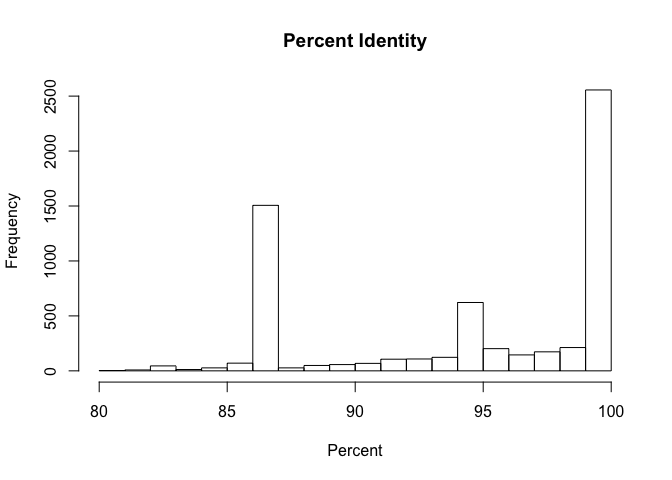

Analysis of BLAST Results
================
Don Francisco
October 6, 2017

Introduction
============

Add 1-2 paragraphs here.

Methods
=======

Sample origin and sequencing
----------------------------

Add about a paragraph here.

Computational
-------------

And another paragraph or two here.

Results
=======

``` r
# Be sure to install these packages before running this script
# They can be installed either with the intall.packages() function
# or with the 'Packages' pane in RStudio

# load packages
library("dplyr")
library("tidyr")
library("knitr")
library("ggplot2")
```

``` r
# Output format from BLAST is as detailed on:
# https://www.ncbi.nlm.nih.gov/books/NBK279675/
# In this case, we used: '10 sscinames std'
# 10 means csv format
# sscinames means unique Subject Scientific Name(s), separated by a ';'
# std means the standard set of result columns, which are:
# 'qseqid sseqid pident length mismatch
# gapopen qstart qend sstart send evalue bitscore',


# this function takes as input a quoted path to a BLAST result file
# and produces as output a dataframe with proper column headers
# and the 'qseqid' column split into sample and seq number
read_blast_output <- function(filename) {
  data_in <- read.csv(filename,
                      header = FALSE, # files don't have column names in them
                      col.names = c("sscinames", # unique Subject Sci Name(s)
                                    "qseqid",    # Query Seq-id
                                    "sseqid",    # Subject Seq-id
                                    "pident",    # Percntge of identical matches
                                    "length",    # Alignment length
                                    "mismatch",  # Number of mismatches
                                    "gapopen",   # Number of gap openings
                                    "qstart",    # Start of alignment in query
                                    "qend",      # End of alignment in query
                                    "sstart",    # Start of alignment in subj
                                    "send",      # End of alignment in subject
                                    "evalue",    # Expect value
                                    "bitscore"))  # Bit score

  # Next we want to split the query sequence ID into
  # Sample and Number components so we can group by sample
  # They originally look like "ERR1942280.1"
  # and we want to split that into two columns: "ERR1942280" and "1"
  # we can use the separate() function from the tidyr library to do this
  # Note that we have to double escape the period for this to work
  # the syntax is
  # separate(column_to_separate,
  # c("New_column_name_1", "New_column_name_2"),
  # "seperator")
  data_in <- data_in %>%
    separate(qseqid, c("sample_name", "sample_number"), "\\.")
}
```

``` r
# this makes a vector of all the BLAST output file names, including
# the name(s) of the directories they are in
files_to_read_in <- list.files(path = "output/blast",
                               full.names = TRUE)

# We need to create an empty matrix with the right number of columns
# so that we can rbind() each dataset on to it
joined_blast_data <- matrix(nrow = 0,
                            ncol = 14)

# now we loop over each of the files in the list and append them
# to the bottom of the 'joined_blast_data' object
# we do this with the rbind() function and the function we
# made earlier to read in the files, read_blast_output()
for (filename in files_to_read_in) {
  joined_blast_data <- rbind(joined_blast_data,
                             read_blast_output(filename))
}
```

``` r
# Next we want to read in the metadata file so we can add that in too
# This is not a csv file, so we have to use a slightly different syntax
# here the `sep = "\t"` tells the function that the data are tab-delimited
# and the `stringsAsFactors = FALSE` tells it not to assume that things are
# categorical variables
metadata_in <- read.table(paste0("data/metadata/",
                                 "fierer_forensic_hand_mouse_SraRunTable.txt"),
                          sep = "\t",
                          header = TRUE,
                          stringsAsFactors = FALSE)

# Finally we use the left_join() function from dplyr to merge or 'join' the
# combined data and metadata into one big table, so it's easier to work with
# in R the `by = c("Run_s" = "sample_name")` syntax tells R which columns
# to match up when joining the datasets together
joined_blast_data_metadata <- metadata_in %>%
  left_join(joined_blast_data,
            by = c("Run_s" = "sample_name"))
```

``` r
# Here we're using the dply piping syntax to select a subset of rows matching a
# criteria we specify (using the filter) function, and then pull out a column
# from the data to make a histogram. We don't need to tell the hist() function
# which data to use, because that's piped in, but we do have to give the
# hist() function the title and axis label we'd like to use for the figure
joined_blast_data_metadata %>%
  filter(env_material_s == "sebum") %>%
  pull(pident) %>%
  hist(main = "Percent Identity",
       xlab = "Percent")
```



Don't forget to report what your figures show in words, here in the Results section.

``` r
# Finally, we'd like to be able to make a summary table of the counts of
# sequences for each taxa for each sample. To do that we can use the table()
# function. We add the kable() function as well (from the tidyr package)
# in order to format the table nicely when the document is knitted
kable(table(joined_blast_data_metadata$sscinames,
            joined_blast_data_metadata$Run_s))
```

|                                                                   |  ERR1942280|  ERR1942281|  ERR1942282|  ERR1942283|  ERR1942284|  ERR1942285|  ERR1942286|  ERR1942287|  ERR1942288|  ERR1942289|  ERR1942290|  ERR1942291|  ERR1942292|  ERR1942293|  ERR1942294|  ERR1942295|  ERR1942296|  ERR1942297|  ERR1942298|  ERR1942299|
|-------------------------------------------------------------------|-----------:|-----------:|-----------:|-----------:|-----------:|-----------:|-----------:|-----------:|-----------:|-----------:|-----------:|-----------:|-----------:|-----------:|-----------:|-----------:|-----------:|-----------:|-----------:|-----------:|
| Acidovorax sp.                                                    |           1|           0|           0|         173|           0|           0|           0|           0|           0|           0|           1|           1|           0|         169|           0|           0|           1|           0|           0|           0|
| Actinomyces sp. oral taxon 449                                    |           1|           0|           0|           0|           0|           0|           0|           0|           0|           0|           0|           0|           0|           0|           0|           0|           0|           0|           0|           0|
| aquatic bacterium FYT12                                           |           1|           0|           0|           0|           0|           0|           0|           0|           0|           0|           0|           0|           0|           0|           0|           0|           0|           0|           0|           0|
| Arthrobacter russicus                                             |           1|           0|           0|           1|           0|           0|           0|           0|           0|           0|           0|           0|           0|           0|           0|           0|           0|           0|           0|           0|
| bacterium NE3006                                                  |           1|           0|           0|           0|           0|           1|           0|           0|           1|           0|           0|           0|           0|           0|           0|           0|           0|           0|           0|           0|
| Bacteroidales bacterium ph8                                       |           1|           0|           0|           0|           0|           1|           0|           1|           0|           0|           1|           0|           0|           0|           0|           0|           2|           0|           0|           0|
| Bacteroidetes endosymbiont of Metaseiulus occidentalis            |         350|           4|           0|           0|           0|           0|           0|           0|         809|           0|           0|           0|           0|           0|           0|           0|           0|           0|           1|           0|
| Bartonella washoensis                                             |           2|           0|           0|           0|           0|         215|           1|         462|           0|           1|           0|           0|         645|           0|           0|           3|         254|           0|           0|           0|
| Chitinophaga sp. BN130233                                         |           1|           0|           0|           0|           0|           0|           0|           0|           0|           0|           0|           0|           0|           0|           0|           0|           0|           0|           0|           0|
| Clostridiaceae bacterium BARN-424-CC-10                           |           2|           0|           0|           8|           0|           0|           0|           0|           0|           0|           0|           0|           0|           0|           0|           0|           0|           0|           1|           0|
| Clostridiales bacterium oral taxon F32                            |           1|           2|           0|           0|           0|           3|           0|           0|           0|           2|           0|           0|           0|           0|           0|           0|           0|           0|           3|           0|
| Clostridium fusiformis                                            |           2|           0|           0|           0|           0|           0|           0|           0|           0|           0|           0|           0|           0|           0|           0|           0|           0|           0|           0|           0|
| Clostridium sp. NH-JN4                                            |           1|           0|           0|           0|           0|           0|           0|           0|           0|           0|           0|           0|           0|           0|           0|           0|           0|           0|           0|           0|
| Frigoribacterium sp. Dmb2                                         |           1|           0|           0|           0|           0|           0|           0|           0|           0|           0|           0|           0|           0|           0|           0|           0|           0|           0|           0|           0|
| Haemophilus parainfluenzae                                        |           1|           0|           0|           0|           0|           0|           0|           0|           0|           0|           0|           0|           0|           0|           0|           0|           0|           0|           0|           0|
| Hymenobacter sp. Xue4                                             |           1|           0|           0|           0|           0|           0|           0|           0|           0|           0|           0|           0|           0|           0|           0|           0|           0|           0|           0|           0|
| Lachnospiraceae bacterium G11                                     |           1|           6|           0|           0|           0|           0|           0|           0|           1|           2|           6|           0|           0|           0|           0|           0|           0|           0|          13|           0|
| Micrococcus sp.                                                   |           1|           0|           0|           0|           0|           0|           0|           0|           0|           0|           0|           0|           0|           0|           0|           0|           0|           0|           0|           1|
| Mucilaginibacter sp. BJC16-A31                                    |           3|           0|           0|           0|           0|           0|           0|           0|           0|           0|           0|           0|           0|           0|           0|           0|           0|           0|           0|           0|
| Paracoccus sp. LPPA 995                                           |           1|           0|           0|           0|           0|           0|           0|           0|           0|           0|           0|           0|           0|           0|           0|           0|           0|           0|           0|           0|
| Pinus oocarpa                                                     |           1|           0|           0|           0|           0|           0|           0|           0|           0|           1|           0|         127|           0|           0|         250|           0|           0|           0|          13|           0|
| Prevotella buccae                                                 |           1|           0|           0|           0|           0|           0|           0|           0|           0|           0|           0|           0|           0|           0|           0|           0|           0|           0|           0|           0|
| Propionibacterium acnes subsp. acnes                              |           6|           2|           8|          23|           9|           3|           2|           1|           0|           7|           3|           7|           0|          23|          19|           3|           4|           3|           1|           2|
| Sphingobacteriaceae bacterium Gsoil 524                           |           1|           0|           0|           0|           1|           0|           0|           0|           0|           0|           0|           3|           0|           0|           0|           0|           0|           0|           0|           0|
| Sphingomonas sp.                                                  |           2|           5|           2|           1|           0|           0|           0|           0|           0|           1|           1|           0|           0|           3|           3|           2|           3|           0|           1|           0|
| Staphylococcus succinus                                           |           4|           5|           5|           1|          53|           0|           9|           0|           1|          11|           0|          26|           0|           0|         148|           9|          26|           9|           0|          60|
| Streptomyces guanduensis                                          |           2|           0|           0|           0|           0|           0|           0|           0|           0|           1|           2|           0|           0|           0|           0|           0|          16|           0|           0|           0|
| TM7 phylum sp. canine oral taxon 308                              |           1|           0|           0|           0|           0|           0|           0|           0|           0|           0|           0|           0|           0|           0|           0|           0|           0|           0|           0|           0|
| unidentified bacterium                                            |           4|          32|           9|          17|          13|          14|         109|           4|           6|          18|          23|          14|           1|           4|          34|           5|          27|          53|          16|          17|
| Acetatifactor muris                                               |           0|           2|           0|           0|           0|           0|           0|           0|           1|           0|           1|           0|           0|           0|           0|           0|           1|           0|          12|           0|
| Actinomadura sp. ATC26                                            |           0|           2|           0|           5|           1|           0|           0|           0|           0|           0|           0|           0|           0|           0|           7|           0|           0|           1|           0|           1|
| Actinomyces naeslundii                                            |           0|           3|           0|           1|           0|           0|           0|           0|           0|           9|           0|           0|           0|           0|           0|           0|           0|           0|           0|           0|
| Actinomyces sp. Chiba101                                          |           0|           3|           0|           0|           0|           0|           0|           0|           0|           0|           0|           0|           0|           0|           0|           0|           0|           0|           0|           0|
| Actinotalea sp. 5GHs33-3                                          |           0|           1|           0|           0|           0|           0|           0|           0|           0|           0|           0|           1|           0|           0|           0|           0|           0|           0|           0|           0|
| Aeromicrobium sp. 9H-4                                            |           0|           2|           0|           0|           0|           0|           0|           0|           0|           0|           0|           0|           0|           0|           0|           0|           0|           0|           0|           0|
| Akkermansia sp. Pyt                                               |           0|           6|           0|           0|           0|           0|           0|           0|           0|           0|           0|           0|           0|           0|           0|           0|           0|           0|           0|           0|
| Alistipes shahii                                                  |           0|           1|           0|           0|           0|           0|           0|           1|           0|           0|           0|           0|           0|           0|           0|           0|           0|           0|           3|           0|
| Anaeroplasma abactoclasticum                                      |           0|           1|           0|           0|           0|           0|           0|           1|           0|           5|           2|           0|           0|           0|           0|           0|          12|           0|          14|           0|
| Anaerotruncus sp. Marseille-P2769                                 |           0|           1|           0|           0|           0|           0|           0|           0|           0|           0|           0|           0|           0|           0|           0|           0|           0|           0|           1|           0|
| Anaplasma phagocytophilum                                         |           0|           1|           0|           0|           0|           0|           0|           4|           0|           1|           4|           0|           0|           0|           0|           0|           3|           0|           1|           0|
| Arthrobacter bergerei                                             |           0|           7|           0|           0|           7|           1|           1|           3|           0|           0|           0|           4|           0|           1|           9|           0|           0|           0|           0|           4|
| Arthrobacter pascens                                              |           0|           4|           0|           0|           0|           0|           0|           0|           0|           0|           0|           0|           0|           0|           0|           0|           0|           0|           0|           0|
| Arthrobacter sp.                                                  |           0|           2|           0|           0|           4|           4|           0|           1|           0|          10|           0|           4|           0|           0|           2|           5|           5|           1|           2|           4|
| Arthrobacter sp. MYb224                                           |           0|           1|           0|           0|           0|          13|           0|           0|           1|           0|           2|           1|           0|           0|           0|           0|           1|           0|           0|           0|
| Arthrobacter sp. RF-3                                             |           0|           1|           0|           0|           0|           0|           0|           0|           0|           0|           2|           0|           0|           0|           0|           0|           0|           0|           0|           0|
| Atopobiaceae bacterium NYU-BL-J4                                  |           0|           1|           0|           0|           0|           0|           0|           0|           0|           0|           0|           0|           0|           0|           0|           0|           0|           0|           0|           0|
| Azonexus hydrophilus                                              |           0|           2|           0|           0|           0|           0|           0|           0|           0|           6|           0|           0|           0|           0|           0|           0|           0|           0|           0|           0|
| Azospirillum halopraeferens                                       |           0|           1|           0|           0|           0|           0|           0|           0|           0|           0|           0|           0|           0|           0|           0|           0|           0|           0|           0|           0|
| Bacillus humi                                                     |           0|           1|           0|           0|           0|           0|           0|           0|           0|           0|           0|           0|           0|           0|           0|           0|           0|           0|           1|           0|
| Bacillus sp.                                                      |           0|           2|           0|           0|           0|           0|           0|           0|           0|           0|           1|           0|           0|           0|           0|           0|           0|           0|           0|           0|
| Bacillus sp. MS5                                                  |           0|           1|           0|           0|           0|           0|           0|           0|           0|           2|           1|           0|           0|           0|           0|           0|           1|           0|           0|           0|
| bacterium AER16F                                                  |           0|           1|           0|           0|           0|           0|           0|           0|           0|           0|           0|           0|           0|           0|           0|           0|           0|           0|           0|           0|
| bacterium ASF500                                                  |           0|           2|           0|           0|           0|           1|           0|           0|           0|           0|           0|           0|           0|           0|           0|           0|           1|           0|           1|           0|
| bacterium FB2012                                                  |           0|           3|           0|           6|           0|           1|           0|           0|           0|           3|          16|           0|           0|           1|           0|           0|           9|           0|          12|           0|
| bacterium ic1379                                                  |           0|           1|           0|           0|           0|           0|           0|           0|           0|           0|           0|           0|           0|           0|           0|           0|           0|           0|           0|           0|
| bacterium LE2001                                                  |           0|           1|           0|           0|           0|           0|           0|           0|           0|           0|           0|           0|           0|           0|           0|           0|           0|           0|           0|           0|
| bacterium mpn-isolate group 2                                     |           0|           1|           0|           0|           0|           0|           0|           0|           0|           0|           0|           0|           0|           0|           0|           0|           0|           0|           0|           0|
| bacterium NB3007                                                  |           0|           2|           0|           0|           0|           0|           0|           0|           0|           1|           2|           0|           0|           0|           0|           0|           1|           0|           1|           0|
| bacterium NLAE-zl-C330                                            |           0|           2|           0|           0|           0|           0|           0|           0|           0|           0|           0|           0|           0|           0|           0|           0|           1|           0|           0|           0|
| bacterium NLAE-zl-G1                                              |           0|           3|           0|           0|           0|           4|           0|           1|           0|           2|           1|           0|           1|           0|           0|           0|           2|           0|           6|           0|
| bacterium NLAE-zl-G12                                             |           0|           2|           0|           0|           0|           3|           0|           1|           2|           1|           3|           0|           1|           0|           0|           0|           5|           0|           9|           0|
| bacterium SVAL1.40                                                |           0|           1|           0|           0|           0|           0|           0|           0|           0|           0|           0|           0|           0|           0|           0|           0|           0|           0|           0|           0|
| bacterium TMB39                                                   |           0|           2|           0|           0|           0|           0|           0|           0|           0|           0|           0|           0|           0|           0|           0|           0|           4|           0|           2|           0|
| bacterium WCD3007                                                 |           0|           1|           0|           0|           0|           0|           0|           1|           0|           0|           0|           0|           0|           0|           0|           0|           0|           0|           0|           0|
| bacterium WH3-2                                                   |           0|           1|           0|           5|           0|           1|           0|           0|           0|           0|           4|           0|           0|           0|           0|           0|           2|           0|           1|           0|
| bacterium XPD2003                                                 |           0|           1|           0|           0|           0|           0|           0|           1|           0|           0|           0|           0|           0|           0|           0|           0|           0|           0|           0|           0|
| bacterium YGD2002                                                 |           0|           2|           0|           0|           0|           0|           0|           0|           0|           0|           0|           0|           0|           0|           0|           0|           0|           0|           1|           0|
| Bacteroides gallinarum                                            |           0|           2|           0|           0|           0|           0|           0|           0|           0|           0|           1|           0|           0|           0|           0|           0|           4|           0|           1|           0|
| Bacteroides rodentium JCM 16496                                   |           0|           3|           0|           0|           0|           0|           0|           0|           0|           0|           0|           0|           0|           0|           0|           0|           0|           0|           0|           0|
| Bacteroides sp. W20                                               |           0|           6|           0|           1|           0|           1|           0|           1|           0|           0|           0|           0|           0|           0|           0|           0|           3|           0|           6|           0|
| Blautia sp. Marseille-P3313                                       |           0|           3|           0|           0|           0|           0|           0|           0|           0|           0|           0|           0|           0|           0|           0|           0|           0|           0|           0|           0|
| Bordetella sp. 1-3                                                |           0|           2|           0|           0|           0|           0|           0|           0|           0|           0|           0|           0|           0|           0|           0|           0|           0|           0|           0|           0|
| Brevibacterium antarcticum                                        |           0|           1|           0|           0|           0|           0|           0|           0|           0|           1|           0|           0|           0|           0|           0|           0|           0|           0|           0|           0|
| Brevibacterium sp.                                                |           0|           9|           2|           0|           4|           0|           1|           0|           0|           8|           4|           3|           0|           1|           6|           5|           7|           2|           0|           5|
| Brevundimonas sp. EM171                                           |           0|           2|           0|           0|           0|           0|           0|           0|           0|           0|           2|           0|           0|           0|           0|           0|           0|           0|           0|           1|
| Burkholderia sp. LB-1                                             |           0|           2|           0|           0|           0|           0|           0|           0|           0|           0|           0|           0|           0|           0|           0|           0|           0|           0|           0|           0|
| Burkholderia tropica;bacterium QTYC46b                            |           0|           1|           0|           0|           0|           0|           0|           0|           0|           3|           2|           0|           0|           0|           0|           0|           1|           1|           0|           0|
| butyrate-producing bacterium A2-207                               |           0|           1|           0|           0|           0|           0|           0|           0|           0|           0|           0|           0|           0|           0|           0|           0|           1|           0|           0|           0|
| Candidatus Cyrtobacter zanobii                                    |           0|           2|           0|           0|           0|           0|           0|           0|           0|           0|           0|           0|           0|           0|           0|           0|           0|           0|           0|           0|
| Candidatus Melainabacteria bacterium MEL.A1                       |           0|           6|           0|           0|           0|           0|           0|           0|           2|           0|           2|           0|           0|           0|           0|           0|           0|           0|           2|           0|
| Candidatus Prevotella conceptionensis                             |           0|           1|           0|           0|           0|           0|           0|           0|           0|           0|           0|           0|           0|           0|           0|           0|           0|           0|           0|           0|
| Chelatococcus daeguensis                                          |           0|           1|           0|           0|           0|           0|           0|           0|           0|           0|           0|           0|           0|           0|           0|           0|           0|           0|           0|           0|
| Clavibacter sp. x1-5                                              |           0|           4|           0|           0|           0|           0|           0|           0|           0|           0|           0|           0|           0|           0|           0|           0|           0|           0|           0|           0|
| Clostridiaceae bacterium DJF\_VP39k1                              |           0|           4|           0|           0|           0|           0|           0|           0|           0|           0|           0|           0|           0|           0|           1|           0|           0|           0|           5|           0|
| Clostridiales bacterium 24-4c                                     |           0|           1|           0|           0|           0|           0|           0|           0|           1|           2|           0|           0|           0|           0|           0|           0|           0|           0|           2|           0|
| Clostridiales bacterium DJF\_CP67                                 |           0|           1|           0|           0|           0|           0|           0|           0|           0|           0|           0|           0|           0|           0|           0|           0|           0|           0|           0|           0|
| Clostridiales bacterium JN18\_A89\_K\*                            |           0|           2|           0|           0|           0|           0|           0|           0|           0|           0|           1|           0|           0|           0|           0|           0|           2|           0|           3|           0|
| Clostridiales bacterium NK3B98                                    |           0|           3|           0|           1|           0|           0|           0|           0|           0|           0|           0|           0|           0|           0|           0|           0|           0|           0|           0|           0|
| Clostridium bolteae                                               |           0|           5|           0|           0|           0|           0|           0|           0|           0|           0|           0|           0|           0|           0|           0|           0|           0|           0|           0|           0|
| Clostridium piliforme                                             |           0|           2|           0|           0|           0|           0|           0|           0|           0|           0|           0|           0|           0|           0|           0|           0|           0|           0|           4|           0|
| Clostridium sp. 619                                               |           0|           1|           0|           2|           0|           0|           0|           0|           0|           0|           1|           0|           0|           0|           0|           0|           1|           0|           5|           0|
| Clostridium sp. Clone-3                                           |           0|           2|           0|           0|           0|           0|           0|           0|           0|           0|           1|           0|           0|           0|           0|           0|           0|           0|           0|           0|
| Clostridium sp. Clone-47                                          |           0|           1|           0|           0|           0|           3|           0|           2|           0|           0|           8|           0|           0|           0|           0|           0|           0|           0|           6|           0|
| Clostridium sp. Culture-27                                        |           0|           1|           0|           0|           0|           2|           0|           0|           0|           0|           1|           0|           0|           0|           0|           0|           0|           0|           2|           0|
| Clostridium sp. ID5                                               |           0|           2|           0|           0|           0|           0|           0|           0|           0|           0|           0|           0|           0|           0|           0|           0|           0|           0|           0|           0|
| Clostridium sp. Marseille-P2776                                   |           0|           1|           0|           0|           0|           0|           0|           0|           0|           0|           2|           0|           2|           0|           0|           0|           0|           0|           1|           0|
| Clostridium sp. VR6                                               |           0|           1|           0|           0|           0|           0|           0|           0|           0|           0|           0|           0|           0|           0|           0|           0|           0|           0|           0|           0|
| Coprococcus catus                                                 |           0|           1|           0|           0|           0|           0|           0|           0|           0|           0|           1|           0|           0|           0|           0|           0|           0|           0|           0|           0|
| Corynebacterium tuberculostearicum                                |           0|           2|           0|           3|           2|           0|           0|           0|           0|           3|           1|           0|           0|           0|           1|           0|           0|           0|           0|           1|
| Delftia sp.                                                       |           0|           1|           0|           0|           0|           0|           0|           0|           0|           0|           1|           0|           0|           0|           0|           0|           0|           0|           0|           0|
| delta proteobacterium BABL1                                       |           0|           2|           0|           0|           0|           0|           0|           0|           0|           0|           0|           0|           0|           0|           0|           0|           0|           0|           0|           0|
| Durinskia baltica                                                 |           0|           2|           0|           0|           0|           0|           0|           0|           0|           0|           0|           0|           0|           0|           0|           0|           0|           0|           0|           0|
| Dyadobacter hamtensis                                             |           0|           1|           0|           0|           0|           0|           0|           0|           0|           0|           0|           0|           0|           0|           0|           0|           0|           0|           0|           0|
| Dyadobacter sp. b209                                              |           0|           1|           0|           0|           0|           0|           0|           0|           0|           0|           0|           0|           0|           0|           0|           0|           0|           0|           0|           0|
| Eubacterium brachy                                                |           0|           1|           0|           0|           0|           0|           0|           0|           0|           0|           0|           0|           0|           0|           0|           0|           0|           0|           0|           0|
| Eubacterium siraeum V10Sc8a                                       |           0|           1|           0|           1|           0|           0|           0|           0|           0|           0|           1|           0|           0|           0|           0|           0|           0|           0|           0|           0|
| Eubacterium sp. JK 623                                            |           0|           1|           0|           0|           0|           0|           0|           0|           0|           0|           3|           0|           0|           0|           0|           0|           0|           0|           0|           0|
| Flexibacter ruber                                                 |           0|           1|           0|           0|           0|           0|           0|           0|           0|           0|           0|           0|           0|           0|           0|           0|           0|           0|           0|           0|
| Friedmanniella capsulata                                          |           0|           1|           0|           0|           0|           0|           0|           0|           0|           0|           0|           0|           0|           0|           0|           0|           0|           0|           0|           0|
| Fusobacterium nucleatum                                           |           0|           1|           0|           0|           0|           0|           0|           0|           0|           0|           0|           0|           0|           0|           0|           0|           0|           0|           0|           0|
| Gordonia hydrophobica                                             |           0|           4|           0|           0|          11|           0|           4|           0|           0|           0|           0|           3|           0|           2|           9|           2|          15|           1|           0|           4|
| Granulicatella elegans                                            |           0|           1|           0|           0|           0|           0|           0|           0|           0|           0|           0|           0|           0|           0|           0|           0|           0|           0|           0|           0|
| Herbaspirillum sp. ES2-54                                         |           0|           1|           0|           0|           0|           0|           0|           0|           0|           0|           0|           0|           0|           0|           0|           0|           0|           0|           0|           0|
| Hymenobacter norwichensis                                         |           0|           1|           0|           0|           0|           0|           0|           0|           0|           0|           0|           0|           0|           0|           0|           0|           0|           0|           0|           0|
| Hymenobacter sp. K2-33028                                         |           0|           2|           0|           0|           0|           0|           0|           0|           0|           0|           0|           0|           0|           0|           0|           0|           0|           0|           0|           0|
| Hymenobacter sp. R-36486                                          |           0|           2|           0|           0|           0|           0|           0|           0|           0|           0|           0|           0|           0|           0|           0|           0|           0|           0|           0|           0|
| Intestinimonas butyriciproducens                                  |           0|           2|           0|           0|           0|           0|           0|           0|           0|           0|           0|           0|           2|           0|           0|           0|           0|           0|           8|           0|
| Intrasporangiaceae bacterium CH8-3                                |           0|           1|           0|           0|           0|           0|           0|           0|           0|           0|           0|           0|           0|           0|           0|           0|           0|           0|           0|           0|
| Janibacter-like sp. V4.BO.43                                      |           0|           4|           0|           1|           1|           0|           0|           0|           0|           0|           0|           1|           0|           0|           0|           0|           0|           0|           0|           0|
| Jeotgalicoccus psychrophilus                                      |           0|           3|           0|           0|           0|           0|           0|           0|           0|           0|           1|           0|           0|           0|           0|           0|           0|           0|           0|           0|
| Jeotgalicoccus sp. L21-PYE-C15                                    |           0|           1|           0|           0|           0|           0|           0|           0|           0|           0|           0|           0|           0|           0|           0|           0|           0|           0|           0|           0|
| Kribbella sp.                                                     |           0|           1|           0|           0|           0|           0|           0|           0|           0|           0|           0|           0|           0|           0|           3|           0|           1|           0|           0|           0|
| Lachnospiraceae bacterium 615                                     |           0|           2|           0|           0|           0|           0|           0|           0|           0|           5|           4|           0|           0|           0|           1|           0|           2|           0|           6|           0|
| Lachnospiraceae bacterium AT6                                     |           0|           1|           0|           0|           0|           0|           0|           0|           0|           0|           1|           0|           0|           0|           0|           0|           0|           0|           0|           0|
| Lachnospiraceae bacterium BLS21                                   |           0|           2|           0|           0|           0|           0|           0|           0|           0|           0|           3|           0|           0|           0|           0|           0|           1|           0|           2|           0|
| Lachnospiraceae bacterium DJF\_VP30                               |           0|           1|           2|           1|           0|           2|           0|           0|           0|           0|           0|           0|           0|           0|           0|           1|           0|           0|           5|           0|
| Lachnospiraceae bacterium DW11                                    |           0|           3|           0|           0|           0|           0|           0|           0|           0|           0|           0|           0|           0|           0|           0|           0|           0|           0|           0|           0|
| Lachnospiraceae bacterium DW12                                    |           0|           1|           0|           0|           0|           1|           0|           0|           0|           0|           1|           0|           0|           0|           0|           0|           0|           0|           1|           0|
| Lachnospiraceae bacterium DW52                                    |           0|           1|           0|           0|           0|           0|           0|           0|           0|           2|           2|           0|           0|           0|           0|           0|           0|           0|           2|           0|
| Lachnospiraceae bacterium TF01-11                                 |           0|           2|           0|           0|           0|           0|           0|           0|           0|           0|           0|           0|           0|           0|           0|           0|           2|           0|           0|           0|
| Lactobacillales bacterium DJF\_B280                               |           0|           1|           0|           1|           0|           0|           0|           0|           0|           0|           2|           0|           0|           0|           0|           0|           4|           0|           3|           0|
| Lactobacillus animalis                                            |           0|           2|           0|           0|           0|           0|           0|           0|           0|           0|           0|           0|           0|           0|           0|           0|           2|           0|           3|           0|
| Lentzea albidocapillata                                           |           0|           1|           0|           0|           0|           0|           0|           0|           0|           0|           0|           0|           0|           0|           0|           0|           0|           0|           0|           0|
| Leucobacter sp. AGL 10                                            |           0|           1|           0|           0|           0|           0|           0|           0|           0|           0|           0|           0|           0|           0|           0|           0|           0|           0|           0|           0|
| Limnohabitans sp. MMS-III-70                                      |           0|           1|           0|           0|           0|           0|           0|           0|           0|           0|           0|           0|           0|           0|           0|           0|           0|           0|           0|           0|
| Limnohabitans sp. T6-5                                            |           0|           1|           0|           0|           0|           0|           0|           0|           0|           0|           0|           0|           0|           0|           0|           0|           0|           0|           0|           0|
| Massilia sp. 8B-2                                                 |           0|           2|           0|           0|           0|           0|           0|           1|           1|           5|          55|           0|           0|           0|           0|           0|           4|           0|           3|           0|
| Microbacteriaceae bacterium Bzb12                                 |           0|           1|           0|           0|           0|           0|           0|           0|           0|           0|           0|           0|           0|           0|           0|           0|           0|           0|           0|           0|
| Microbacterium maritypicum                                        |           0|           2|           0|           0|           0|           0|           0|           0|           0|           0|           0|           0|           0|           0|           0|           0|           0|           0|           0|           0|
| Microbacterium PCA2-17\_Pa                                        |           0|           1|           0|           0|           0|           1|           0|           0|           0|           0|           0|           0|           0|           0|           0|           0|           0|           0|           0|           0|
| Microbacterium sp.                                                |           0|           2|           0|           0|           0|           0|           0|           0|           2|           1|           0|           2|           0|           0|           0|           0|           0|           0|           0|           0|
| Microbacterium sp. NCCP-694                                       |           0|           3|           0|           0|           0|           0|           0|           0|           0|           0|           0|           0|           0|           0|           0|           0|           0|           0|           0|           0|
| Microcoleus sp. PCC 7113                                          |           0|           1|           0|           0|           0|           0|           0|           0|           0|           0|           0|           0|           0|           0|           0|           0|           0|           0|           0|           0|
| Microvirga sp. 7\_57                                              |           0|           1|           0|           0|           0|           0|           0|           0|           0|           0|           0|           0|           0|           0|           0|           0|           0|           0|           1|           0|
| mixed culture ruminal bacterium PAD193                            |           0|           1|           0|           0|           0|           0|           0|           0|           1|           0|           0|           0|           0|           0|           0|           0|           0|           0|           5|           0|
| Mycobacterium sp. URHB0018                                        |           0|           3|           0|           0|           0|           0|           0|           0|           0|           0|           0|           0|           0|           0|           0|           0|           0|           0|           0|           0|
| Mycobacterium sp.;Klebsiella sp. EN1                              |           0|           4|           0|           1|           1|           0|           0|           0|           0|           0|           0|           0|           0|           0|           0|           1|           0|           0|           0|           0|
| Mycobacterium tusciae                                             |           0|           3|           0|           1|           0|           0|           0|           0|           0|           0|           0|           0|           0|           0|           0|           0|           0|           0|           0|           0|
| Mycobacterium tusciae JS617                                       |           0|          16|           0|           2|           0|           0|           0|           0|           0|           0|           0|           0|           0|           0|           0|           0|           0|           0|           0|           0|
| Neisseria animalis                                                |           0|           2|           0|           0|           0|           0|           1|           0|           0|           1|           0|           0|           0|           0|           3|           0|           0|           0|           0|           0|
| Neisseriaceae bacterium Lie1-3                                    |           0|           1|           0|           0|           0|           0|           0|           0|           0|           0|           0|           0|           0|           0|           0|           0|           0|           0|           0|           0|
| Nicoletella semolina                                              |           0|           1|           0|           0|           0|           0|           0|           0|           0|           0|           0|           0|           0|           0|           0|           0|           0|           0|           0|           0|
| Nocardia sp.                                                      |           0|           1|           0|           2|           0|           0|           0|           0|           0|           0|           0|           0|           0|           0|           0|           0|           0|           0|           0|           0|
| Nocardioides sp. P3693                                            |           0|           1|           0|           0|           1|           0|           1|           0|           0|           0|           0|           0|           0|           2|           8|           4|           0|           0|           0|           2|
| Odoribacter sp.                                                   |           0|           1|           0|           0|           0|           0|           0|           0|           0|           0|           1|           0|           0|           0|           0|           0|           0|           0|           1|           0|
| Oribacterium sp. oral taxon 372                                   |           0|           1|           0|           0|           0|           0|           0|           0|           0|           0|           0|           0|           0|           0|           0|           0|           0|           0|           0|           0|
| Oscillibacter valericigenes                                       |           0|           2|           0|           1|           0|           1|           0|           0|           0|           2|           1|           0|           0|           0|           0|           0|           0|           0|           0|           0|
| Oscillospiraceae bacterium Marseille-P2840                        |           0|           7|           0|           0|           0|           0|           0|           0|           0|           1|           2|           0|           0|           0|           0|           0|           3|           0|          11|           0|
| Paenibacillus chondroitinus                                       |           0|           1|           0|           0|           0|           0|           0|           0|           0|           0|           1|           0|           0|           0|           0|           0|           0|           0|           1|           0|
| Paludibacter propionicigenes                                      |           0|           1|           0|           0|           0|           0|           0|           0|           0|           0|           0|           0|           0|           0|           0|           0|           0|           0|           0|           0|
| Pasteurellaceae bacterium canine oral taxon 272                   |           0|           1|           0|           0|           0|           0|           0|           0|           0|           0|           0|           0|           0|           0|           0|           0|           0|           0|           0|           0|
| Pedobacter sp. BFE1A                                              |           0|           1|           0|           0|           0|           0|           0|           0|           0|           0|           0|           0|           0|           0|           0|           0|           0|           0|           0|           0|
| Pelomonas puraquae                                                |           0|           3|           1|           4|           0|           0|           2|           0|           0|           0|           2|           2|           1|           1|          15|           0|           1|           0|           0|           0|
| Pelomonas sp. CPO 4.0052                                          |           0|           1|           0|           0|           0|           0|           0|           0|           0|           0|           0|           0|           0|           0|           0|           0|           0|           0|           0|           0|
| Pinnularia sp. U-strain                                           |           0|           1|           0|           0|           0|           0|           0|           0|           0|           0|           0|           0|           0|           0|           0|           0|           0|           0|           0|           0|
| Polynucleobacter necessarius subsp. asymbioticus                  |           0|           1|           0|           0|           0|           0|           0|           0|           0|           0|           0|           0|           0|           0|           1|           0|           0|           0|           0|           0|
| Prevotella sp. DJF\_RP53                                          |           0|           1|           0|           0|           0|           0|           0|           0|           0|           0|           0|           0|           0|           0|           0|           0|           0|           0|           0|           0|
| Prevotellaceae bacterium DJF\_RP84                                |           0|           1|           0|           0|           0|           0|           0|           0|           0|           0|           0|           0|           0|           0|           0|           0|           0|           0|           0|           0|
| Promicromonospora sp. RP36                                        |           0|           1|           0|           0|           0|           0|           0|           0|           0|           0|           0|           0|           0|           0|           0|           0|           0|           0|           0|           0|
| Promicromonospora sp. YIM 78156                                   |           0|           2|           0|           0|           0|           0|           0|           0|           0|           0|           0|           0|           0|           0|           0|           0|           0|           0|           0|           0|
| Pseudoflavonifractor sp. Marseille-P3106                          |           0|           1|           0|           0|           0|           0|           0|           0|           1|           0|           0|           0|           0|           0|           0|           0|           1|           0|           0|           0|
| Pseudomonas sp.                                                   |           0|           1|           0|           1|           0|           0|           0|           1|           0|           0|           1|           0|           0|           0|           3|           1|           1|           0|           1|           2|
| Pseudonocardia sp. N23                                            |           0|           2|           0|           0|           0|           0|           0|           0|           0|           0|           0|           0|           0|           0|           0|           0|           0|           0|           0|           0|
| rhizosphere soil bacterium RSI-21                                 |           0|           2|           0|           0|           0|           0|           0|           0|           0|           0|           0|           0|           0|           0|           0|           0|           0|           0|           2|           0|
| Rhodococcus coprophilus                                           |           0|           2|           0|           0|           0|           0|           0|           0|           0|           0|           0|           0|           0|           0|           0|           0|           0|           0|           0|           0|
| Rhodoferax fermentans                                             |           0|           3|           0|           0|           0|           0|           0|           0|           0|           0|           0|           0|           0|           0|           0|           0|           0|           0|           0|           0|
| Rhodoferax saidenbachensis                                        |           0|           1|           0|           0|           0|           0|           0|           0|           0|           0|           0|           0|           0|           0|           0|           0|           0|           0|           0|           0|
| Roseburia cecicola                                                |           0|           1|           0|           0|           0|           0|           0|           0|           0|           0|           0|           0|           0|           0|           0|           0|           0|           0|           0|           0|
| Roseburia hominis A2-183                                          |           0|           4|           0|           0|           0|           0|           0|           0|           0|           0|           0|           0|           0|           0|           0|           0|           0|           0|           0|           0|
| Roseburia sp. DJF\_RR73                                           |           0|           2|           0|           0|           0|           0|           0|           0|           0|           0|           0|           0|           0|           0|           0|           0|           0|           0|           0|           0|
| Rubrobacter radiotolerans                                         |           0|           1|           0|           0|           0|           0|           0|           0|           0|           0|           0|           0|           0|           0|           0|           0|           0|           0|           0|           0|
| rumen bacterium NK4A222                                           |           0|           5|           0|           0|           0|           1|           0|           0|           0|           0|           0|           0|           0|           0|           0|           0|           0|           0|           4|           0|
| Ruminococcus flavefaciens                                         |           0|           2|           0|           0|           0|           1|           0|           2|           0|           0|           2|           0|           0|           0|           0|           0|           2|           0|           2|           0|
| Ruminococcus sp.                                                  |           0|           1|           0|           7|           0|           4|           0|           0|           0|           2|           5|           0|           0|           0|           0|           0|           1|           0|          13|           0|
| Ruminococcus sp. CS6                                              |           0|           3|           0|           0|           0|           0|           0|           0|           0|           0|           0|           0|           0|           0|           0|           0|           0|           0|           0|           0|
| Ruminococcus sp. Marseille-P3213                                  |           0|           1|           0|           0|           0|           0|           0|           0|           0|           0|           0|           0|           0|           0|           0|           0|           1|           0|           0|           0|
| Saccharopolyspora sp. 3SS5\_12                                    |           0|          14|           0|           0|           0|           0|           0|           0|           0|           0|           0|           0|           0|           0|           0|           0|           0|           0|           0|           0|
| Saccharopolyspora sp. MSSRFGi44                                   |           0|           1|           0|           0|           0|           0|           0|           0|           0|           0|           0|           0|           0|           0|           0|           0|           0|           0|           0|           0|
| Sphingomonas sp. Air186                                           |           0|           1|           0|           0|           0|           0|           0|           0|           0|           0|           0|           0|           0|           0|           0|           0|           0|           0|           0|           0|
| Stappia sp.                                                       |           0|           2|           0|           0|           0|           0|           0|           0|           0|           0|           0|           0|           0|           0|           0|           0|           0|           0|           0|           0|
| Streptococcus gallolyticus                                        |           0|           1|           0|           0|           0|           0|           0|           0|           0|           0|           0|           0|           0|           0|           0|           0|           0|           0|           0|           0|
| Streptococcus sp. foal3                                           |           0|           2|           0|           0|           0|           0|           0|           0|           0|           0|           1|           0|           0|           0|           0|           0|           0|           0|           0|           0|
| Streptococcus sp. HTS2                                            |           0|           1|           0|           0|           0|           0|           0|           4|           0|           0|           1|           0|           0|           0|           0|           0|           0|          16|           0|           0|
| Streptomyces sp.                                                  |           0|          17|           0|           0|           1|           1|           1|           0|           0|           1|           5|           1|           0|           1|          16|           3|           9|           1|           0|           1|
| Streptomyces sp. BNT558                                           |           0|           2|           0|           0|           0|           0|           0|           0|           0|           0|           0|           0|           0|           0|           0|           0|           0|           0|           0|           0|
| Streptomyces sp. MAR4 CNX-435                                     |           0|           2|           0|           0|           0|           0|           0|           0|           0|           0|           0|           0|           0|           0|           0|           0|           0|           0|           0|           0|
| Streptomyces tritolerans                                          |           0|           1|           0|           0|           0|           0|           1|           0|           0|           0|           0|           0|           0|           0|           0|           0|           0|           0|           0|           0|
| Tsuga sieboldii                                                   |           0|           2|           0|           0|           0|           0|           1|           0|           0|           0|           0|           0|           0|           0|           0|           0|           6|           0|           0|           0|
| Aquitalea sp. KJ011                                               |           0|           0|           1|           0|           2|           0|          40|           0|           0|           0|           0|           0|           0|         113|          28|           0|           0|          25|           0|         362|
| Enhydrobacter sp.                                                 |           0|           0|           1|           0|           0|           0|           0|           0|           0|           0|           0|           0|           0|           2|           0|           0|           0|           0|           0|           0|
| Flavobacterium aciduliphilum                                      |           0|           0|           1|           0|           0|           0|           0|           0|           0|           0|           0|           0|           0|           0|           3|           0|           0|           0|           0|           0|
| Flavobacterium sp. AS20-23                                        |           0|           0|           2|           0|           0|           0|           0|           0|           0|           0|           0|           0|           0|           0|           0|           0|           0|           0|           0|           0|
| Flavobacterium sp. GENT11                                         |           0|           0|           1|           0|           0|           0|           0|           0|           0|           0|           0|           0|           0|           0|           1|           0|           0|           0|           0|           0|
| Gordonia sp. 5/2                                                  |           0|           0|           1|           0|           0|           0|           0|           0|           0|           0|           0|           0|           0|           0|           0|           0|           0|           0|           0|           0|
| Intrasporangiaceae bacterium LCK-2009.8                           |           0|           0|           4|           0|           5|           0|           1|           0|           0|           0|           0|           1|           0|           3|           1|           2|           0|           1|           0|           2|
| Marmoricola sp. S20-100                                           |           0|           0|           1|          16|           0|           0|           0|           0|           0|           0|           0|           3|           0|           1|           6|           1|           1|           0|           0|           6|
| Massilia sp.                                                      |           0|           0|           2|           1|           0|           0|           0|           0|           0|           0|           1|           0|           0|           0|           0|           0|           2|           0|           1|           0|
| Microgenomates (Daviesbacteria) bacterium GW2011\_GWC1\_40\_9     |           0|           0|           1|           0|           0|           0|           0|           0|           0|           0|           0|           0|           0|           0|           2|           0|           4|           0|           0|           0|
| Nocardioides albertani                                            |           0|           0|           1|           0|           3|           0|           3|           0|           0|           0|           0|           4|           0|           1|           1|           6|           0|           0|           0|           2|
| Pedobacter luteus                                                 |           0|           0|           1|           0|           0|           0|           0|           0|           0|           0|           0|           0|           0|           0|           0|           0|           0|           0|           0|           0|
| Sphingobacterium sp.                                              |           0|           0|           1|           0|           0|           0|           1|           0|           0|           0|           0|           1|           0|           0|           4|           0|           0|           0|           0|           0|
| Sphingobium sp.                                                   |           0|           0|           5|           0|           0|           0|           0|           0|           0|           0|           0|           0|           0|           0|           0|           0|           0|           0|           0|           0|
| Spiroplasma corruscae                                             |           0|           0|         308|           0|           0|           0|           0|           0|           0|           0|           0|           0|           0|           0|           0|           0|           0|           0|           0|           0|
| Spiroplasma sp. GSU5478;Spiroplasma sp. GSU5510                   |           0|           0|           1|           0|           0|           0|           0|           0|           0|           0|           0|           0|           0|           0|           0|           0|           0|           0|           0|           0|
| Spiroplasma sp. GSU5862                                           |           0|           0|           2|           0|           0|           0|           0|           0|           0|           0|           0|           0|           0|           0|           0|           0|           0|           0|           0|           0|
| Sporosarcina sp. KW3b2                                            |           0|           0|           1|           0|           0|           0|           0|           0|           0|           0|           0|           0|           0|           0|           0|           0|           0|           0|           0|           0|
| Staphylococcus gallinarum                                         |           0|           0|           1|           0|           0|           0|           0|           0|           0|           0|           0|           0|           0|           0|           1|           0|           0|           0|           0|           0|
| Acidovorax caeni                                                  |           0|           0|           0|           1|           0|           0|           0|           0|           0|           0|           0|           0|           0|           2|           0|           0|           0|           0|           0|           0|
| Acidovorax delafieldii                                            |           0|           0|           0|           1|           0|           0|           0|           0|           0|           0|           0|           0|           0|           0|           0|           0|           0|           0|           0|           0|
| Acidovorax temperans                                              |           0|           0|           0|          18|           0|           0|           0|           0|           0|           0|           0|           0|           0|          25|           1|           0|           0|           0|           0|           0|
| Acinetobacter baumannii                                           |           0|           0|           0|           1|           0|           0|           0|           0|           0|           0|           0|           0|           0|           3|           0|           0|           0|           0|           0|           0|
| Acinetobacter calcoaceticus                                       |           0|           0|           0|           1|           0|           0|           0|           0|           0|           0|           0|           0|           0|           4|           0|           0|           0|           0|           0|           0|
| Acinetobacter genomosp. 15                                        |           0|           0|           0|           3|           0|           0|           0|           0|           0|           0|           0|           0|           0|           0|           0|           0|           0|           0|           0|           0|
| Acinetobacter indicus                                             |           0|           0|           0|           5|           0|           0|           0|           0|           0|           0|           0|           0|           0|          51|           0|           0|           0|           0|           0|           0|
| Acinetobacter junii                                               |           0|           0|           0|           8|           0|           0|           0|           0|           0|           0|           0|           0|           0|         117|           0|           0|           0|           0|           0|           0|
| Actinomadura sp. NEAU-Gz5                                         |           0|           0|           0|           7|           0|           0|           0|           0|           0|           0|           0|           0|           0|           0|           0|           0|           0|           0|           0|           0|
| Actinomycetales bacterium                                         |           0|           0|           0|           2|           0|           0|           0|           0|           0|           1|           0|           0|           0|           0|           0|           0|           0|           0|           0|           1|
| actinomycete S23434                                               |           0|           0|           0|           1|           0|           0|           0|           0|           0|           0|           0|           0|           0|           0|           0|           0|           0|           0|           0|           0|
| Actinophytocola sp. YIM M13705                                    |           0|           0|           0|           1|           0|           0|           0|           0|           0|           0|           0|           0|           0|           0|           0|           0|           0|           0|           0|           0|
| Aetherobacter rufus                                               |           0|           0|           0|           1|           0|           0|           0|           0|           0|           0|           0|           0|           0|           0|           0|           0|           0|           0|           0|           0|
| Agitococcus lubricus                                              |           0|           0|           0|           1|           0|           0|           0|           0|           0|           0|           0|           0|           0|           0|           0|           0|           0|           0|           0|           0|
| bacterium 52-L049642-122-014-D07                                  |           0|           0|           0|           3|           0|           0|           0|           0|           0|           0|           0|           0|           0|           0|           0|           0|           0|           0|           0|           0|
| bacterium A7(2010)                                                |           0|           0|           0|           1|           0|           0|           0|           0|           0|           0|           0|           0|           0|           0|           0|           0|           0|           0|           0|           0|
| bacterium NB4001                                                  |           0|           0|           0|           1|           0|           0|           0|           0|           0|           0|           0|           0|           0|           0|           0|           0|           0|           0|           0|           0|
| bacterium NLAE-zl-C488                                            |           0|           0|           0|           2|           0|           0|           0|           0|           0|           0|           3|           0|           0|           0|           0|           0|           0|           0|           3|           0|
| bacterium P2G6                                                    |           0|           0|           0|           2|           0|           1|           0|           0|           0|           0|           0|           0|           0|           0|           0|           0|           0|           0|           0|           0|
| bacterium S3-021-16S                                              |           0|           0|           0|          14|           0|           0|           0|           0|           0|           0|           0|           0|           0|           0|           0|           0|           0|           0|           0|           0|
| bacterium XPD3003                                                 |           0|           0|           0|           4|           0|           0|           0|           0|           0|           0|           0|           0|           0|           0|           0|           0|           0|           0|           0|           0|
| Bacteroidales bacterium 'ARUP UnID 176'                           |           0|           0|           0|           1|           0|           0|           0|           0|           0|           0|           0|           0|           0|           0|           0|           0|           0|           0|           0|           0|
| Bacteroidales bacterium R61                                       |           0|           0|           0|           1|           0|           2|           0|           0|           0|           0|           0|           0|           0|           0|           0|           0|           0|           0|           0|           0|
| Bacteroides clarus YIT 12056                                      |           0|           0|           0|           1|           0|           0|           0|           0|           0|           0|           1|           0|           0|           0|           0|           0|           2|           0|          12|           0|
| Bacteroides stercoris                                             |           0|           0|           0|           1|           0|           1|           0|           0|           0|           2|           2|           0|           0|           0|           0|           0|           4|           0|           0|           0|
| Bacteroides uniformis                                             |           0|           0|           0|           2|           0|           0|           0|           0|           0|           0|           3|           0|           0|           0|           0|           0|           0|           0|           2|           0|
| Bartonella sp. JB63                                               |           0|           0|           0|           8|           0|           0|           0|           0|           0|           0|           0|           0|           0|           4|           0|           0|           2|           0|           0|           0|
| Brachybacterium sp. THG-DL23                                      |           0|           0|           0|           1|           1|           0|           3|           0|           0|           0|           0|           0|           0|           0|           0|           0|           0|           1|           0|           0|
| Brevibacterium linens                                             |           0|           0|           0|           4|           0|           0|           0|           0|           0|           0|           0|           0|           0|           0|           0|           0|           5|           0|           0|           1|
| Brochothrix sp.                                                   |           0|           0|           0|           1|           0|           0|           0|           0|           0|           0|           0|           0|           0|           0|           0|           0|           0|           0|           0|           0|
| Burkholderia ambifaria                                            |           0|           0|           0|           3|           0|           0|           0|           0|           0|           0|           0|           0|           0|           0|           0|           0|           0|           0|           0|           0|
| Candidatus Azospirillum massiliensis                              |           0|           0|           0|           1|           0|           0|           0|           0|           0|           0|           0|           0|           0|           6|           0|           0|           0|           0|           0|           0|
| Chryseobacterium indoltheticum                                    |           0|           0|           0|           2|           0|           0|           0|           0|           0|           0|           0|           0|           0|           0|           0|           0|           0|           0|           0|           0|
| Cloacibacterium normanense                                        |           0|           0|           0|          33|           0|           0|           0|           0|           0|           0|           0|           0|           0|          19|           5|           0|           0|           0|           0|           0|
| Cloacibacterium sp. O15.2                                         |           0|           0|           0|          14|           0|           0|           0|           0|           0|           0|           0|           0|           0|           6|           0|           0|           0|           0|           0|           0|
| Clostridiaceae bacterium SH032                                    |           0|           0|           0|           1|           0|           0|           0|           0|           0|           0|           0|           0|           0|           0|           0|           0|           0|           0|           0|           0|
| Clostridiales bacterium 30-4c                                     |           0|           0|           0|           4|           0|           2|           0|           0|           0|           0|           1|           0|           1|           0|           0|           0|           2|           0|          11|           0|
| Clostridiales bacterium CIEAF 012                                 |           0|           0|           0|           1|           0|           0|           0|           0|           0|           0|           0|           0|           0|           0|           0|           0|           0|           0|           0|           0|
| Clostridiales bacterium CIEAF 021                                 |           0|           0|           0|           1|           0|           1|           0|           0|           0|           0|           2|           0|           0|           0|           0|           0|           0|           0|           6|           0|
| Clostridiales bacterium oral taxon C20                            |           0|           0|           0|           2|           0|           0|           0|           0|           0|           0|           1|           0|           0|           0|           0|           0|           1|           0|           1|           0|
| Clostridium algidicarnis                                          |           0|           0|           0|           1|           0|           0|           0|           0|           0|           0|           0|           0|           0|           0|           0|           0|           0|           0|           0|           0|
| Corynebacterium sp. full20                                        |           0|           0|           0|           2|           0|           0|           0|           0|           0|           0|           0|           0|           0|           0|           0|           0|           0|           0|           0|           0|
| Dechloromonas sp. I20                                             |           0|           0|           0|           1|           0|           0|           0|           0|           0|           0|           0|           0|           0|           0|           0|           0|           0|           0|           0|           0|
| Dermacoccaceae bacterium C5-30                                    |           0|           0|           0|           1|           0|           0|           0|           0|           0|           0|           0|           0|           0|           0|           0|           0|           0|           0|           0|           0|
| Dermacoccus sp.                                                   |           0|           0|           0|           1|           1|           0|           0|           0|           0|           0|           0|           0|           0|           0|           1|           1|           1|           0|           0|           0|
| Diaphorobacter sp.                                                |           0|           0|           0|          29|           0|           0|           0|           0|           0|           0|           0|           0|           0|          14|           0|           0|           0|           0|           0|           0|
| Dokdonella sp. KIS55-21                                           |           0|           0|           0|           2|           0|           0|           0|           0|           0|           0|           0|           0|           0|           0|           0|           0|           0|           0|           0|           0|
| Enterobacteriaceae bacterium PGBS004                              |           0|           0|           0|           1|           0|           0|           0|           0|           0|           0|           0|           0|           0|           0|           0|           0|           0|           0|           0|           0|
| Erysipelotrichaceae bacterium X-d8                                |           0|           0|           0|           3|           0|           0|           0|           0|           0|           0|           0|           0|           0|           0|           0|           0|           0|           0|           0|           0|
| Exiguobacterium sp.                                               |           0|           0|           0|           2|           0|           0|           0|           0|           0|           0|           0|           0|           0|           0|           0|           0|           0|           0|           0|           0|
| Flavobacterium sasangense                                         |           0|           0|           0|           2|           0|           0|           0|           0|           0|           0|           0|           0|           0|           7|           0|           0|           0|           0|           0|           0|
| Flavobacterium sp. THWCSN34                                       |           0|           0|           0|           1|           0|           0|           0|           0|           0|           0|           0|           0|           0|           0|           0|           0|           0|           0|           0|           0|
| Flexivirga sp. R1                                                 |           0|           0|           0|           2|           0|           0|           0|           0|           0|           0|           0|           0|           0|           0|           0|           0|           0|           0|           0|           0|
| Galbibacter sp. ck-I2-15                                          |           0|           0|           0|           1|           0|           0|           0|           0|           0|           0|           0|           0|           0|           0|           3|           0|           0|           0|           0|           0|
| Geosporobacter sp. LAM1220                                        |           0|           0|           0|           2|           0|           0|           0|           0|           0|           0|           0|           0|           0|           0|           0|           0|           0|           0|           1|           0|
| Ginkgo biloba                                                     |           0|           0|           0|           2|           0|           0|           0|           0|           0|           0|           0|           0|           0|           0|           6|           0|           0|           0|           0|           0|
| Hydrogenophilus thermoluteolus                                    |           0|           0|           0|           2|           0|           0|           0|           0|           0|           0|           0|           0|           0|           0|           0|           0|           0|           0|           0|           0|
| Hymenobacter sp.                                                  |           0|           0|           0|           1|           0|           0|           0|           0|           0|           0|           0|           0|           0|           0|           0|           0|           0|           0|           1|           0|
| Hymenobacter sp. 16F7D                                            |           0|           0|           0|           1|           0|           0|           0|           0|           0|           0|           0|           0|           0|           0|           0|           0|           0|           0|           0|           0|
| Jiangella alkaliphila                                             |           0|           0|           0|           2|           0|           0|           0|           0|           0|           0|           0|           0|           0|           0|           0|           0|           0|           0|           0|           0|
| Knoellia sp. R-43101                                              |           0|           0|           0|           2|           0|           0|           0|           0|           0|           0|           0|           0|           0|           0|           0|           0|           0|           0|           0|           0|
| Lactobacillales bacterium HY-36-1                                 |           0|           0|           0|           3|           0|           3|           0|           0|           2|           0|           9|           0|           1|           0|           0|           0|           1|           0|          12|           0|
| Lactococcus lactis                                                |           0|           0|           0|           1|           0|           0|           0|           0|           0|           0|           0|           0|           0|           0|           0|           0|           0|           0|           0|           0|
| Lactococcus lactis subsp. lactis                                  |           0|           0|           0|           6|           0|           0|           0|           0|           0|           0|           0|           0|           0|           0|           0|           0|           0|           0|           0|           0|
| Lupinus angustiflorus                                             |           0|           0|           0|          76|           0|           0|           0|           0|           0|           0|           0|           0|           0|          16|           0|           0|           0|           0|           0|           0|
| Methylobacillus sp. OV                                            |           0|           0|           0|           1|           0|           0|           0|           0|           0|           0|           0|           0|           0|           1|           0|           0|           0|           0|           0|           0|
| Methylobacillus sp. VITPRS29                                      |           0|           0|           0|           1|           0|           0|           0|           0|           0|           0|           0|           0|           0|           0|           0|           0|           0|           0|           0|           0|
| Methylobacillus sp. Z                                             |           0|           0|           0|          12|           0|           0|           0|           0|           0|           0|           0|           0|           0|           1|           0|           0|           0|           0|           0|           0|
| Methylobacterium sp. F3.2                                         |           0|           0|           0|           1|           0|           0|           0|           0|           0|           0|           0|           0|           0|           0|           0|           0|           0|           0|           0|           0|
| Methylomonas clara                                                |           0|           0|           0|           1|           0|           0|           0|           0|           0|           0|           0|           0|           0|           0|           0|           0|           0|           0|           0|           0|
| Methylophilus quaylei                                             |           0|           0|           0|          55|           0|           0|           0|           0|           0|           0|           0|           0|           0|           3|           0|           0|           0|           0|           0|           0|
| Methylophilus sp. EHg7                                            |           0|           0|           0|           1|           0|           0|           0|           0|           0|           0|           0|           0|           0|           0|           0|           0|           0|           0|           0|           0|
| Methylophilus sp. LTK                                             |           0|           0|           0|           4|           0|           0|           0|           0|           0|           0|           0|           0|           0|           2|           0|           0|           0|           0|           0|           0|
| Methylophilus sp. TWE2                                            |           0|           0|           0|           9|           0|           0|           0|           0|           0|           0|           0|           0|           0|           1|           0|           0|           0|           0|           0|           0|
| Methylotenera mobilis                                             |           0|           0|           0|           9|           0|           0|           0|           0|           0|           0|           0|           0|           0|           1|           0|           0|           0|           0|           0|           0|
| Methylovorus glucosotrophus                                       |           0|           0|           0|           1|           0|           0|           0|           0|           0|           0|           0|           0|           0|           1|           0|           0|           0|           0|           0|           0|
| Microbacterium phyllosphaerae                                     |           0|           0|           0|           1|           0|           0|           0|           0|           0|           0|           0|           0|           0|           0|           4|           0|           0|           0|           0|           3|
| Microcystis sp. SAG 43.90                                         |           0|           0|           0|           3|           0|           0|           0|           0|           0|           0|           0|           0|           0|           0|           0|           0|           0|           0|           0|           0|
| Moraxella sp. feline oral taxon 350                               |           0|           0|           0|           2|           0|           0|           0|           0|           0|           0|           0|           0|           0|           0|           0|           0|           0|           0|           0|           0|
| Mycobacterium coloregonium                                        |           0|           0|           0|           6|           0|           0|           0|           0|           0|           0|           0|           0|           0|           0|           0|           0|           0|           0|           0|           0|
| Mycobacterium sp. 62/1                                            |           0|           0|           0|           6|           0|           0|           0|           0|           0|           0|           0|           0|           0|           0|           0|           0|           0|           0|           0|           0|
| Mycobacterium sp. DM-11                                           |           0|           0|           0|           5|           0|           0|           0|           0|           0|           0|           0|           0|           0|           0|           0|           0|           0|           0|           0|           0|
| Mycobacterium sp. smRA94                                          |           0|           0|           0|           1|           0|           0|           0|           0|           0|           0|           0|           0|           0|           0|           0|           0|           0|           0|           0|           0|
| Nocardia sp. AR23308                                              |           0|           0|           0|           4|           0|           0|           0|           0|           0|           0|           0|           0|           0|           0|           0|           0|           0|           0|           0|           0|
| Nocardioides sp. AP3                                              |           0|           0|           0|           1|           0|           0|           1|           0|           0|           0|           0|           2|           0|           0|           1|           1|           0|           0|           0|           0|
| Nocardioides sp. RHLT1-14                                         |           0|           0|           0|           1|           0|           0|           0|           0|           0|           0|           0|           0|           0|           0|           0|           0|           0|           0|           0|           0|
| Novosphingobium sp.                                               |           0|           0|           0|           1|           0|           0|           0|           0|           0|           0|           0|           0|           0|          21|           0|           0|           0|           0|           0|           0|
| Oxalobacteraceae bacterium MORI3                                  |           0|           0|           0|           1|           0|           0|           0|           0|           0|           0|           0|           0|           0|           0|           0|           0|           0|           0|           0|           0|
| Paracoccus sp. 1011MAR3C25                                        |           0|           0|           0|           1|           0|           0|           0|           0|           0|           0|           0|           0|           0|           0|           0|           0|           0|           0|           0|           0|
| Parcubacteria bacterium GW2011\_GWC2\_32\_10                      |           0|           0|           0|           4|           0|           0|           0|           0|           0|           1|           0|           0|           0|           0|           0|           0|           0|           0|           0|           0|
| Polaromonas sp. G1-28                                             |           0|           0|           0|           1|           0|           0|           0|           0|           0|           0|           0|           0|           0|           0|           0|           0|           0|           0|           0|           0|
| Prevotella melaninogenica                                         |           0|           0|           0|           3|           0|           1|           0|           1|           0|           0|           0|           0|           0|           0|           0|           2|           0|           0|           2|           0|
| Propionibacterium acnes                                           |           0|           0|           0|           2|           1|           0|           0|           0|           0|           0|           0|           0|           0|           0|           1|           0|           0|           0|           0|           0|
| Pseudomonas gessardii                                             |           0|           0|           0|           1|           0|           0|           1|           0|           0|           0|           0|           0|           0|           1|           6|           0|           0|           0|           1|           2|
| Pseudonocardia alaniniphila                                       |           0|           0|           0|           1|           0|           0|           0|           0|           0|           0|           0|           1|           0|           0|           0|           0|           0|           0|           0|           0|
| Pseudonocardia sp. IFP 2050                                       |           0|           0|           0|           2|           0|           0|           0|           0|           0|           0|           0|           0|           0|           0|           0|           0|           0|           0|           0|           0|
| Rhodanobacter soli                                                |           0|           0|           0|           2|           0|           0|           0|           0|           0|           0|           0|           0|           0|           0|           0|           0|           0|           0|           0|           0|
| Rhodanobacter sp. MJ01                                            |           0|           0|           0|           2|           0|           0|           0|           0|           0|           0|           0|           0|           0|           0|           0|           0|           0|           0|           0|           0|
| Rhodococcus sp.                                                   |           0|           0|           0|           2|           0|           0|           0|           0|           0|           0|           0|           0|           0|           0|           0|           0|           2|           0|           0|           0|
| Rhodoferax sp. K129                                               |           0|           0|           0|           1|           0|           0|           0|           0|           0|           0|           0|           0|           0|           0|           0|           0|           0|           0|           0|           0|
| Rothia mucilaginosa                                               |           0|           0|           0|           1|           0|           0|           0|           0|           0|           0|           0|           0|           0|           0|           0|           0|           0|           0|           0|           0|
| Rubrivivax sp. SNRB4-8                                            |           0|           0|           0|           1|           0|           0|           0|           0|           0|           0|           0|           0|           0|           0|           0|           0|           0|           0|           0|           0|
| rumen bacterium R-21                                              |           0|           0|           0|           1|           0|           0|           0|           0|           0|           0|           0|           0|           0|           1|           0|           0|           0|           0|           0|           0|
| Saccharothrix syringae                                            |           0|           0|           0|           5|           0|           0|           0|           0|           0|           0|           0|           0|           0|           0|           0|           0|           0|           0|           0|           0|
| Sphingobium vulgare                                               |           0|           0|           0|           2|           0|           0|           0|           0|           0|           0|           0|           0|           0|           2|           0|           0|           0|           0|           0|           0|
| Streptococcus mitis                                               |           0|           0|           0|           1|           0|           0|           0|           0|           0|           0|           0|           0|           0|           0|           0|           0|           1|           0|           0|           5|
| Streptomyces atroolivaceus                                        |           0|           0|           0|           1|           0|           0|           0|           0|           0|           0|           0|           0|           0|           0|           5|           1|           0|           0|           0|           0|
| Streptomyces griseus                                              |           0|           0|           0|           1|           0|           0|           0|           0|           0|           0|           0|           0|           0|           0|           0|           0|           0|           0|           0|           0|
| Streptomyces sp. 14CM001                                          |           0|           0|           0|           5|           1|           0|           1|           0|           0|           0|           0|           1|           0|           0|           1|           0|           0|           0|           0|           2|
| Streptomyces sp. 172205                                           |           0|           0|           0|           1|           0|           0|           0|           0|           0|           0|           0|           0|           0|           0|           1|           0|           0|           0|           0|           0|
| Streptomyces sp. B1S171                                           |           0|           0|           0|           4|           0|           0|           0|           0|           0|           0|           0|           0|           0|           0|           0|           0|           0|           0|           0|           0|
| Streptosporangiaceae bacterium ACTS20                             |           0|           0|           0|           1|           0|           0|           0|           0|           0|           0|           0|           0|           0|           0|           0|           0|           0|           0|           0|           0|
| Streptosporangineae bacterium 413C05                              |           0|           0|           0|           2|           0|           0|           0|           0|           0|           0|           0|           0|           0|           0|           0|           0|           0|           0|           0|           0|
| Synedra hyperborea                                                |           0|           0|           0|           1|           0|           0|           0|           0|           0|           0|           0|           0|           0|           0|           0|           0|           0|           0|           0|           0|
| Uliginosibacterium sp. JJ016                                      |           0|           0|           0|           2|           0|           0|           0|           0|           0|           0|           0|           0|           0|           0|           0|           0|           0|           0|           0|           0|
| Virgosporangium sp. 331E12                                        |           0|           0|           0|           1|           0|           0|           0|           0|           0|           0|           0|           0|           0|           0|           0|           0|           0|           0|           0|           0|
| Zoogloea caeni                                                    |           0|           0|           0|           3|           0|           0|           0|           0|           0|           0|           0|           0|           0|          14|           0|           0|           0|           0|           0|           0|
| actinobacterium YJ6                                               |           0|           0|           0|           0|           1|           0|           0|           0|           0|           0|           0|           0|           0|           0|           0|           1|           0|           0|           0|           0|
| Alphaproteobacteria bacterium                                     |           0|           0|           0|           0|           5|           0|           3|           0|           0|           0|           0|          12|           0|           1|           0|          12|           0|           3|           0|           6|
| Arthrobacter sp. 4J27                                             |           0|           0|           0|           0|           2|           0|           0|           0|           0|           0|           3|           0|           0|           0|           0|           0|           0|           0|           1|           0|
| Arthrobacter sp. 5                                                |           0|           0|           0|           0|           1|           0|           1|           0|           0|           0|           0|           1|           0|           0|           4|           2|           0|           0|           0|           1|
| Arthrobacter sp. THG-GM14                                         |           0|           0|           0|           0|           3|           6|           0|           0|           0|           0|           0|           0|           0|           0|           0|           0|           0|           0|           0|           0|
| Bacillus sp. IDA1983                                              |           0|           0|           0|           0|           1|           0|           0|           0|           0|           0|           0|           0|           0|           0|           3|           0|           1|           0|           0|           0|
| bacterium endosymbiont of Onthophagus Taurus                      |           0|           0|           0|           0|           1|           0|          25|           0|           0|           0|           0|           0|           0|           0|           0|           0|           0|           9|           0|           0|
| bacterium ic1294                                                  |           0|           0|           0|           0|           1|           0|           0|           0|           0|           0|           0|           0|           0|           0|           0|           0|           0|           0|           0|           0|
| Brachybacterium paraconglomeratum                                 |           0|           0|           0|           0|           1|           0|           0|           1|           0|           0|           0|           0|           0|           0|           3|           0|           0|           0|           0|           1|
| Cardiobacterium sp. feline oral taxon 346                         |           0|           0|           0|           0|          18|           0|          15|           0|           0|           0|           0|          25|           0|           1|           0|          20|           0|           3|           0|          19|
| Choricystis parasitica                                            |           0|           0|           0|           0|           1|           0|           0|           0|           0|           0|           0|           2|           0|           0|           0|           1|           0|           0|           0|           0|
| Chryseobacterium sp.                                              |           0|           0|           0|           0|           1|           0|           0|           0|           0|           0|           0|           0|           0|           0|           0|           0|           0|           0|           0|           0|
| Corynebacterium glutamicum                                        |           0|           0|           0|           0|          12|           0|           0|           0|           0|           0|           0|           0|           0|           0|           0|           0|           0|           0|           0|           0|
| Corynebacterium segmentosum                                       |           0|           0|           0|           0|           1|           0|           0|           0|           0|           1|           0|           0|           0|           0|           0|           0|           0|           0|           0|           0|
| Cressa cretica                                                    |           0|           0|           0|           0|           2|           0|           0|           0|           0|           0|           0|           0|           0|           0|           2|           0|           0|           0|           0|           0|
| Curvibacter sp.                                                   |           0|           0|           0|           0|           1|           0|           0|           0|           0|           0|           0|           0|           0|           0|           0|           0|           0|           0|           0|           0|
| cyanobacterium cCLB-12                                            |           0|           0|           0|           0|           1|           0|           0|           0|           0|           0|           0|           0|           0|           0|           0|           0|           0|           0|           0|           0|
| Dermacoccus sp. cb8                                               |           0|           0|           0|           0|           1|           0|           0|           0|           0|           0|           0|           0|           0|           0|           0|           0|           0|           0|           0|           0|
| Devosia sp. R41                                                   |           0|           0|           0|           0|           1|           0|           0|           0|           0|           0|           0|           0|           0|           0|           0|           0|           0|           0|           0|           0|
| Fragaria nipponica                                                |           0|           0|           0|           0|           2|           0|           0|           0|           0|           0|           0|           2|           0|           0|           0|           0|           0|           0|           0|           0|
| Gulbenkiania sp.                                                  |           0|           0|           0|           0|           1|           0|           2|           0|           0|           0|           0|           0|           0|          13|           3|           0|           0|           1|           0|          54|
| Halomonas sp. NIMMe7                                              |           0|           0|           0|           0|           1|           0|           0|           0|           0|           0|           0|           3|           0|           0|           0|           1|           0|           1|           0|           0|
| Janibacter sp.                                                    |           0|           0|           0|           0|           1|           0|           1|           0|           0|           2|           0|           1|           0|           0|           2|           0|           0|           1|           0|           5|
| Janthinobacterium sp.                                             |           0|           0|           0|           0|           1|           0|           0|           0|           0|           0|           0|           0|           0|           0|           0|           0|           0|           0|           0|           0|
| Knoellia sp.                                                      |           0|           0|           0|           0|           1|           0|           0|           0|           1|           0|           0|           0|           0|           0|           0|           0|           0|           0|           0|           0|
| Loktanella sp.                                                    |           0|           0|           0|           0|           1|           0|           0|           0|           0|           0|           0|           0|           0|           0|           0|           0|           0|           0|           0|           0|
| Magnetospirillum bellicus                                         |           0|           0|           0|           0|           1|           0|           0|           0|           0|           0|           0|           0|           0|           0|           0|           0|           0|           0|           0|           0|
| Melosira varians                                                  |           0|           0|           0|           0|           2|           0|           0|           0|           0|           0|           0|           0|           0|           0|           0|           0|           0|           0|           0|           0|
| Microvirga sp.                                                    |           0|           0|           0|           0|           1|           0|           0|           0|           0|           1|           4|           0|           0|           0|           0|           0|           2|           0|           0|           0|
| Nocardia sp. X1037                                                |           0|           0|           0|           0|           1|           0|           0|           0|           0|           0|           0|           0|           0|           0|           0|           0|           0|           0|           0|           0|
| Nocardioides albus                                                |           0|           0|           0|           0|           2|           0|           0|           0|           0|           0|           0|           0|           0|           0|           0|           0|           0|           0|           0|           0|
| Nocardioides sp.                                                  |           0|           0|           0|           0|           4|           0|           0|           0|           0|           2|           1|           0|           0|           1|           6|           0|           2|           0|           0|           1|
| proteobacterium E4-1                                              |           0|           0|           0|           0|           1|           0|           0|           0|           0|           0|           0|           1|           0|           0|           0|           0|           0|           0|           0|           0|
| Prunus cerasoides                                                 |           0|           0|           0|           0|           6|           0|           0|           0|           0|           0|           0|           6|           0|           2|           0|           0|           0|           0|           0|           0|
| Pseudarthrobacter sp.                                             |           0|           0|           0|           0|           1|           0|           0|           0|           0|           0|           0|           0|           0|           0|           0|           0|           1|           0|           0|           0|
| Rhizobium sp.                                                     |           0|           0|           0|           0|           1|           0|           0|           0|           0|           1|           0|           1|           0|           0|           0|           0|           0|           0|           0|           0|
| Salinisphaera sp.                                                 |           0|           0|           0|           0|           1|           0|           0|           0|           0|           0|           0|           1|           0|           0|           0|           1|           0|           0|           0|           0|
| Shigella flexneri                                                 |           0|           0|           0|           0|           1|           1|           1|           0|           0|           0|           0|           0|           0|           0|           0|           1|           0|           0|           0|           0|
| Solemya pervernicosa gill symbiont                                |           0|           0|           0|           0|         441|           0|         371|           0|           0|           0|           0|         560|           3|          14|           7|         532|           0|         131|           1|         312|
| Staphylococcus sp.                                                |           0|           0|           0|           0|           2|           0|           0|           0|           0|           1|           3|           4|           1|           3|          13|           3|           1|           4|           0|           3|
| Staphylococcus sp. P33400VB04\_16S\_27f                           |           0|           0|           0|           0|           1|           0|           0|           0|           0|           0|           0|           0|           0|           0|           0|           0|           0|           0|           0|           0|
| Staphylococcus succinus subsp. casei                              |           0|           0|           0|           0|           2|           0|           0|           0|           0|           0|           0|           2|           0|           0|           2|           1|           0|           0|           0|           7|
| Staphylococcus succinus subsp. succinus                           |           0|           0|           0|           0|           8|           3|           0|           1|           0|           0|           0|           1|           0|           0|           2|           0|           0|           0|           0|           6|
| \[Ruminococcus\] gnavus                                           |           0|           0|           0|           0|           0|           1|           0|           2|           0|           0|           0|           0|           0|           0|           0|           0|           0|           0|           2|           0|
| Acetobacter aceti                                                 |           0|           0|           0|           0|           0|           3|           0|           0|           0|           0|           0|           0|           0|           0|           0|           0|           0|           0|           0|           0|
| Acetobacter tropicalis                                            |           0|           0|           0|           0|           0|           1|           0|           0|           0|           0|           0|           0|           0|           0|           0|           0|           0|           0|           0|           0|
| Aeromicrobium sp. R-42664                                         |           0|           0|           0|           0|           0|           1|           0|           0|           0|           0|           0|           0|           0|           0|           0|           0|           0|           0|           0|           0|
| Alloprevotella tannerae                                           |           0|           0|           0|           0|           0|           1|           0|           0|           0|           0|           0|           0|           0|           0|           0|           0|           0|           0|           0|           0|
| Amnibacterium sp. PB243                                           |           0|           0|           0|           0|           0|           1|           0|           0|           0|           0|           0|           0|           0|           0|           0|           0|           0|           0|           0|           0|
| anaerobic bacterium foal30                                        |           0|           0|           0|           0|           0|           1|           0|           0|           0|           0|           0|           0|           0|           0|           0|           1|           0|           0|           1|           0|
| Arthrobacter sp. EP\_S\_69                                        |           0|           0|           0|           0|           0|           1|           0|           0|           0|           0|           0|           0|           0|           0|           0|           0|           0|           0|           0|           0|
| bacterium                                                         |           0|           0|           0|           0|           0|           3|           0|           0|           0|           0|           2|           0|           0|           0|           0|           1|           0|           0|           0|           0|
| bacterium AB2031                                                  |           0|           0|           0|           0|           0|           1|           0|           0|           0|           1|           1|           0|           0|           0|           0|           0|           0|           0|           1|           0|
| bacterium AC2028                                                  |           0|           0|           0|           0|           0|          11|           0|           1|           3|           0|           0|           0|           1|           0|           0|           0|           0|           0|           0|           2|
| bacterium AC2044                                                  |           0|           0|           0|           0|           0|           1|           0|           2|           0|           0|           0|           0|           0|           0|           0|           0|           0|           0|           0|           0|
| bacterium AE3015                                                  |           0|           0|           0|           0|           0|           1|           0|           1|           0|           0|           0|           0|           0|           0|           0|           0|           1|           0|           0|           0|
| bacterium FB2005                                                  |           0|           0|           0|           0|           0|           3|           0|           0|           0|           0|           2|           0|           0|           0|           0|           0|           0|           0|           4|           0|
| bacterium V9D2002                                                 |           0|           0|           0|           0|           0|           1|           0|           0|           0|           0|           0|           0|           2|           0|           0|           0|           0|           0|           2|           0|
| bacterium V9D2013                                                 |           0|           0|           0|           0|           0|           1|           0|           0|           0|           0|           1|           0|           0|           1|           0|           0|           0|           0|           0|           0|
| bacterium YSD2009                                                 |           0|           0|           0|           0|           0|           2|           0|           0|           0|           0|           0|           0|           0|           0|           0|           0|           0|           0|           0|           0|
| Bacteroides sp. canine oral taxon 040                             |           0|           0|           0|           0|           0|           1|           0|           0|           0|           0|           0|           0|           0|           0|           0|           0|           0|           0|           0|           0|
| Bacteroides sp. DSM 12148                                         |           0|           0|           0|           0|           0|           1|           0|           0|           0|           0|           1|           0|           0|           0|           0|           0|           0|           0|           2|           0|
| Bartonella jaculi                                                 |           0|           0|           0|           0|           0|           1|           0|           2|           0|           2|           0|           0|           3|           0|           0|           0|           3|           0|           0|           0|
| Bartonella sp. JM-1                                               |           0|           0|           0|           0|           0|           2|           0|           2|           0|           0|           0|           0|           0|           0|           0|           0|           0|           0|           0|           0|
| Blautia stercoris                                                 |           0|           0|           0|           0|           0|           2|           0|           0|           0|           0|           0|           0|           0|           0|           0|           0|           0|           0|           0|           0|
| Butyricicoccus sp. KS-2                                           |           0|           0|           0|           0|           0|           1|           0|           0|           0|           0|           0|           0|           0|           0|           0|           0|           0|           0|           0|           0|
| Campylobacter sp. 0403804-C0128                                   |           0|           0|           0|           0|           0|           1|           0|           0|           0|           0|           0|           0|           0|           0|           0|           0|           0|           0|           0|           0|
| Carnobacterium divergens                                          |           0|           0|           0|           0|           0|           1|           2|           0|           0|           0|           0|           0|           0|           0|           0|           0|           0|           0|           0|           0|
| Clostridiaceae bacterium DJF\_VR76                                |           0|           0|           0|           0|           0|           1|           0|           0|           0|           0|           0|           0|           0|           0|           0|           0|           0|           0|           0|           0|
| Clostridiales bacterium 14                                        |           0|           0|           0|           0|           0|           2|           0|           0|           0|           0|           0|           0|           0|           0|           0|           0|           0|           0|           1|           0|
| Clostridiales bacterium CIEAF 020                                 |           0|           0|           0|           0|           0|           1|           0|           2|           0|           1|           0|           0|           0|           0|           0|           0|           1|           0|           2|           0|
| Clostridiales bacterium CIEAF 022                                 |           0|           0|           0|           0|           0|           3|           0|           0|           0|           0|           0|           0|           0|           0|           0|           0|           0|           0|           2|           0|
| Clostridiales bacterium CIEAF 029                                 |           0|           0|           0|           0|           0|           1|           0|           0|           1|           0|           0|           0|           0|           0|           0|           0|           0|           0|           5|           0|
| Clostridiales bacterium Marseille-P2846                           |           0|           0|           0|           0|           0|           2|           0|           1|           0|           0|           1|           0|           0|           0|           0|           0|           2|           0|           6|           0|
| Clostridiales bacterium oral taxon 085                            |           0|           0|           0|           0|           0|           4|           0|           2|           1|           0|           3|           0|           1|           0|           0|           0|           1|           0|           4|           0|
| Clostridium methylpentosum;Clostridium methylpentosum DSM 5476    |           0|           0|           0|           0|           0|           1|           0|           0|           0|           0|           2|           0|           0|           0|           0|           0|           3|           0|           3|           0|
| Clostridium sp. JL2\_S                                            |           0|           0|           0|           0|           0|           1|           0|           0|           0|           0|           0|           0|           0|           0|           0|           0|           0|           0|           0|           0|
| Clostridium tyrobutyricum                                         |           0|           0|           0|           0|           0|           1|           0|           0|           0|           0|           0|           0|           0|           0|           0|           0|           0|           0|           0|           0|
| Conchiformibius steedae                                           |           0|           0|           0|           0|           0|           1|           0|           0|           0|           1|           0|           0|           0|           0|           0|           0|           0|           0|           0|           0|
| Corynebacterium mucifaciens                                       |           0|           0|           0|           0|           0|           1|           0|           0|           0|           0|           0|           0|           0|           0|           0|           0|           0|           0|           0|           0|
| Enterobacter sp.                                                  |           0|           0|           0|           0|           0|           1|           0|           0|           0|           0|           0|           0|           0|           0|           0|           0|           0|           0|           0|           0|
| Friedmanniella sp. Pao56                                          |           0|           0|           0|           0|           0|           1|           0|           0|           0|           0|           0|           0|           0|           0|           0|           0|           0|           0|           0|           0|
| Haemonchus placei                                                 |           0|           0|           0|           0|           0|           2|           0|           0|           0|           0|           1|           0|           0|           0|           0|           0|           1|           0|           1|           0|
| Lachnobacterium sp. wal 14165                                     |           0|           0|           0|           0|           0|           1|           0|           0|           0|           2|           0|           0|           0|           0|           0|           0|           1|           0|           0|           0|
| Lachnospira pectinoschiza                                         |           0|           0|           0|           0|           0|           1|           0|           0|           0|           0|           0|           0|           0|           0|           0|           0|           0|           0|           0|           0|
| Lachnospiraceae bacterium 4C56CA                                  |           0|           0|           0|           0|           0|           1|           0|           0|           0|           0|           1|           0|           0|           0|           0|           0|           0|           0|           0|           0|
| Lachnospiraceae bacterium G41                                     |           0|           0|           0|           0|           0|           1|           0|           0|           0|           0|           0|           0|           0|           0|           0|           0|           0|           0|           0|           0|
| Lachnospiraceae bacterium SRB530                                  |           0|           0|           0|           0|           0|           2|           0|           0|           1|           0|           0|           0|           0|           0|           0|           0|           0|           0|           1|           0|
| Lachnospiraceae bacterium V37\_10\_1                              |           0|           0|           0|           0|           0|           3|           0|           0|           1|           0|           0|           0|           0|           0|           0|           0|           0|           0|           0|           0|
| Lactobacillus rogosae                                             |           0|           0|           0|           0|           0|           2|           0|           0|           0|           0|           0|           0|           0|           0|           0|           0|           0|           0|           0|           0|
| Leucobacter sp. CSB21                                             |           0|           0|           0|           0|           0|           1|           0|           0|           0|           0|           0|           0|           0|           0|           0|           0|           0|           0|           0|           0|
| Lysobacter sp.                                                    |           0|           0|           0|           0|           0|           1|           0|           0|           0|           1|           0|           0|           0|           0|           0|           1|           0|           0|           0|           0|
| Massilia brevitalea                                               |           0|           0|           0|           0|           0|           1|           0|           0|           1|           1|           0|           1|           0|           0|           0|           0|           0|           0|           0|           0|
| Massilia sp. 8-F94A                                               |           0|           0|           0|           0|           0|           1|           0|           0|           0|           0|           0|           0|           0|           0|           0|           0|           0|           0|           0|           0|
| Ochrobactrum sp. Cr13                                             |           0|           0|           0|           0|           0|           1|           0|           0|           0|           0|           0|           0|           0|           0|           0|           0|           0|           0|           0|           0|
| Oscillospira sp. H                                                |           0|           0|           0|           0|           0|           1|           0|           0|           0|           0|           0|           0|           0|           0|           0|           0|           1|           0|           0|           0|
| Parapedobacter koreensis                                          |           0|           0|           0|           0|           0|           1|           0|           0|           0|           0|           0|           0|           0|           0|           0|           0|           0|           0|           0|           0|
| Pasteurellaceae bacterium canine oral taxon 326                   |           0|           0|           0|           0|           0|           2|           0|           0|           0|           0|           0|           0|           0|           0|           0|           0|           0|           0|           0|           0|
| Pedobacter bauzanensis                                            |           0|           0|           0|           0|           0|           1|           0|           1|           0|           0|           0|           0|           0|           0|           0|           0|           0|           0|           0|           0|
| Planomicrobium sp. ES2                                            |           0|           0|           0|           0|           0|           2|           0|           0|           0|           0|           0|           1|           0|           0|           0|           0|           0|           0|           0|           0|
| Pontibacter sp. HYL7-26                                           |           0|           0|           0|           0|           0|           1|           0|           0|           0|           0|           0|           0|           0|           0|           0|           0|           0|           0|           0|           0|
| Porphyromonadaceae bacterium S9 HS-8                              |           0|           0|           0|           0|           0|           3|           0|           0|           0|           0|           1|           0|           0|           0|           0|           0|           0|           0|           0|           0|
| Propionibacterium granulosum                                      |           0|           0|           0|           0|           0|           1|           0|           0|           0|           0|           0|           0|           0|           4|           0|           0|           0|           1|           0|           0|
| Roseburia sp. 1120                                                |           0|           0|           0|           0|           0|           1|           0|           1|           0|           0|           2|           0|           0|           0|           0|           0|           2|           0|           2|           0|
| rumen bacterium NK4A78                                            |           0|           0|           0|           0|           0|           4|           0|           0|           0|           0|           1|           0|           0|           2|           0|           0|           0|           0|           0|           0|
| rumen bacterium YS2                                               |           0|           0|           0|           0|           0|           2|           0|           0|           1|           5|           1|           0|           0|           0|           0|           0|          10|           0|           7|           0|
| Ruminococcus sp. 80/3                                             |           0|           0|           0|           0|           0|           1|           0|           0|           0|           0|           0|           0|           0|           0|           0|           0|           0|           0|           0|           0|
| Shewanella algae                                                  |           0|           0|           0|           0|           0|           1|           0|           0|           0|           0|           0|           0|           0|           0|           0|           0|           0|           0|           0|           0|
| Sphingobacterium sp. ML3W                                         |           0|           0|           0|           0|           0|           8|           0|           0|           0|           0|           0|           0|           0|           0|           0|           0|           0|           0|           0|           0|
| Sphingomonadaceae bacterium MC 3718                               |           0|           0|           0|           0|           0|           1|           0|           0|           0|           0|           0|           0|           0|           0|           0|           0|           0|           0|           0|           0|
| Sphingomonas sp. AB23T14                                          |           0|           0|           0|           0|           0|           1|           0|           0|           0|           0|           0|           0|           0|           0|           0|           0|           0|           0|           0|           0|
| Streptococcus oralis                                              |           0|           0|           0|           0|           0|           1|           0|           0|           0|           0|           0|           0|           0|           0|           0|           0|           0|           0|           0|           0|
| Streptococcus sp. canine oral taxon 279                           |           0|           0|           0|           0|           0|           2|           0|           0|           0|           0|           0|           0|           0|           0|           0|           0|           0|           0|           0|           0|
| Tyzzerella sp. Marseille-P3062                                    |           0|           0|           0|           0|           0|           1|           0|           0|           0|           0|           0|           0|           0|           0|           0|           0|           0|           0|           1|           0|
| Acidovorax sp. NII-0922                                           |           0|           0|           0|           0|           0|           0|           2|           0|           0|           0|           0|           0|           0|           0|           0|           0|           0|           0|           0|           0|
| Acinetobacter guillouiae                                          |           0|           0|           0|           0|           0|           0|           1|           0|           0|           0|           4|           0|           0|           0|           7|           0|           0|           0|           0|           0|
| Actinotalea sp. EBR-4-2                                           |           0|           0|           0|           0|           0|           0|           1|           0|           0|           0|           0|           0|           0|           0|           0|           0|           0|           0|           0|           0|
| bacterium 15M                                                     |           0|           0|           0|           0|           0|           0|           1|           0|           0|           0|           0|           0|           0|           0|           0|           0|           0|           0|           0|           0|
| bacterium F163                                                    |           0|           0|           0|           0|           0|           0|           2|           0|           0|           0|           0|           0|           0|           0|           0|           0|           0|           0|           0|           0|
| bacterium symbiont of Euplotes sp.                                |           0|           0|           0|           0|           0|           0|           2|           0|           0|           0|           0|           0|           0|           0|           0|           0|           0|           1|           0|           0|
| bacterium WM06i\_A1D                                              |           0|           0|           0|           0|           0|           0|           1|           0|           0|           0|           0|           0|           0|           0|           0|           0|           0|           0|           0|           0|
| Bacteroidetes bacterium UKL13-3                                   |           0|           0|           0|           0|           0|           0|           2|           0|           0|           0|           0|           0|           0|           0|           0|           0|           0|           0|           0|           0|
| Beggiatoa sp. 'Guadeloupe FWI'                                    |           0|           0|           0|           0|           0|           0|           1|           0|           0|           0|           0|           1|           0|           0|           0|           2|           0|           0|           0|           1|
| Cardiobacterium sp. canine oral taxon 177                         |           0|           0|           0|           0|           0|           0|           1|           0|           0|           0|           0|           0|           0|           0|           0|           0|           0|           0|           0|           0|
| Chlorophyta symbiont of Lubomirskia sp.                           |           0|           0|           0|           0|           0|           0|           2|           0|           0|           0|           0|           0|           0|           0|           0|           0|           0|           0|           0|           0|
| Corynebacterium kroppenstedtii                                    |           0|           0|           0|           0|           0|           0|           1|           0|           0|           0|           0|           0|           0|           0|           0|           0|           0|           0|           0|           0|
| Denitratisoma oestradiolicum                                      |           0|           0|           0|           0|           0|           0|           1|           0|           0|           0|           0|           0|           0|           0|           0|           0|           0|           0|           0|           1|
| Legionella sp. MDA6655                                            |           0|           0|           0|           0|           0|           0|           1|           0|           0|           0|           0|           0|           0|           0|           0|           0|           0|           0|           0|           0|
| Magnetococcaceae bacterium 1 53m                                  |           0|           0|           0|           0|           0|           0|           2|           0|           0|           0|           0|           0|           0|           0|           0|           0|           0|           0|           0|           0|
| Massilia niabensis                                                |           0|           0|           0|           0|           0|           0|           1|           0|           0|           0|           0|           0|           0|           0|           0|           0|           0|           0|           0|           0|
| Miscanthus x giganteus                                            |           0|           0|           0|           0|           0|           0|           2|           0|           0|           0|           4|           0|           0|           0|           8|           2|           0|           0|           0|           0|
| Mycobacterium sp. URHA0026                                        |           0|           0|           0|           0|           0|           0|           3|           0|           0|           0|           0|           0|           0|           0|           0|           0|           0|           0|           0|           0|
| Nocardioides sp. 7\_17                                            |           0|           0|           0|           0|           0|           0|           1|           0|           0|           0|           0|           0|           0|           0|           0|           0|           0|           0|           0|           0|
| Rhodospirillales bacterium URHD0088                               |           0|           0|           0|           0|           0|           0|           1|           0|           0|           0|           0|           0|           0|           0|           0|           0|           0|           0|           0|           0|
| Sphingobacterium daejeonense                                      |           0|           0|           0|           0|           0|           0|           1|           0|           0|           0|           0|           0|           0|           0|           0|           0|           0|           0|           0|           0|
| Sphingomonas koreensis                                            |           0|           0|           0|           0|           0|           0|           1|           0|           0|           0|           0|           0|           0|           0|           3|           0|           0|           0|           0|           0|
| Tessaracoccus sp. YIM 101269                                      |           0|           0|           0|           0|           0|           0|           1|           0|           0|           0|           0|           0|           0|           0|           0|           0|           0|           0|           0|           0|
| Treubaria triappendiculata                                        |           0|           0|           0|           0|           0|           0|          16|           0|           0|           0|           0|           0|           0|           0|           0|           0|           0|           0|           0|           0|
| Wautersiella falsenii                                             |           0|           0|           0|           0|           0|           0|           1|           0|           0|           0|           0|           0|           0|           0|           0|           0|           0|           0|           0|           0|
| Alkalibacterium iburiense                                         |           0|           0|           0|           0|           0|           0|           0|           4|           0|           0|           0|           0|           0|           0|           0|           0|           0|           0|           0|           0|
| bacterium AC2010                                                  |           0|           0|           0|           0|           0|           0|           0|           1|           0|           0|           0|           0|           0|           0|           0|           0|           0|           0|           0|           0|
| bacterium F6(2009)                                                |           0|           0|           0|           0|           0|           0|           0|           2|           0|           0|           0|           0|           0|           0|           0|           0|           0|           0|           0|           0|
| bacterium NC2001                                                  |           0|           0|           0|           0|           0|           0|           0|           1|           0|           0|           0|           0|           0|           0|           0|           0|           2|           0|           1|           0|
| bacterium WCE2003                                                 |           0|           0|           0|           0|           0|           0|           0|           1|           0|           0|           0|           0|           0|           0|           0|           0|           0|           0|           0|           0|
| Bartonella tribocorum                                             |           0|           0|           0|           0|           0|           0|           0|           2|           0|           0|           0|           0|           0|           0|           0|           0|           0|           0|           0|           0|
| Butyricicoccus sp. BB10                                           |           0|           0|           0|           0|           0|           0|           0|           1|           2|           3|           0|           0|           0|           0|           0|           0|           2|           0|           5|           0|
| Clostridium sp. ARIAKE994                                         |           0|           0|           0|           0|           0|           0|           0|           1|           0|           0|           0|           0|           0|           0|           0|           0|           0|           0|           2|           0|
| Clostridium sp. S11-3-10                                          |           0|           0|           0|           0|           0|           0|           0|           1|           0|           0|           0|           0|           0|           0|           0|           0|           0|           0|           0|           0|
| Coprococcus catus GD/7                                            |           0|           0|           0|           0|           0|           0|           0|           1|           0|           0|           0|           0|           0|           0|           0|           0|           0|           0|           0|           0|
| Coprococcus sp. NATH-2371                                         |           0|           0|           0|           0|           0|           0|           0|           2|           0|           0|           0|           0|           0|           0|           0|           0|           0|           0|           0|           0|
| Devosia geojensis                                                 |           0|           0|           0|           0|           0|           0|           0|           1|           0|           0|           0|           0|           0|           0|           0|           0|           0|           0|           0|           0|
| Eubacterium siraeum 70/3                                          |           0|           0|           0|           0|           0|           0|           0|           1|           0|           0|           0|           0|           0|           0|           0|           0|           0|           0|           0|           0|
| Flavobacterium sp. CRH                                            |           0|           0|           0|           0|           0|           0|           0|           2|           0|           0|           0|           0|           0|           0|           1|           0|           0|           0|           0|           0|
| Gram-negative bacterium cL10-2b-4                                 |           0|           0|           0|           0|           0|           0|           0|           1|           2|           1|           2|           0|           0|           0|           0|           0|           0|           0|           2|           0|
| Hymenobacter sp. 9PNM-21                                          |           0|           0|           0|           0|           0|           0|           0|           1|           0|           0|           0|           0|           0|           0|           0|           1|           0|           0|           0|           0|
| Lachnospiraceae bacterium NK4A179                                 |           0|           0|           0|           0|           0|           0|           0|           1|           0|           0|           0|           0|           0|           0|           0|           0|           0|           0|           0|           0|
| Leucobacter sp.                                                   |           0|           0|           0|           0|           0|           0|           0|           1|           0|           0|           0|           0|           0|           0|           0|           0|           0|           0|           0|           0|
| Microlunatus panaciterrae                                         |           0|           0|           0|           0|           0|           0|           0|           1|           0|           0|           0|           0|           0|           1|           0|           1|           0|           0|           0|           0|
| Peptoniphilus sp. BG5                                             |           0|           0|           0|           0|           0|           0|           0|           1|           0|           0|           0|           0|           0|           0|           0|           0|           0|           0|           0|           0|
| Propionibacterium sp. canine oral taxon 431                       |           0|           0|           0|           0|           0|           0|           0|           1|           0|           0|           0|           0|           0|           0|           0|           0|           0|           0|           0|           0|
| Rothia amarae                                                     |           0|           0|           0|           0|           0|           0|           0|           1|           0|           0|           0|           0|           0|           0|           0|           0|           0|           0|           0|           0|
| Rugamonas sp.                                                     |           0|           0|           0|           0|           0|           0|           0|           1|           0|           0|           0|           0|           0|           0|           0|           0|           0|           0|           0|           0|
| rumen bacterium NK4B4                                             |           0|           0|           0|           0|           0|           0|           0|           1|           1|           0|           0|           0|           0|           0|           0|           0|           0|           0|           0|           0|
| Subtercola sp. MDB1-51                                            |           0|           0|           0|           0|           0|           0|           0|           2|           0|           0|           0|           0|           0|           0|           0|           0|           0|           0|           0|           0|
| Alistipes senegalensis JC50                                       |           0|           0|           0|           0|           0|           0|           0|           0|           2|           0|           0|           0|           0|           0|           0|           0|           0|           0|           0|           0|
| Anaerostipes sp. 494a                                             |           0|           0|           0|           0|           0|           0|           0|           0|           1|           0|           0|           0|           0|           0|           0|           0|           0|           0|           0|           0|
| bacterium FE2016                                                  |           0|           0|           0|           0|           0|           0|           0|           0|           1|           0|           0|           0|           0|           0|           0|           0|           0|           0|           0|           0|
| bacterium Iso11\_2                                                |           0|           0|           0|           0|           0|           0|           0|           0|           1|           0|           0|           0|           0|           0|           0|           0|           0|           0|           0|           0|
| bacterium NLAE-zl-H350                                            |           0|           0|           0|           0|           0|           0|           0|           0|           1|           0|           0|           0|           0|           0|           0|           0|           0|           0|           0|           0|
| bacterium YGD2004                                                 |           0|           0|           0|           0|           0|           0|           0|           0|           1|           0|           0|           0|           0|           0|           0|           0|           0|           0|           0|           0|
| Bacteroides finegoldii                                            |           0|           0|           0|           0|           0|           0|           0|           0|           2|           0|           0|           0|           0|           0|           0|           0|           0|           0|           1|           0|
| Christensenella sp. AF73-05CM02                                   |           0|           0|           0|           0|           0|           0|           0|           0|           1|           0|           0|           0|           0|           0|           0|           0|           1|           0|           0|           0|
| Clostridiaceae bacterium WN011                                    |           0|           0|           0|           0|           0|           0|           0|           0|           1|           1|           0|           0|           0|           0|           0|           0|           0|           0|           0|           0|
| Clostridium aminophilum                                           |           0|           0|           0|           0|           0|           0|           0|           0|           2|           0|           0|           0|           0|           0|           0|           0|           0|           0|           2|           0|
| Clostridium sp. cTPY-17                                           |           0|           0|           0|           0|           0|           0|           0|           0|           1|           0|           0|           0|           0|           0|           0|           0|           0|           0|           0|           0|
| Clostridium sp. Culture-23                                        |           0|           0|           0|           0|           0|           0|           0|           0|           1|           0|           0|           0|           0|           0|           0|           0|           0|           0|           0|           0|
| Eubacterium coprostanoligenes                                     |           0|           0|           0|           0|           0|           0|           0|           0|           2|           0|           0|           0|           0|           0|           0|           0|           2|           0|           0|           0|
| Flavonifractor plautii                                            |           0|           0|           0|           0|           0|           0|           0|           0|           1|           0|           0|           0|           0|           0|           0|           0|           0|           0|           2|           0|
| Friedmanniella sp.                                                |           0|           0|           0|           0|           0|           0|           0|           0|           2|           0|           0|           0|           0|           0|           0|           0|           0|           0|           1|           0|
| Friedmanniella sp. Pao13                                          |           0|           0|           0|           0|           0|           0|           0|           0|           1|           0|           0|           0|           0|           0|           0|           0|           0|           0|           0|           0|
| Lachnospiraceae bacterium 14-2                                    |           0|           0|           0|           0|           0|           0|           0|           0|           1|           0|           2|           0|           0|           0|           0|           0|           0|           0|           0|           0|
| Mycobacterium pyrenivorans                                        |           0|           0|           0|           0|           0|           0|           0|           0|           1|           0|           0|           0|           0|           0|           0|           0|           0|           0|           0|           0|
| Ruminococcaceae bacterium Marseille-P2963                         |           0|           0|           0|           0|           0|           0|           0|           0|           1|           0|           0|           0|           0|           0|           0|           0|           0|           0|           1|           0|
| Ruminococcus champanellensis 18P13                                |           0|           0|           0|           0|           0|           0|           0|           0|           2|           0|           0|           0|           0|           0|           0|           0|           0|           0|           0|           0|
| Staphylococcus saccharolyticus                                    |           0|           0|           0|           0|           0|           0|           0|           0|           1|           0|           0|           0|           0|           0|           3|           0|           0|           1|           0|           0|
| Streptomyces sp. 645271                                           |           0|           0|           0|           0|           0|           0|           0|           0|           1|           0|           0|           0|           0|           0|           0|           0|           0|           0|           0|           0|
| Tannerella forsythia KS16                                         |           0|           0|           0|           0|           0|           0|           0|           0|           2|           0|           0|           0|           0|           0|           0|           0|           0|           0|           0|           0|
| TM7 phylum sp. oral taxon 351                                     |           0|           0|           0|           0|           0|           0|           0|           0|           1|           0|           0|           0|           0|           0|           0|           0|           0|           0|           0|           0|
| Acidobacteria bacterium KF4-16/2                                  |           0|           0|           0|           0|           0|           0|           0|           0|           0|           1|           0|           0|           0|           0|           0|           0|           0|           0|           0|           0|
| Acinetobacter sp. D75                                             |           0|           0|           0|           0|           0|           0|           0|           0|           0|           1|           0|           0|           0|           0|           0|           0|           0|           0|           0|           0|
| Actinoalloteichus sp.                                             |           0|           0|           0|           0|           0|           0|           0|           0|           0|           1|           0|           0|           0|           0|           0|           0|           1|           0|           0|           0|
| Actinomadura sp. EGI 80046                                        |           0|           0|           0|           0|           0|           0|           0|           0|           0|           2|           0|           0|           0|           0|           0|           0|           0|           0|           0|           0|
| Aeromicrobium sp. PclMES3                                         |           0|           0|           0|           0|           0|           0|           0|           0|           0|           3|           0|           0|           0|           0|           0|           0|           0|           0|           0|           0|
| Agrobacterium sp. HP5J1                                           |           0|           0|           0|           0|           0|           0|           0|           0|           0|           1|           0|           0|           0|           0|           0|           0|           0|           0|           0|           0|
| Agrobacterium tumefaciens                                         |           0|           0|           0|           0|           0|           0|           0|           0|           0|           1|           0|           0|           0|           0|           0|           0|           1|           0|           0|           0|
| Anaerococcus octavius                                             |           0|           0|           0|           0|           0|           0|           0|           0|           0|           1|           0|           0|           0|           0|           0|           0|           0|           0|           0|           0|
| Aquincola sp. ID0723                                              |           0|           0|           0|           0|           0|           0|           0|           0|           0|           1|           0|           0|           0|           0|           0|           0|           0|           0|           0|           0|
| Arthrobacter agilis                                               |           0|           0|           0|           0|           0|           0|           0|           0|           0|           3|           1|           0|           0|           0|           0|           0|           0|           0|           0|           0|
| Arthrobacter sp. CPCC203934                                       |           0|           0|           0|           0|           0|           0|           0|           0|           0|           1|           0|           0|           0|           0|           0|           0|           0|           0|           1|           0|
| Bacillus sp. IDA4275                                              |           0|           0|           0|           0|           0|           0|           0|           0|           0|           4|           0|           0|           0|           1|           0|           0|           0|           0|           0|           0|
| Bacillus sp. IDA4715                                              |           0|           0|           0|           0|           0|           0|           0|           0|           0|           4|           0|           0|           0|           0|           0|           0|           1|           0|           0|           2|
| bacterium 21\_oclvp54                                             |           0|           0|           0|           0|           0|           0|           0|           0|           0|          13|           9|           0|           0|           0|           0|           0|           2|           0|           0|           0|
| bacterium AE3018                                                  |           0|           0|           0|           0|           0|           0|           0|           0|           0|           1|           1|           0|           0|           0|           0|           0|           1|           0|           0|           0|
| bacterium BEL C3                                                  |           0|           0|           0|           0|           0|           0|           0|           0|           0|           1|           0|           0|           0|           0|           0|           0|           4|           0|           0|           0|
| bacterium Ellin517                                                |           0|           0|           0|           0|           0|           0|           0|           0|           0|           1|           0|           0|           0|           0|           0|           0|           0|           0|           0|           0|
| bacterium endosmybiont of Otiorhynchus armadillo                  |           0|           0|           0|           0|           0|           0|           0|           0|           0|           1|           1|           0|           0|           0|           0|           0|           0|           0|           0|           0|
| bacterium GFCr-3                                                  |           0|           0|           0|           0|           0|           0|           0|           0|           0|           1|           0|           0|           0|           0|           0|           0|           0|           0|           0|           0|
| bacterium NLAE-zl-C273                                            |           0|           0|           0|           0|           0|           0|           0|           0|           0|           2|           1|           0|           0|           0|           0|           0|           0|           0|           2|           0|
| bacterium NLAE-zl-C349                                            |           0|           0|           0|           0|           0|           0|           0|           0|           0|           1|           0|           0|           0|           0|           0|           0|           0|           0|           0|           0|
| bacterium PB90-2                                                  |           0|           0|           0|           0|           0|           0|           0|           0|           0|           1|           0|           0|           0|           0|           0|           0|           0|           0|           0|           0|
| bacterium SH4-10                                                  |           0|           0|           0|           0|           0|           0|           0|           0|           0|           2|           0|           0|           0|           0|           0|           0|           0|           0|           0|           0|
| bacterium SL5.38                                                  |           0|           0|           0|           0|           0|           0|           0|           0|           0|           1|           0|           0|           0|           0|           0|           0|           0|           0|           0|           0|
| Bacteroides sp. S427                                              |           0|           0|           0|           0|           0|           0|           0|           0|           0|           3|           0|           0|           0|           0|           0|           0|           0|           0|           4|           0|
| Blautia coccoides                                                 |           0|           0|           0|           0|           0|           0|           0|           0|           0|          10|           1|           0|           0|           0|           0|           0|           0|           0|          25|           0|
| Blautia schinkii                                                  |           0|           0|           0|           0|           0|           0|           0|           0|           0|           3|           0|           0|           0|           0|           0|           0|           1|           0|           2|           0|
| Blautia sp. Marseille-P3441                                       |           0|           0|           0|           0|           0|           0|           0|           0|           0|           2|           0|           0|           0|           0|           0|           0|           0|           0|           2|           0|
| Blautia wexlerae                                                  |           0|           0|           0|           0|           0|           0|           0|           0|           0|           1|           0|           0|           0|           0|           0|           0|           0|           0|           1|           0|
| Brachybacterium sp. BN5                                           |           0|           0|           0|           0|           0|           0|           0|           0|           0|           1|           0|           2|           0|           0|           4|           3|           3|           0|           0|           2|
| Brachybacterium sp. o16                                           |           0|           0|           0|           0|           0|           0|           0|           0|           0|           1|           0|           0|           0|           0|           0|           0|           0|           0|           0|           0|
| Brachybacterium tyrofermentans                                    |           0|           0|           0|           0|           0|           0|           0|           0|           0|           1|           1|           0|           0|           0|           0|           0|           0|           0|           0|           0|
| Brevundimonas sp. TAR-002                                         |           0|           0|           0|           0|           0|           0|           0|           0|           0|           1|           0|           0|           0|           0|           0|           0|           0|           0|           0|           0|
| Chryseobacterium chaponense                                       |           0|           0|           0|           0|           0|           0|           0|           0|           0|           1|           0|           0|           0|           0|           0|           0|           0|           0|           0|           0|
| Clostridiales bacterium CIEAF 017                                 |           0|           0|           0|           0|           0|           0|           0|           0|           0|           2|           0|           0|           0|           0|           0|           0|           0|           0|           0|           0|
| Clostridium sp. Culture Jar-13                                    |           0|           0|           0|           0|           0|           0|           0|           0|           0|           1|           0|           0|           0|           0|           0|           0|           0|           0|           3|           0|
| Clostridium sp. SN17                                              |           0|           0|           0|           0|           0|           0|           0|           0|           0|           1|           0|           0|           0|           0|           0|           0|           1|           0|           0|           0|
| Conyzicola sp. B33-1                                              |           0|           0|           0|           0|           0|           0|           0|           0|           0|           1|           0|           0|           0|           0|           0|           0|           0|           0|           0|           0|
| Corynebacterium flavescens                                        |           0|           0|           0|           0|           0|           0|           0|           0|           0|           3|           0|           0|           0|           0|           0|           0|           0|           0|           0|           0|
| Corynebacterium sp. oral taxon B00                                |           0|           0|           0|           0|           0|           0|           0|           0|           0|          12|           0|           0|           0|           0|           0|           0|           0|           0|           0|           0|
| Corynebacterium sp. OT4                                           |           0|           0|           0|           0|           0|           0|           0|           0|           0|           1|           0|           0|           0|           0|           1|           0|           0|           0|           0|           2|
| Craurococcus sp. HM28-1                                           |           0|           0|           0|           0|           0|           0|           0|           0|           0|           1|           0|           0|           0|           0|           0|           0|           0|           0|           0|           0|
| Dionaea muscipula                                                 |           0|           0|           0|           0|           0|           0|           0|           0|           0|           2|           0|           0|           0|           0|           0|           0|           0|           0|           0|           0|
| Eggerthella sp. YY7918                                            |           0|           0|           0|           0|           0|           0|           0|           0|           0|           2|           0|           0|           0|           0|           0|           0|           0|           0|           0|           0|
| Friedmanniella sagamiharensis                                     |           0|           0|           0|           0|           0|           0|           0|           0|           0|           1|           0|           0|           0|           0|           0|           0|           0|           0|           0|           0|
| Friedmanniella sp. 7515T-26                                       |           0|           0|           0|           0|           0|           0|           0|           0|           0|           1|           0|           0|           0|           0|           0|           0|           0|           0|           0|           0|
| Friedmanniella sp. UPAR04                                         |           0|           0|           0|           0|           0|           0|           0|           0|           0|           1|           0|           0|           0|           0|           0|           0|           1|           0|           0|           0|
| Herbaspirillum seropedicae                                        |           0|           0|           0|           0|           0|           0|           0|           0|           0|           1|           0|           0|           0|           0|           0|           0|           0|           0|           0|           0|
| Herbaspirillum sp.                                                |           0|           0|           0|           0|           0|           0|           0|           0|           0|           1|           0|           0|           0|           0|           0|           2|           0|           0|           0|           3|
| Herbaspirillum sp. 5410S-62                                       |           0|           0|           0|           0|           0|           0|           0|           0|           0|           1|           0|           0|           0|           0|           0|           0|           0|           0|           1|           0|
| human intestinal firmicute CJ36                                   |           0|           0|           0|           0|           0|           0|           0|           0|           0|           2|           0|           0|           0|           0|           0|           0|           0|           0|           0|           0|
| Humicoccus flavidus                                               |           0|           0|           0|           0|           0|           0|           0|           0|           0|           1|           0|           0|           0|           0|           0|           0|           0|           0|           0|           0|
| Knoellia sp. BA4(2011)                                            |           0|           0|           0|           0|           0|           0|           0|           0|           0|           1|           0|           0|           0|           0|           0|           0|           0|           0|           0|           1|
| Lachnospiraceae bacterium DW70                                    |           0|           0|           0|           0|           0|           0|           0|           0|           0|           2|           1|           0|           0|           0|           0|           0|           0|           0|           3|           0|
| Leptotrichia sp. oral taxon 213                                   |           0|           0|           0|           0|           0|           0|           0|           0|           0|           2|           0|           0|           0|           0|           0|           0|           0|           0|           0|           0|
| Leptotrichia sp. oral taxon 215                                   |           0|           0|           0|           0|           0|           0|           0|           0|           0|           2|           0|           0|           0|           0|           0|           0|           0|           0|           0|           0|
| Luteimonas sp. UM1                                                |           0|           0|           0|           0|           0|           0|           0|           0|           0|           2|           0|           0|           0|           0|           0|           0|           0|           0|           0|           0|
| Lysobacter sp. RS LYSO-3                                          |           0|           0|           0|           0|           0|           0|           0|           0|           0|           1|           0|           0|           0|           0|           0|           0|           0|           0|           0|           0|
| Massilia sp. ARS148-11                                            |           0|           0|           0|           0|           0|           0|           0|           0|           0|           1|           0|           0|           0|           0|           0|           0|           0|           0|           0|           0|
| Massilia sp. BRM32                                                |           0|           0|           0|           0|           0|           0|           0|           0|           0|           1|           0|           0|           0|           0|           0|           0|           0|           0|           0|           0|
| Massilia sp. PB248;Massilia sp. MK02                              |           0|           0|           0|           0|           0|           0|           0|           0|           0|           2|           0|           0|           0|           0|           0|           0|           0|           0|           0|           0|
| Microbacteriaceae bacterium N4\_97\_1                             |           0|           0|           0|           0|           0|           0|           0|           0|           0|           1|           0|           0|           0|           0|           0|           0|           0|           0|           1|           0|
| Microbacterium esteraromaticum                                    |           0|           0|           0|           0|           0|           0|           0|           0|           0|           2|           0|           0|           0|           0|           0|           0|           0|           0|           0|           0|
| Microbacterium profundi                                           |           0|           0|           0|           0|           0|           0|           0|           0|           0|           1|           0|           0|           0|           0|           0|           0|           0|           0|           0|           0|
| Microvirga sp. R491-7                                             |           0|           0|           0|           0|           0|           0|           0|           0|           0|           3|           2|           0|           0|           0|           7|           0|           1|           0|           0|           0|
| Nocardioides iriomotensis                                         |           0|           0|           0|           0|           0|           0|           0|           0|           0|           1|           0|           0|           0|           0|           0|           0|           0|           0|           0|           0|
| Nocardioides sp. RW28                                             |           0|           0|           0|           0|           0|           0|           0|           0|           0|           1|           0|           0|           0|           0|           0|           0|           0|           0|           0|           0|
| Nocardiopsis sp. GBA\_103-23                                      |           0|           0|           0|           0|           0|           0|           0|           0|           0|           2|           0|           0|           0|           0|           0|           0|           0|           0|           0|           0|
| Nocardiopsis sp. OAct761                                          |           0|           0|           0|           0|           0|           0|           0|           0|           0|          18|           2|           0|           0|           0|           0|           0|          38|           0|           0|           0|
| Novosphingobium sp. LP3.2                                         |           0|           0|           0|           0|           0|           0|           0|           0|           0|           1|           0|           0|           0|           0|           0|           0|           0|           0|           0|           0|
| Pedobacter roseus                                                 |           0|           0|           0|           0|           0|           0|           0|           0|           0|           1|           0|           0|           0|           0|           0|           0|           0|           0|           0|           0|
| Pedobacter sp. RSB5.6                                             |           0|           0|           0|           0|           0|           0|           0|           0|           0|           1|           0|           0|           0|           0|           0|           0|           0|           0|           0|           0|
| Peregrinibacteria bacterium GW2011\_GWB1\_54\_5                   |           0|           0|           0|           0|           0|           0|           0|           0|           0|           1|           0|           0|           0|           0|           0|           0|           0|           0|           0|           0|
| Phyllobacterium sp. CCGE2278                                      |           0|           0|           0|           0|           0|           0|           0|           0|           0|           2|           0|           0|           0|           0|           0|           0|           0|           0|           0|           0|
| Polynucleobacter necessarius                                      |           0|           0|           0|           0|           0|           0|           0|           0|           0|           1|           0|           0|           0|           0|           0|           0|           0|           0|           0|           0|
| Propionibacteriaceae sp. Pao16                                    |           0|           0|           0|           0|           0|           0|           0|           0|           0|           3|           2|           0|           0|           0|           0|           0|           0|           0|           2|           0|
| Pseudomonas koreensis                                             |           0|           0|           0|           0|           0|           0|           0|           0|           0|           5|           0|           0|           0|           2|           2|           0|           0|           0|           0|           0|
| Pseudomonas sp. KS                                                |           0|           0|           0|           0|           0|           0|           0|           0|           0|           1|           0|           0|           0|           0|           0|           0|           0|           0|           0|           0|
| Pseudomonas stutzeri                                              |           0|           0|           0|           0|           0|           0|           0|           0|           0|           1|           0|           0|           0|           0|           0|           0|           0|           0|           0|           0|
| Pseudonocardia sp. I12A-02697                                     |           0|           0|           0|           0|           0|           0|           0|           0|           0|           2|           0|           0|           0|           0|           0|           0|           0|           0|           0|           0|
| Pseudonocardia spinosispora                                       |           0|           0|           0|           0|           0|           0|           0|           0|           0|           1|           0|           0|           0|           0|           0|           0|           0|           0|           0|           0|
| Rhodococcus sp. RG-14                                             |           0|           0|           0|           0|           0|           0|           0|           0|           0|           1|           0|           0|           0|           0|           0|           0|           1|           0|           1|           0|
| Rothia dentocariosa                                               |           0|           0|           0|           0|           0|           0|           0|           0|           0|           1|           0|           0|           0|           0|           0|           0|           0|           0|           0|           0|
| Rubrobacter xylanophilus                                          |           0|           0|           0|           0|           0|           0|           0|           0|           0|           3|           0|           0|           0|           0|           0|           0|           1|           0|           1|           1|
| Ruminococcus sp. M73                                              |           0|           0|           0|           0|           0|           0|           0|           0|           0|           2|           1|           0|           0|           0|           0|           0|           0|           0|           1|           0|
| Saccharopolyspora sp. KLBMP1305                                   |           0|           0|           0|           0|           0|           0|           0|           0|           0|           2|           0|           0|           0|           0|           0|           0|           1|           0|           0|           0|
| Salinibacterium xinjiangense                                      |           0|           0|           0|           0|           0|           0|           0|           0|           0|           2|           8|           0|           0|           0|           0|           0|           3|           0|           0|           0|
| Sphingomonas sp. X1                                               |           0|           0|           0|           0|           0|           0|           0|           0|           0|           3|           0|           0|           0|           0|           0|           0|           0|           0|           0|           0|
| Staphylococcus capitis CR01                                       |           0|           0|           0|           0|           0|           0|           0|           0|           0|          18|           0|           0|           0|           0|           0|           0|           0|           0|           0|           0|
| Staphylococcus xylosus                                            |           0|           0|           0|           0|           0|           0|           0|           0|           0|           1|           2|           1|           0|           0|           0|           0|           0|           0|           0|           0|
| Streptococcus sanguinis                                           |           0|           0|           0|           0|           0|           0|           0|           0|           0|           1|           0|           0|           0|           0|           1|           0|           0|           0|           0|           0|
| Streptomyces clavuligerus                                         |           0|           0|           0|           0|           0|           0|           0|           0|           0|           1|           0|           0|           0|           0|           0|           0|           0|           0|           0|           0|
| Streptomyces sp. ACT-5                                            |           0|           0|           0|           0|           0|           0|           0|           0|           0|           1|           0|           0|           0|           0|           0|           0|           0|           0|           0|           0|
| Streptomyces sp. EGI80234                                         |           0|           0|           0|           0|           0|           0|           0|           0|           0|           3|           0|           0|           0|           0|           0|           0|           1|           0|           0|           0|
| Streptomyces sp. HBUE20205                                        |           0|           0|           0|           0|           0|           0|           0|           0|           0|           1|           0|           0|           0|           0|           0|           0|           0|           0|           0|           0|
| Streptomyces thermocoprophilus                                    |           0|           0|           0|           0|           0|           0|           0|           0|           0|           4|           0|           0|           0|           0|           0|           0|           0|           0|           0|           0|
| Thermobifida halotolerans;Thermobifida sp. SPO5                   |           0|           0|           0|           0|           0|           0|           0|           0|           0|           1|           0|           0|           0|           0|           0|           0|           0|           0|           0|           0|
| Undibacterium sp. MIC2007                                         |           0|           0|           0|           0|           0|           0|           0|           0|           0|           4|           0|           0|           0|           0|           0|           0|           0|           0|           0|           0|
| unidentified eubacterium clone BSV43                              |           0|           0|           0|           0|           0|           0|           0|           0|           0|           1|           0|           0|           0|           0|           0|           0|           0|           0|           0|           0|
| Yaniella sp. UASWS1012                                            |           0|           0|           0|           0|           0|           0|           0|           0|           0|           1|           0|           0|           0|           0|           0|           0|           0|           0|           0|           0|
| Acetanaerobacterium elongatum                                     |           0|           0|           0|           0|           0|           0|           0|           0|           0|           0|           1|           0|           0|           0|           0|           0|           0|           0|           0|           0|
| Acholeplasmatales bacterium canine oral taxon 316                 |           0|           0|           0|           0|           0|           0|           0|           0|           0|           0|           1|           0|           0|           0|           0|           0|           0|           0|           0|           0|
| Acinetobacter towneri                                             |           0|           0|           0|           0|           0|           0|           0|           0|           0|           0|           1|           0|           0|           0|           0|           0|           0|           0|           0|           0|
| Actinobacteria bacterium IMCC26103                                |           0|           0|           0|           0|           0|           0|           0|           0|           0|           0|           1|           0|           0|           0|           0|           0|           0|           0|           0|           0|
| Actinomyces sp. HA3                                               |           0|           0|           0|           0|           0|           0|           0|           0|           0|           0|           2|           0|           0|           0|           0|           0|           0|           0|           0|           0|
| Actinomyces suimastitidis                                         |           0|           0|           0|           0|           0|           0|           0|           0|           0|           0|           1|           0|           0|           0|           0|           0|           0|           0|           0|           0|
| Actinomycetales                                                   |           0|           0|           0|           0|           0|           0|           0|           0|           0|           0|           2|           0|           0|           0|           0|           0|           0|           0|           0|           0|
| Actinoplanes violaceus                                            |           0|           0|           0|           0|           0|           0|           0|           0|           0|           0|           2|           0|           0|           0|           0|           0|           0|           0|           0|           0|
| Agromyces sp. MN5-7                                               |           0|           0|           0|           0|           0|           0|           0|           0|           0|           0|           1|           0|           0|           0|           0|           0|           0|           0|           0|           0|
| Albidiferax ferrireducens                                         |           0|           0|           0|           0|           0|           0|           0|           0|           0|           0|           1|           0|           0|           0|           0|           0|           0|           0|           0|           0|
| Anaerostipes hadrus                                               |           0|           0|           0|           0|           0|           0|           0|           0|           0|           0|           9|           0|           0|           0|           0|           0|           9|           0|           9|           0|
| Arthrobacter globiformis                                          |           0|           0|           0|           0|           0|           0|           0|           0|           0|           0|           1|           0|           0|           0|           0|           0|           0|           0|           0|           0|
| Bacteriovorax sp. B2T3-F                                          |           0|           0|           0|           0|           0|           0|           0|           0|           0|           0|           1|           0|           0|           0|           0|           0|           0|           0|           0|           0|
| bacterium AD3011                                                  |           0|           0|           0|           0|           0|           0|           0|           0|           0|           0|           1|           0|           0|           0|           0|           0|           0|           0|           0|           0|
| bacterium AE3010                                                  |           0|           0|           0|           0|           0|           0|           0|           0|           0|           0|           1|           0|           0|           0|           0|           0|           0|           0|           0|           0|
| bacterium GLT-Slr-60                                              |           0|           0|           0|           0|           0|           0|           0|           0|           0|           0|           1|           0|           0|           0|           0|           0|           0|           0|           0|           0|
| bacterium gwi89                                                   |           0|           0|           0|           0|           0|           0|           0|           0|           0|           0|           1|           0|           0|           0|           0|           0|           0|           0|           0|           0|
| bacterium MD2004                                                  |           0|           0|           0|           0|           0|           0|           0|           0|           0|           0|           1|           0|           0|           0|           0|           0|           0|           0|           0|           0|
| bacterium ND2007                                                  |           0|           0|           0|           0|           0|           0|           0|           0|           0|           0|           1|           0|           0|           0|           0|           0|           0|           0|           0|           0|
| bacterium NE2021                                                  |           0|           0|           0|           0|           0|           0|           0|           0|           0|           0|           1|           0|           0|           0|           0|           0|           0|           0|           0|           0|
| bacterium SRC\_DSE6                                               |           0|           0|           0|           0|           0|           0|           0|           0|           0|           0|           1|           0|           0|           0|           0|           0|           0|           0|           0|           0|
| bacterium WTE2008                                                 |           0|           0|           0|           0|           0|           0|           0|           0|           0|           0|           2|           0|           0|           0|           0|           0|           0|           0|           0|           0|
| bacterium X8                                                      |           0|           0|           0|           0|           0|           0|           0|           0|           0|           0|           2|           0|           0|           0|           0|           0|           0|           0|           0|           0|
| bacterium YE57                                                    |           0|           0|           0|           0|           0|           0|           0|           0|           0|           0|           3|           0|           0|           0|           0|           0|           2|           0|           1|           0|
| bacterium YE64                                                    |           0|           0|           0|           0|           0|           0|           0|           0|           0|           0|           3|           0|           0|           0|           0|           0|           0|           0|           2|           0|
| bacterium YSD2013                                                 |           0|           0|           0|           0|           0|           0|           0|           0|           0|           0|           2|           0|           0|           0|           0|           0|           0|           0|           0|           0|
| Bacteroides sp. CJ44                                              |           0|           0|           0|           0|           0|           0|           0|           0|           0|           0|           1|           0|           0|           0|           0|           0|           0|           0|           0|           0|
| Blastococcus sp. 13-106                                           |           0|           0|           0|           0|           0|           0|           0|           0|           0|           0|           2|           0|           0|           0|           0|           0|           0|           0|           0|           0|
| Blastococcus sp. BMG 817                                          |           0|           0|           0|           0|           0|           0|           0|           0|           0|           0|           1|           0|           0|           0|           0|           0|           1|           0|           3|           0|
| butyrate-producing bacterium L2-50                                |           0|           0|           0|           0|           0|           0|           0|           0|           0|           0|           1|           0|           0|           0|           0|           0|           0|           0|           0|           0|
| butyrate-producing bacterium T2-145                               |           0|           0|           0|           0|           0|           0|           0|           0|           0|           0|           1|           0|           0|           0|           0|           0|           0|           0|           1|           0|
| Butyrivibrio crossotus                                            |           0|           0|           0|           0|           0|           0|           0|           0|           0|           0|           2|           0|           0|           0|           0|           0|           0|           0|           0|           0|
| Butyrivibrio sp. G36                                              |           0|           0|           0|           0|           0|           0|           0|           0|           0|           0|           1|           0|           0|           0|           0|           0|           0|           0|           0|           0|
| Candidatus Planktophila limnetica                                 |           0|           0|           0|           0|           0|           0|           0|           0|           0|           0|           1|           0|           0|           0|           0|           0|           0|           0|           0|           0|
| Chitinophagaceae bacterium StRD338                                |           0|           0|           0|           0|           0|           0|           0|           0|           0|           0|           1|           0|           0|           0|           0|           0|           0|           0|           3|           0|
| Clostridium sp. YIT 12069                                         |           0|           0|           0|           0|           0|           0|           0|           0|           0|           0|           1|           0|           0|           0|           0|           0|           0|           0|           1|           0|
| Corynebacterium mastitidis                                        |           0|           0|           0|           0|           0|           0|           0|           0|           0|           0|           1|           0|           0|           0|           0|           0|           0|           0|           0|           0|
| Corynebacterium sp. SN15                                          |           0|           0|           0|           0|           0|           0|           0|           0|           0|           0|           2|           0|           0|           0|           0|           0|           0|           0|           0|           0|
| Cryobacterium sp.                                                 |           0|           0|           0|           0|           0|           0|           0|           0|           0|           0|           1|           0|           0|           0|           0|           0|           0|           0|           0|           0|
| Cytophaga hutchinsonii                                            |           0|           0|           0|           0|           0|           0|           0|           0|           0|           0|           1|           0|           0|           0|           0|           0|           0|           0|           0|           0|
| Dyadobacter alkalitolerans                                        |           0|           0|           0|           0|           0|           0|           0|           0|           0|           0|           1|           0|           0|           0|           0|           0|           0|           0|           0|           0|
| Eggerthellaceae bacterium                                         |           0|           0|           0|           0|           0|           0|           0|           0|           0|           0|           1|           0|           0|           0|           3|           0|           0|           0|           2|           0|
| Eubacterium rectale ATCC 33656                                    |           0|           0|           0|           0|           0|           0|           0|           0|           0|           0|           1|           0|           0|           0|           0|           0|           0|           0|           0|           0|
| Firmicutes bacterium M53                                          |           0|           0|           0|           0|           0|           0|           0|           0|           0|           0|           3|           0|           0|           0|           0|           0|           2|           0|           9|           0|
| Friedmanniella luteola                                            |           0|           0|           0|           0|           0|           0|           0|           0|           0|           0|           2|           0|           0|           0|           0|           0|           0|           0|           0|           0|
| Fusobacterium sp. canine oral taxon 189                           |           0|           0|           0|           0|           0|           0|           0|           0|           0|           0|           1|           0|           0|           0|           0|           0|           0|           0|           0|           0|
| Gemella palaticanis                                               |           0|           0|           0|           0|           0|           0|           0|           0|           0|           0|           1|           0|           0|           0|           0|           0|           0|           0|           0|           0|
| Geosporobacter sp. IRF9                                           |           0|           0|           0|           0|           0|           0|           0|           0|           0|           0|          11|           0|           0|           0|           0|           0|           0|           0|           0|           0|
| Glycomyces harbinensis                                            |           0|           0|           0|           0|           0|           0|           0|           0|           0|           0|           1|           0|           0|           0|           1|           0|           0|           0|           0|           0|
| Haemophilus haemolyticus                                          |           0|           0|           0|           0|           0|           0|           0|           0|           0|           0|           1|           0|           0|           0|           0|           0|           0|           0|           0|           0|
| Haemophilus parasuis                                              |           0|           0|           0|           0|           0|           0|           0|           0|           0|           0|           1|           0|           0|           0|           0|           0|           0|           0|           0|           0|
| Intestinimonas sp. GD4                                            |           0|           0|           0|           0|           0|           0|           0|           0|           0|           0|           3|           0|           0|           0|           0|           0|           0|           0|           0|           0|
| Jatrophihabitans sp. KIS75-12                                     |           0|           0|           0|           0|           0|           0|           0|           0|           0|           0|           1|           0|           0|           0|           0|           0|           0|           0|           0|           0|
| Lachnospiraceae bacterium DJF\_VR44                               |           0|           0|           0|           0|           0|           0|           0|           0|           0|           0|           1|           0|           0|           0|           0|           0|           0|           0|           0|           0|
| Leadbetterella sp. HME6675                                        |           0|           0|           0|           0|           0|           0|           0|           0|           0|           0|           1|           0|           0|           0|           0|           0|           0|           0|           0|           0|
| Luteibacter rhizovicinus                                          |           0|           0|           0|           0|           0|           0|           0|           0|           0|           0|           3|           0|           0|           0|           0|           0|           0|           0|           0|           0|
| Massilia sp. B2696\_1                                             |           0|           0|           0|           0|           0|           0|           0|           0|           0|           0|           1|           0|           0|           0|           0|           0|           0|           0|           0|           0|
| Massilia sp. TG2-MRL                                              |           0|           0|           0|           0|           0|           0|           0|           0|           0|           0|           6|           0|           0|           0|           0|           0|           2|           0|           0|           0|
| Microchaete sp. CENA176                                           |           0|           0|           0|           0|           0|           0|           0|           0|           0|           0|           3|           0|           0|           0|           0|           0|           0|           0|           0|           0|
| Microgenomates (Woesebacteria) bacterium GW2011\_GWF2\_46\_8      |           0|           0|           0|           0|           0|           0|           0|           0|           0|           0|           1|           0|           0|           0|           0|           0|           0|           0|           0|           0|
| Mycobacterium elephantis                                          |           0|           0|           0|           0|           0|           0|           0|           0|           0|           0|           1|           0|           0|           0|           0|           0|           0|           0|           0|           0|
| Nitrospira sp. ND1                                                |           0|           0|           0|           0|           0|           0|           0|           0|           0|           0|           2|           0|           0|           0|           0|           0|           0|           0|           0|           0|
| Nocardioides sp. SS2                                              |           0|           0|           0|           0|           0|           0|           0|           0|           0|           0|           1|           0|           0|           0|           0|           0|           0|           0|           0|           0|
| Novosphingobium sp. PE-R2A-25                                     |           0|           0|           0|           0|           0|           0|           0|           0|           0|           0|           2|           0|           0|           0|           0|           0|           0|           0|           0|           0|
| Ornithinibacillus bavariensis                                     |           0|           0|           0|           0|           0|           0|           0|           0|           0|           0|           1|           0|           0|           0|           0|           0|           0|           0|           0|           0|
| Oscillibacter sp. Marseille-P2778                                 |           0|           0|           0|           0|           0|           0|           0|           0|           0|           0|           1|           0|           0|           0|           0|           0|           0|           0|           1|           0|
| Oxalobacter formigenes OXCC13                                     |           0|           0|           0|           0|           0|           0|           0|           0|           0|           0|           2|           0|           0|           0|           0|           0|           0|           0|           0|           0|
| Paracoccus sp. C-17                                               |           0|           0|           0|           0|           0|           0|           0|           0|           0|           0|           1|           0|           0|           0|           0|           0|           0|           0|           1|           0|
| Parvimonas sp. canine oral taxon 101                              |           0|           0|           0|           0|           0|           0|           0|           0|           0|           0|           2|           0|           0|           0|           0|           0|           0|           0|           0|           0|
| Pedobacter sp.                                                    |           0|           0|           0|           0|           0|           0|           0|           0|           0|           0|           2|           0|           0|           0|           1|           0|           3|           0|           1|           0|
| Pedobacter sp. DL5                                                |           0|           0|           0|           0|           0|           0|           0|           0|           0|           0|           2|           0|           0|           0|           0|           0|           0|           0|           0|           0|
| Pedobacter sp. Tibet-YD5003-2                                     |           0|           0|           0|           0|           0|           0|           0|           0|           0|           0|           1|           0|           0|           0|           0|           0|           0|           0|           0|           0|
| Peptostreptococcus anaerobius                                     |           0|           0|           0|           0|           0|           0|           0|           0|           0|           0|           2|           0|           0|           0|           0|           0|           0|           0|           0|           0|
| Porphyromonas endodontalis                                        |           0|           0|           0|           0|           0|           0|           0|           0|           0|           0|           5|           0|           0|           0|           0|           0|           0|           0|           1|           0|
| Prevotella sp.                                                    |           0|           0|           0|           0|           0|           0|           0|           0|           0|           0|           3|           0|           0|           0|           0|           0|           0|           0|           0|           0|
| Pseudobutyrivibrio sp.                                            |           0|           0|           0|           0|           0|           0|           0|           0|           0|           0|           1|           0|           0|           0|           0|           0|           0|           0|           0|           0|
| Pseudomonas frederiksbergensis                                    |           0|           0|           0|           0|           0|           0|           0|           0|           0|           0|           1|           0|           0|           0|           0|           0|           0|           0|           0|           0|
| Rhodoferax sp. DCY110                                             |           0|           0|           0|           0|           0|           0|           0|           0|           0|           0|           3|           0|           0|           0|           0|           0|           0|           0|           0|           0|
| Rubellimicrobium mesophilum DSM 19309;Rubellimicrobium mesophilum |           0|           0|           0|           0|           0|           0|           0|           0|           0|           0|           1|           0|           0|           0|           1|           0|           0|           0|           0|           0|
| Rubellimicrobium roseum                                           |           0|           0|           0|           0|           0|           0|           0|           0|           0|           0|           2|           0|           0|           0|           0|           0|           0|           0|           2|           0|
| Ruminococcus albus                                                |           0|           0|           0|           0|           0|           0|           0|           0|           0|           0|           1|           0|           0|           0|           0|           0|           2|           0|           2|           0|
| Ruminococcus sp. CO47                                             |           0|           0|           0|           0|           0|           0|           0|           0|           0|           0|           1|           0|           0|           0|           2|           0|           6|           0|           5|           0|
| Ruminococcus sp. DJF\_VR70k1                                      |           0|           0|           0|           0|           0|           0|           0|           0|           0|           0|           1|           0|           0|           0|           0|           0|           0|           0|           2|           0|
| Ruminococcus sp. FSAA-18                                          |           0|           0|           0|           0|           0|           0|           0|           0|           0|           0|           1|           0|           0|           0|           0|           0|           0|           0|           0|           0|
| Saccharopolyspora sp. KLBMP 1530                                  |           0|           0|           0|           0|           0|           0|           0|           0|           0|           0|           1|           0|           0|           0|           0|           0|           1|           0|           0|           0|
| Solibacillus silvestris                                           |           0|           0|           0|           0|           0|           0|           0|           0|           0|           0|           1|           0|           0|           0|           0|           0|           0|           0|           0|           0|
| Sphingomonas sp. URHE0011                                         |           0|           0|           0|           0|           0|           0|           0|           0|           0|           0|           1|           0|           0|           0|           0|           0|           0|           0|           0|           0|
| Streptococcus australis                                           |           0|           0|           0|           0|           0|           0|           0|           0|           0|           0|           1|           0|           0|           1|           0|           0|           0|           0|           0|           0|
| Streptococcus henryi                                              |           0|           0|           0|           0|           0|           0|           0|           0|           0|           0|           1|           0|           0|           0|           0|           0|           0|           0|           0|           0|
| Streptococcus sp. NED12/00049-6B                                  |           0|           0|           0|           0|           0|           0|           0|           0|           0|           0|           1|           0|           0|           0|           1|           0|           0|           0|           0|           0|
| Streptomyces sp. KLBMP1330                                        |           0|           0|           0|           0|           0|           0|           0|           0|           0|           0|           2|           0|           0|           0|           0|           1|           2|           0|           0|           0|
| Thiomicrospira sp. AD03                                           |           0|           0|           0|           0|           0|           0|           0|           0|           0|           0|           1|           0|           0|           0|           0|           0|           0|           0|           0|           0|
| Variovorax paradoxus                                              |           0|           0|           0|           0|           0|           0|           0|           0|           0|           0|           1|           0|           0|           0|           0|           0|           0|           0|           1|           0|
| Veillonella sp. C535                                              |           0|           0|           0|           0|           0|           0|           0|           0|           0|           0|           2|           0|           0|           0|           0|           0|           0|           0|           0|           0|
| Veillonella sp. S6-Pu6                                            |           0|           0|           0|           0|           0|           0|           0|           0|           0|           0|           1|           0|           0|           0|           0|           0|           0|           0|           0|           0|
| \[Clostridium\] lituseburense                                     |           0|           0|           0|           0|           0|           0|           0|           0|           0|           0|           0|           1|           0|           0|           6|           0|           0|           0|           0|           0|
| Acinetobacter lwoffii                                             |           0|           0|           0|           0|           0|           0|           0|           0|           0|           0|           0|           2|           0|           0|           0|           0|           2|           0|           0|           0|
| Anaplasma marginale                                               |           0|           0|           0|           0|           0|           0|           0|           0|           0|           0|           0|           1|           0|           0|           0|           0|           0|           0|           0|           0|
| Antarctic bacterium 3C8                                           |           0|           0|           0|           0|           0|           0|           0|           0|           0|           0|           0|           1|           0|           0|           0|           0|           0|           0|           0|           0|
| Arthrobacter nicotianae                                           |           0|           0|           0|           0|           0|           0|           0|           0|           0|           0|           0|           1|           0|           0|           0|           0|           0|           0|           0|           0|
| Arthrobacter sp. Bca54                                            |           0|           0|           0|           0|           0|           0|           0|           0|           0|           0|           0|           1|           0|           0|           0|           0|           0|           0|           0|           0|
| bacterium C14                                                     |           0|           0|           0|           0|           0|           0|           0|           0|           0|           0|           0|           1|           0|           0|           0|           0|           0|           0|           0|           0|
| bacterium YC-ZSS-LKJ140                                           |           0|           0|           0|           0|           0|           0|           0|           0|           0|           0|           0|           1|           0|           0|           0|           0|           0|           0|           0|           0|
| Bartonella sp. TR-39                                              |           0|           0|           0|           0|           0|           0|           0|           0|           0|           0|           0|           1|           0|           0|           0|           0|           0|           0|           0|           0|
| Clostridiales bacterium oral taxon 075                            |           0|           0|           0|           0|           0|           0|           0|           0|           0|           0|           0|           1|           0|           0|           0|           0|           0|           0|           0|           0|
| Conexibacter sp. URHE0039                                         |           0|           0|           0|           0|           0|           0|           0|           0|           0|           0|           0|           1|           0|           0|           0|           0|           0|           0|           0|           0|
| Desulfovibrio fructosivorans                                      |           0|           0|           0|           0|           0|           0|           0|           0|           0|           0|           0|           1|           0|           0|           0|           0|           0|           0|           0|           0|
| Duganella zoogloeoides                                            |           0|           0|           0|           0|           0|           0|           0|           0|           0|           0|           0|           3|           0|           0|           0|           0|           0|           0|           0|           0|
| Erysipelatoclostridium sp. SNUG30370                              |           0|           0|           0|           0|           0|           0|           0|           0|           0|           0|           0|           2|           0|           0|           0|           0|           0|           0|           0|           0|
| filamentous bacterium Plant1 Iso8                                 |           0|           0|           0|           0|           0|           0|           0|           0|           0|           0|           0|           1|           0|           0|           0|           0|           0|           0|           0|           0|
| Flavobacterium sp. HME6133                                        |           0|           0|           0|           0|           0|           0|           0|           0|           0|           0|           0|           1|           0|           0|           3|           0|           0|           0|           0|           0|
| Flavobacterium sp. SC19                                           |           0|           0|           0|           0|           0|           0|           0|           0|           0|           0|           0|           1|           0|           0|           0|           0|           0|           0|           0|           0|
| Jeotgalicoccus sp. 218B4\_12EMRSA                                 |           0|           0|           0|           0|           0|           0|           0|           0|           0|           0|           0|           1|           0|           0|           0|           0|           0|           0|           0|           0|
| Larix decidua                                                     |           0|           0|           0|           0|           0|           0|           0|           0|           0|           0|           0|           1|           0|           0|           1|           0|           0|           0|           0|           0|
| Marinobacter sp. YCSD73-1                                         |           0|           0|           0|           0|           0|           0|           0|           0|           0|           0|           0|           1|           0|           0|           0|           0|           0|           0|           0|           0|
| Microbulbifer celer                                               |           0|           0|           0|           0|           0|           0|           0|           0|           0|           0|           0|           1|           0|           0|           0|           0|           0|           0|           0|           0|
| Modestobacter versicolor                                          |           0|           0|           0|           0|           0|           0|           0|           0|           0|           0|           0|           1|           0|           0|           0|           0|           0|           0|           0|           0|
| Nocardia ignorata                                                 |           0|           0|           0|           0|           0|           0|           0|           0|           0|           0|           0|           1|           0|           0|           0|           1|           0|           0|           0|           0|
| Paenibacillus sp. L2129                                           |           0|           0|           0|           0|           0|           0|           0|           0|           0|           0|           0|           2|           0|           0|           0|           0|           0|           0|           0|           0|
| Pseudonocardia hydrocarbonoxydans                                 |           0|           0|           0|           0|           0|           0|           0|           0|           0|           0|           0|           1|           0|           0|           0|           0|           0|           0|           0|           0|
| Psychrobacillus psychrodurans                                     |           0|           0|           0|           0|           0|           0|           0|           0|           0|           0|           0|           1|           0|           0|           0|           0|           0|           0|           0|           0|
| Rickettsiella endosymbiont of Ixodes tasmani                      |           0|           0|           0|           0|           0|           0|           0|           0|           0|           0|           0|           2|           0|           0|           0|           1|           0|           0|           0|           0|
| Sphingomonas fennica                                              |           0|           0|           0|           0|           0|           0|           0|           0|           0|           0|           0|           1|           0|           0|           0|           0|           0|           0|           0|           0|
| Sphingomonas sp. NSA\_2                                           |           0|           0|           0|           0|           0|           0|           0|           0|           0|           0|           0|           1|           0|           0|           0|           0|           0|           0|           0|           0|
| Stackebrandtia sp. YIM 64602                                      |           0|           0|           0|           0|           0|           0|           0|           0|           0|           0|           0|           1|           0|           0|           0|           0|           0|           0|           0|           0|
| Undibacterium sp.                                                 |           0|           0|           0|           0|           0|           0|           0|           0|           0|           0|           0|           1|           0|           0|           0|           0|           0|           0|           0|           0|
| Aestuariimicrobium kwangyangense                                  |           0|           0|           0|           0|           0|           0|           0|           0|           0|           0|           0|           0|           1|           0|           0|           0|           0|           0|           0|           0|
| bacterium XPB1014                                                 |           0|           0|           0|           0|           0|           0|           0|           0|           0|           0|           0|           0|           1|           0|           0|           0|           0|           0|           0|           0|
| Clostridium clostridioforme                                       |           0|           0|           0|           0|           0|           0|           0|           0|           0|           0|           0|           0|           1|           0|           0|           0|           0|           0|           2|           0|
| Eggerthellaceae bacterium Marseille-P2849                         |           0|           0|           0|           0|           0|           0|           0|           0|           0|           0|           0|           0|           1|           0|           0|           0|           0|           0|           0|           0|
| Acidovorax sp. K-4-16                                             |           0|           0|           0|           0|           0|           0|           0|           0|           0|           0|           0|           0|           0|           1|           0|           0|           0|           0|           0|           0|
| Acinetobacter baumannii Naval-18                                  |           0|           0|           0|           0|           0|           0|           0|           0|           0|           0|           0|           0|           0|           1|           0|           0|           0|           0|           0|           0|
| Acinetobacter baumannii OIFC083                                   |           0|           0|           0|           0|           0|           0|           0|           0|           0|           0|           0|           0|           0|           1|           0|           0|           0|           0|           0|           0|
| Acinetobacter baumannii OIFC143                                   |           0|           0|           0|           0|           0|           0|           0|           0|           0|           0|           0|           0|           0|           1|           0|           0|           0|           0|           0|           0|
| Acinetobacter sp.                                                 |           0|           0|           0|           0|           0|           0|           0|           0|           0|           0|           0|           0|           0|           2|           3|           0|           0|           0|           0|           0|
| Acinetobacter sp. DsA.N033                                        |           0|           0|           0|           0|           0|           0|           0|           0|           0|           0|           0|           0|           0|           1|           0|           0|           0|           0|           0|           0|
| Acinetobacter sp. WN5(2010)                                       |           0|           0|           0|           0|           0|           0|           0|           0|           0|           0|           0|           0|           0|           1|           0|           0|           0|           0|           0|           0|
| Acinetobacter venetianus                                          |           0|           0|           0|           0|           0|           0|           0|           0|           0|           0|           0|           0|           0|           1|           0|           0|           0|           0|           0|           0|
| Afipia sp. alfa7-PCA-E3-2                                         |           0|           0|           0|           0|           0|           0|           0|           0|           0|           0|           0|           0|           0|           1|           1|           0|           0|           0|           0|           0|
| alpha proteobacterium AKB-2008-KU10                               |           0|           0|           0|           0|           0|           0|           0|           0|           0|           0|           0|           0|           0|           1|           0|           0|           0|           0|           0|           0|
| Azonexus caeni                                                    |           0|           0|           0|           0|           0|           0|           0|           0|           0|           0|           0|           0|           0|           3|           0|           0|           0|           0|           0|           0|
| Azospirillum sp. CC-LY736                                         |           0|           0|           0|           0|           0|           0|           0|           0|           0|           0|           0|           0|           0|           7|           0|           0|           0|           0|           0|           0|
| Azotobacter sp. L461                                              |           0|           0|           0|           0|           0|           0|           0|           0|           0|           0|           0|           0|           0|           1|           0|           0|           0|           0|           0|           0|
| bacterium DQS-01                                                  |           0|           0|           0|           0|           0|           0|           0|           0|           0|           0|           0|           0|           0|           3|           0|           0|           0|           0|           0|           0|
| bacterium E2-59                                                   |           0|           0|           0|           0|           0|           0|           0|           0|           0|           0|           0|           0|           0|           1|           0|           0|           0|           0|           0|           0|
| bacterium IARFR2474                                               |           0|           0|           0|           0|           0|           0|           0|           0|           0|           0|           0|           0|           0|           1|           0|           0|           0|           0|           0|           0|
| bacterium L14(2011b)                                              |           0|           0|           0|           0|           0|           0|           0|           0|           0|           0|           0|           0|           0|           1|           0|           0|           0|           0|           0|           0|
| bacterium symbiont of Bactrocera correcta                         |           0|           0|           0|           0|           0|           0|           0|           0|           0|           0|           0|           0|           0|           1|           0|           0|           0|           0|           0|           0|
| bacterium VCD1001                                                 |           0|           0|           0|           0|           0|           0|           0|           0|           0|           0|           0|           0|           0|           1|           0|           0|           0|           0|           0|           0|
| bacterium WH5-5                                                   |           0|           0|           0|           0|           0|           0|           0|           0|           0|           0|           0|           0|           0|           2|           0|           0|           0|           0|           0|           0|
| Bdellovibrio bacteriovorus                                        |           0|           0|           0|           0|           0|           0|           0|           0|           0|           0|           0|           0|           0|           1|           0|           0|           0|           0|           0|           0|
| beta proteobacterium Gu1-7                                        |           0|           0|           0|           0|           0|           0|           0|           0|           0|           0|           0|           0|           0|           1|           0|           0|           0|           0|           0|           0|
| Bosea sp. LMG 26381                                               |           0|           0|           0|           0|           0|           0|           0|           0|           0|           0|           0|           0|           0|           1|           0|           0|           0|           0|           0|           0|
| Chionanthus retusus                                               |           0|           0|           0|           0|           0|           0|           0|           0|           0|           0|           0|           0|           0|          18|           6|           0|           0|           0|           0|           0|
| Clavibacter michiganensis subsp. michiganensis                    |           0|           0|           0|           0|           0|           0|           0|           0|           0|           0|           0|           0|           0|           1|           0|           0|           0|           0|           0|           0|
| Corynebacterium sp. CH82b\_3T                                     |           0|           0|           0|           0|           0|           0|           0|           0|           0|           0|           0|           0|           0|           2|           0|           0|           0|           0|           0|           1|
| Desulfovibrio sp. ZIRB-2                                          |           0|           0|           0|           0|           0|           0|           0|           0|           0|           0|           0|           0|           0|           1|           0|           0|           0|           0|           0|           0|
| Diaphorobacter sp. 8604S-37                                       |           0|           0|           0|           0|           0|           0|           0|           0|           0|           0|           0|           0|           0|           1|           0|           0|           0|           0|           0|           0|
| Flavobacterium flaviflagrans                                      |           0|           0|           0|           0|           0|           0|           0|           0|           0|           0|           0|           0|           0|           1|           0|           0|           0|           0|           0|           0|
| Hydrogenophaga sp. SA\_12                                         |           0|           0|           0|           0|           0|           0|           0|           0|           0|           0|           0|           0|           0|           2|           0|           0|           0|           0|           0|           0|
| Isoptericola sp.                                                  |           0|           0|           0|           0|           0|           0|           0|           0|           0|           0|           0|           0|           0|           1|           0|           0|           0|           0|           0|           0|
| Microvirgula aerodenitrificans                                    |           0|           0|           0|           0|           0|           0|           0|           0|           0|           0|           0|           0|           0|           1|           0|           0|           0|           0|           0|           0|
| Neisseria sp. KH2364                                              |           0|           0|           0|           0|           0|           0|           0|           0|           0|           0|           0|           0|           0|           1|           0|           0|           0|           0|           0|           0|
| Novosphingobium resinovorum                                       |           0|           0|           0|           0|           0|           0|           0|           0|           0|           0|           0|           0|           0|           1|           0|           0|           0|           0|           0|           0|
| Novosphingobium sp. B0.09-8                                       |           0|           0|           0|           0|           0|           0|           0|           0|           0|           0|           0|           0|           0|           1|           0|           0|           0|           0|           0|           0|
| Paludibacterium yongneupense                                      |           0|           0|           0|           0|           0|           0|           0|           0|           0|           0|           0|           0|           0|           1|           0|           0|           0|           0|           0|           1|
| Polaromonas sp.                                                   |           0|           0|           0|           0|           0|           0|           0|           0|           0|           0|           0|           0|           0|           1|           0|           0|           0|           0|           0|           0|
| Ponticoccus sp.                                                   |           0|           0|           0|           0|           0|           0|           0|           0|           0|           0|           0|           0|           0|           1|           0|           0|           0|           0|           0|           0|
| Roseomonas sp. M72C12B                                            |           0|           0|           0|           0|           0|           0|           0|           0|           0|           0|           0|           0|           0|           1|           0|           0|           0|           0|           0|           0|
| Ruminococcus sp. P311                                             |           0|           0|           0|           0|           0|           0|           0|           0|           0|           0|           0|           0|           0|           1|           0|           0|           0|           0|           0|           0|
| Sphingobium sp. THG-SQA7                                          |           0|           0|           0|           0|           0|           0|           0|           0|           0|           0|           0|           0|           0|           1|           0|           0|           0|           0|           0|           0|
| Streptosporangium sp. NEAU-GH7                                    |           0|           0|           0|           0|           0|           0|           0|           0|           0|           0|           0|           0|           0|           1|           0|           0|           0|           0|           0|           0|
| Uliginosibacterium gangwonense                                    |           0|           0|           0|           0|           0|           0|           0|           0|           0|           0|           0|           0|           0|           1|           0|           0|           0|           0|           0|           0|
| Uliginosibacterium sp. M1-21                                      |           0|           0|           0|           0|           0|           0|           0|           0|           0|           0|           0|           0|           0|           1|           0|           0|           0|           0|           0|           0|
| Zoogloea sp. AOPS-03-15                                           |           0|           0|           0|           0|           0|           0|           0|           0|           0|           0|           0|           0|           0|           1|           0|           0|           0|           0|           0|           0|
| Zoogloea sp. HJ1                                                  |           0|           0|           0|           0|           0|           0|           0|           0|           0|           0|           0|           0|           0|           1|           0|           0|           0|           0|           0|           0|
| Achromobacter xylosoxidans                                        |           0|           0|           0|           0|           0|           0|           0|           0|           0|           0|           0|           0|           0|           0|           1|           0|           0|           0|           0|           0|
| Acidobacteria bacterium Ellin7196                                 |           0|           0|           0|           0|           0|           0|           0|           0|           0|           0|           0|           0|           0|           0|           1|           0|           0|           0|           0|           0|
| Acidobacteria bacterium UCL-085                                   |           0|           0|           0|           0|           0|           0|           0|           0|           0|           0|           0|           0|           0|           0|           2|           0|           0|           0|           0|           0|
| Actinobacillus minor                                              |           0|           0|           0|           0|           0|           0|           0|           0|           0|           0|           0|           0|           0|           0|           7|           0|           0|           0|           0|           0|
| Actinophytocola xinjiangensis                                     |           0|           0|           0|           0|           0|           0|           0|           0|           0|           0|           0|           0|           0|           0|           2|           0|           0|           0|           0|           0|
| Amycolatopsis sp.                                                 |           0|           0|           0|           0|           0|           0|           0|           0|           0|           0|           0|           0|           0|           0|           1|           0|           0|           0|           0|           0|
| Bacillus sp. FJAT-14515                                           |           0|           0|           0|           0|           0|           0|           0|           0|           0|           0|           0|           0|           0|           0|           1|           0|           0|           0|           0|           0|
| Bacillus sp. OM18                                                 |           0|           0|           0|           0|           0|           0|           0|           0|           0|           0|           0|           0|           0|           0|           2|           0|           0|           0|           0|           0|
| Bacillus sp. S12210                                               |           0|           0|           0|           0|           0|           0|           0|           0|           0|           0|           0|           0|           0|           0|           1|           0|           0|           0|           0|           0|
| bacterium 78-L049658-122-015-F10                                  |           0|           0|           0|           0|           0|           0|           0|           0|           0|           0|           0|           0|           0|           0|           4|           0|           0|           0|           0|           0|
| bacterium Ellin6085                                               |           0|           0|           0|           0|           0|           0|           0|           0|           0|           0|           0|           0|           0|           0|           2|           0|           0|           0|           0|           0|
| bacterium SCGC AAA018-P21                                         |           0|           0|           0|           0|           0|           0|           0|           0|           0|           0|           0|           0|           0|           0|           2|           0|           0|           0|           0|           0|
| Bacteroides sp. I48                                               |           0|           0|           0|           0|           0|           0|           0|           0|           0|           0|           0|           0|           0|           0|          25|           0|           0|           0|           0|           0|
| Blastococcus sp. URHD0036                                         |           0|           0|           0|           0|           0|           0|           0|           0|           0|           0|           0|           0|           0|           0|           1|           0|           0|           0|           0|           0|
| Brachybacterium conglomeratum                                     |           0|           0|           0|           0|           0|           0|           0|           0|           0|           0|           0|           0|           0|           0|           1|           0|           0|           0|           0|           0|
| Cedrus deodara                                                    |           0|           0|           0|           0|           0|           0|           0|           0|           0|           0|           0|           0|           0|           0|           1|           0|           0|           0|           0|           0|
| Chitinophagaceae bacterium                                        |           0|           0|           0|           0|           0|           0|           0|           0|           0|           0|           0|           0|           0|           0|           3|           0|           0|           0|           0|           0|
| Chryseobacterium sp. 113                                          |           0|           0|           0|           0|           0|           0|           0|           0|           0|           0|           0|           0|           0|           0|           2|           0|           0|           0|           0|           0|
| Clostridiaceae bacterium 37-7-2Cl                                 |           0|           0|           0|           0|           0|           0|           0|           0|           0|           0|           0|           0|           0|           0|           1|           0|           0|           0|           0|           0|
| Clostridiales bacterium CIEAF 015                                 |           0|           0|           0|           0|           0|           0|           0|           0|           0|           0|           0|           0|           0|           0|           1|           0|           0|           0|           0|           0|
| Clostridium sp. M2/40                                             |           0|           0|           0|           0|           0|           0|           0|           0|           0|           0|           0|           0|           0|           0|          56|           0|           0|           0|           0|           0|
| Corynebacterium kutscheri                                         |           0|           0|           0|           0|           0|           0|           0|           0|           0|           0|           0|           0|           0|           0|           4|           0|           0|           0|           0|           0|
| Corynebacterium sp. YIM 101505                                    |           0|           0|           0|           0|           0|           0|           0|           0|           0|           0|           0|           0|           0|           0|           3|           4|           0|           1|           0|           2|
| Coxiellaceae bacterium RA15029                                    |           0|           0|           0|           0|           0|           0|           0|           0|           0|           0|           0|           0|           0|           0|           2|           0|           0|           0|           0|           0|
| Cryobacterium sp. 5116S-4                                         |           0|           0|           0|           0|           0|           0|           0|           0|           0|           0|           0|           0|           0|           0|           1|           0|           0|           0|           0|           0|
| Curvibacter sp. AEP1-3                                            |           0|           0|           0|           0|           0|           0|           0|           0|           0|           0|           0|           0|           0|           0|           4|           0|           0|           0|           0|           0|
| Desulfonosporus sp. AAN04                                         |           0|           0|           0|           0|           0|           0|           0|           0|           0|           0|           0|           0|           0|           0|           2|           0|           0|           0|           0|           0|
| Enterococcus cecorum                                              |           0|           0|           0|           0|           0|           0|           0|           0|           0|           0|           0|           0|           0|           0|           1|           0|           0|           0|           0|           0|
| Flavobacterium sp. TH124                                          |           0|           0|           0|           0|           0|           0|           0|           0|           0|           0|           0|           0|           0|           0|           2|           0|           0|           0|           0|           0|
| Fluviicola hefeinensis                                            |           0|           0|           0|           0|           0|           0|           0|           0|           0|           0|           0|           0|           0|           0|           1|           0|           0|           0|           0|           0|
| Gammaproteobacteria bacterium LSN-49                              |           0|           0|           0|           0|           0|           0|           0|           0|           0|           0|           0|           0|           0|           0|           1|           0|           0|           0|           0|           0|
| Gemmatimonadetes bacterium AW1220                                 |           0|           0|           0|           0|           0|           0|           0|           0|           0|           0|           0|           0|           0|           0|           7|           0|           0|           0|           0|           0|
| Gemmatimonas aurantiaca T-27                                      |           0|           0|           0|           0|           0|           0|           0|           0|           0|           0|           0|           0|           0|           0|           6|           0|           0|           0|           0|           0|
| Geothrix fermentans                                               |           0|           0|           0|           0|           0|           0|           0|           0|           0|           0|           0|           0|           0|           0|           1|           0|           0|           0|           0|           0|
| Gordonia sp. MOLA 1586                                            |           0|           0|           0|           0|           0|           0|           0|           0|           0|           0|           0|           0|           0|           0|           1|           0|           0|           0|           0|           0|
| Kaistobacter terrae                                               |           0|           0|           0|           0|           0|           0|           0|           0|           0|           0|           0|           0|           0|           0|           6|           0|           0|           0|           0|           0|
| Lachnospiraceae bacterium DJF\_RP14                               |           0|           0|           0|           0|           0|           0|           0|           0|           0|           0|           0|           0|           0|           0|           1|           0|           0|           0|           0|           0|
| Limnohabitans sp. MMS-10A-181                                     |           0|           0|           0|           0|           0|           0|           0|           0|           0|           0|           0|           0|           0|           0|           1|           0|           0|           0|           0|           0|
| Luteococcus sp. l37                                               |           0|           0|           0|           0|           0|           0|           0|           0|           0|           0|           0|           0|           0|           0|           2|           0|           0|           0|           0|           0|
| Marmoricola sp. PSY093                                            |           0|           0|           0|           0|           0|           0|           0|           0|           0|           0|           0|           0|           0|           0|           5|           0|           0|           0|           0|           0|
| Microvirga sp. B015-82                                            |           0|           0|           0|           0|           0|           0|           0|           0|           0|           0|           0|           0|           0|           0|           1|           0|           0|           0|           0|           0|
| Muricauda sp. BB-My12                                             |           0|           0|           0|           0|           0|           0|           0|           0|           0|           0|           0|           0|           0|           0|           1|           0|           0|           0|           0|           0|
| Myceligenerans xiligouense                                        |           0|           0|           0|           0|           0|           0|           0|           0|           0|           0|           0|           0|           0|           0|           1|           0|           0|           0|           0|           0|
| Neisseria elongata                                                |           0|           0|           0|           0|           0|           0|           0|           0|           0|           0|           0|           0|           0|           0|           1|           0|           0|           0|           0|           0|
| Nocardioides dubius                                               |           0|           0|           0|           0|           0|           0|           0|           0|           0|           0|           0|           0|           0|           0|           1|           0|           0|           0|           0|           0|
| Novosphingobium sp. D39                                           |           0|           0|           0|           0|           0|           0|           0|           0|           0|           0|           0|           0|           0|           0|           1|           0|           0|           0|           0|           0|
| Ochrobactrum sp.                                                  |           0|           0|           0|           0|           0|           0|           0|           0|           0|           0|           0|           0|           0|           0|           1|           0|           0|           0|           0|           0|
| Olsenella sp. G43                                                 |           0|           0|           0|           0|           0|           0|           0|           0|           0|           0|           0|           0|           0|           0|           3|           0|           0|           0|           0|           0|
| Pedobacter sp. CY44                                               |           0|           0|           0|           0|           0|           0|           0|           0|           0|           0|           0|           0|           0|           0|           2|           0|           0|           0|           0|           0|
| Pelomonas sp. K89                                                 |           0|           0|           0|           0|           0|           0|           0|           0|           0|           0|           0|           0|           0|           0|           1|           0|           0|           0|           0|           0|
| Phyllobacterium myrsinacearum                                     |           0|           0|           0|           0|           0|           0|           0|           0|           0|           0|           0|           0|           0|           0|           2|           0|           0|           0|           0|           0|
| Phytoactinopolyspora sp. YIM 96448                                |           0|           0|           0|           0|           0|           0|           0|           0|           0|           0|           0|           0|           0|           0|           1|           0|           0|           0|           0|           0|
| Porphyromonadaceae bacterium YL27                                 |           0|           0|           0|           0|           0|           0|           0|           0|           0|           0|           0|           0|           0|           0|           4|           0|           0|           0|           0|           0|
| Prevotellaceae bacterium DJF\_LS10                                |           0|           0|           0|           0|           0|           0|           0|           0|           0|           0|           0|           0|           0|           0|           1|           0|           0|           0|           0|           0|
| Promicromonospora sp. JCM 28265                                   |           0|           0|           0|           0|           0|           0|           0|           0|           0|           0|           0|           0|           0|           0|           1|           1|           0|           1|           0|           0|
| Pseudomonas putida                                                |           0|           0|           0|           0|           0|           0|           0|           0|           0|           0|           0|           0|           0|           0|           1|           0|           0|           0|           0|           0|
| Salegentibacter sp. NP12                                          |           0|           0|           0|           0|           0|           0|           0|           0|           0|           0|           0|           0|           0|           0|           4|           0|           0|           0|           0|           0|
| Solirubrobacterales bacterium                                     |           0|           0|           0|           0|           0|           0|           0|           0|           0|           0|           0|           0|           0|           0|           1|           0|           0|           0|           0|           0|
| Sphingobacteriaceae bacterium GW460-11-11-14-LB5                  |           0|           0|           0|           0|           0|           0|           0|           0|           0|           0|           0|           0|           0|           0|           4|           0|           0|           0|           0|           0|
| Spirochaeta sp. MWH-HuW8                                          |           0|           0|           0|           0|           0|           0|           0|           0|           0|           0|           0|           0|           0|           0|           4|           0|           0|           0|           0|           0|
| Staphylococcus vitulinus                                          |           0|           0|           0|           0|           0|           0|           0|           0|           0|           0|           0|           0|           0|           0|           1|           0|           0|           0|           0|           0|
| Stenotrophomonas sp.                                              |           0|           0|           0|           0|           0|           0|           0|           0|           0|           0|           0|           0|           0|           0|           1|           0|           0|           0|           0|           0|
| Streptococcus parasanguinis                                       |           0|           0|           0|           0|           0|           0|           0|           0|           0|           0|           0|           0|           0|           0|           3|           0|           0|           0|           0|           0|
| Streptococcus sp. HXF0013                                         |           0|           0|           0|           0|           0|           0|           0|           0|           0|           0|           0|           0|           0|           0|           4|           0|           0|           0|           0|           0|
| Streptococcus suis                                                |           0|           0|           0|           0|           0|           0|           0|           0|           0|           0|           0|           0|           0|           0|           5|           0|           0|           1|           0|           0|
| Streptomyces sp. MK63-43F2                                        |           0|           0|           0|           0|           0|           0|           0|           0|           0|           0|           0|           0|           0|           0|           2|           0|           0|           0|           0|           0|
| Thermoactinomyces sp. T36                                         |           0|           0|           0|           0|           0|           0|           0|           0|           0|           0|           0|           0|           0|           0|           1|           0|           0|           0|           0|           0|
| Undibacterium sp. SHS05-24                                        |           0|           0|           0|           0|           0|           0|           0|           0|           0|           0|           0|           0|           0|           0|           1|           0|           0|           0|           0|           0|
| Variovorax sp.                                                    |           0|           0|           0|           0|           0|           0|           0|           0|           0|           0|           0|           0|           0|           0|           3|           0|           0|           0|           0|           0|
| Veillonella parvula                                               |           0|           0|           0|           0|           0|           0|           0|           0|           0|           0|           0|           0|           0|           0|           4|           0|           0|           0|           0|           0|
| Xanthomonas hortorum                                              |           0|           0|           0|           0|           0|           0|           0|           0|           0|           0|           0|           0|           0|           0|           4|           0|           0|           0|           0|           0|
| Xanthomonas oryzae pv. oryzae                                     |           0|           0|           0|           0|           0|           0|           0|           0|           0|           0|           0|           0|           0|           0|           2|           0|           0|           0|           0|           0|
| Zoogloea sp. Rud03                                                |           0|           0|           0|           0|           0|           0|           0|           0|           0|           0|           0|           0|           0|           0|           1|           0|           0|           0|           0|           0|
| Actinoplanes sp. IR51-RC111                                       |           0|           0|           0|           0|           0|           0|           0|           0|           0|           0|           0|           0|           0|           0|           0|           1|           0|           0|           0|           0|
| Allobaculum stercoricanis DSM 13633                               |           0|           0|           0|           0|           0|           0|           0|           0|           0|           0|           0|           0|           0|           0|           0|           1|           0|           0|           0|           0|
| Amycolatopsis sp. SX2R71                                          |           0|           0|           0|           0|           0|           0|           0|           0|           0|           0|           0|           0|           0|           0|           0|           1|           0|           0|           0|           0|
| Arthrobacter sp. I14A-01134                                       |           0|           0|           0|           0|           0|           0|           0|           0|           0|           0|           0|           0|           0|           0|           0|           1|           0|           0|           0|           0|
| bacterium E2-126                                                  |           0|           0|           0|           0|           0|           0|           0|           0|           0|           0|           0|           0|           0|           0|           0|           1|           0|           0|           0|           0|
| bacterium N05                                                     |           0|           0|           0|           0|           0|           0|           0|           0|           0|           0|           0|           0|           0|           0|           0|           1|           0|           0|           0|           0|
| Brevundimonas sp. HLS17                                           |           0|           0|           0|           0|           0|           0|           0|           0|           0|           0|           0|           0|           0|           0|           0|           1|           0|           0|           0|           0|
| Chryseobacterium soldanellicola                                   |           0|           0|           0|           0|           0|           0|           0|           0|           0|           0|           0|           0|           0|           0|           0|           1|           0|           0|           0|           0|
| Coxiella endosymbiont of Amblyomma cajennense                     |           0|           0|           0|           0|           0|           0|           0|           0|           0|           0|           0|           0|           0|           0|           0|           1|           0|           0|           0|           0|
| Dermacoccus sp. MC10-14                                           |           0|           0|           0|           0|           0|           0|           0|           0|           0|           0|           0|           0|           0|           0|           0|           1|           0|           0|           0|           0|
| Escherichia coli                                                  |           0|           0|           0|           0|           0|           0|           0|           0|           0|           0|           0|           0|           0|           0|           0|           7|           0|           0|           0|           0|
| Flavobacterium sp. C\_OB2.61                                      |           0|           0|           0|           0|           0|           0|           0|           0|           0|           0|           0|           0|           0|           0|           0|           1|           0|           0|           0|           0|
| Flavobacterium sp. S118.08.SCU.W.Gill.N                           |           0|           0|           0|           0|           0|           0|           0|           0|           0|           0|           0|           0|           0|           0|           0|           1|           0|           0|           0|           0|
| Glycomyces sp.                                                    |           0|           0|           0|           0|           0|           0|           0|           0|           0|           0|           0|           0|           0|           0|           0|           1|           0|           0|           0|           0|
| Leucobacter exalbidus                                             |           0|           0|           0|           0|           0|           0|           0|           0|           0|           0|           0|           0|           0|           0|           0|           1|           0|           0|           0|           0|
| Mesorhizobium thiogangeticum                                      |           0|           0|           0|           0|           0|           0|           0|           0|           0|           0|           0|           0|           0|           0|           0|           1|           0|           0|           0|           0|
| Microbulbifer sp. Bac197                                          |           0|           0|           0|           0|           0|           0|           0|           0|           0|           0|           0|           0|           0|           0|           0|           1|           0|           0|           0|           0|
| Moraxella equi                                                    |           0|           0|           0|           0|           0|           0|           0|           0|           0|           0|           0|           0|           0|           0|           0|           2|           0|           0|           0|           0|
| Neisseria subflava                                                |           0|           0|           0|           0|           0|           0|           0|           0|           0|           0|           0|           0|           0|           0|           0|           1|           0|           1|           0|           0|
| Oceanicola sp. YCWB25-2                                           |           0|           0|           0|           0|           0|           0|           0|           0|           0|           0|           0|           0|           0|           0|           0|           1|           0|           0|           0|           1|
| Pararhodobacter sp. DQW12E6-69-1                                  |           0|           0|           0|           0|           0|           0|           0|           0|           0|           0|           0|           0|           0|           0|           0|           1|           0|           0|           0|           0|
| Promicromonospora sp.                                             |           0|           0|           0|           0|           0|           0|           0|           0|           0|           0|           0|           0|           0|           0|           0|           1|           0|           0|           0|           0|
| Pseudo-nitzschia seriata                                          |           0|           0|           0|           0|           0|           0|           0|           0|           0|           0|           0|           0|           0|           0|           0|           1|           0|           0|           0|           0|
| Sphingobium yanoikuyae                                            |           0|           0|           0|           0|           0|           0|           0|           0|           0|           0|           0|           0|           0|           0|           0|           1|           0|           0|           0|           0|
| Streptomyces sp. ATD211                                           |           0|           0|           0|           0|           0|           0|           0|           0|           0|           0|           0|           0|           0|           0|           0|           2|           0|           0|           0|           0|
| Treponema sp. oral taxon 239                                      |           0|           0|           0|           0|           0|           0|           0|           0|           0|           0|           0|           0|           0|           0|           0|           1|           0|           0|           0|           0|
| Acidobacteria bacterium KF4-20/2                                  |           0|           0|           0|           0|           0|           0|           0|           0|           0|           0|           0|           0|           0|           0|           0|           0|           2|           0|           0|           0|
| Acidobacteria bacterium UCL-110                                   |           0|           0|           0|           0|           0|           0|           0|           0|           0|           0|           0|           0|           0|           0|           0|           0|           1|           0|           1|           0|
| Agrococcus jenensis                                               |           0|           0|           0|           0|           0|           0|           0|           0|           0|           0|           0|           0|           0|           0|           0|           0|           1|           0|           0|           0|
| Agrococcus sp. SX2R1S2                                            |           0|           0|           0|           0|           0|           0|           0|           0|           0|           0|           0|           0|           0|           0|           0|           0|           1|           0|           0|           0|
| Agromyces sp.                                                     |           0|           0|           0|           0|           0|           0|           0|           0|           0|           0|           0|           0|           0|           0|           0|           0|           2|           0|           0|           0|
| Alistipes sp.                                                     |           0|           0|           0|           0|           0|           0|           0|           0|           0|           0|           0|           0|           0|           0|           0|           0|           1|           0|           0|           0|
| Arcicella sp. HME7208                                             |           0|           0|           0|           0|           0|           0|           0|           0|           0|           0|           0|           0|           0|           0|           0|           0|           1|           0|           0|           0|
| Arthrobacter citreus                                              |           0|           0|           0|           0|           0|           0|           0|           0|           0|           0|           0|           0|           0|           0|           0|           0|           1|           0|           0|           0|
| Arthrobacter nicotinovorans                                       |           0|           0|           0|           0|           0|           0|           0|           0|           0|           0|           0|           0|           0|           0|           0|           0|           1|           0|           0|           0|
| Arthrobacter oxydans                                              |           0|           0|           0|           0|           0|           0|           0|           0|           0|           0|           0|           0|           0|           0|           0|           0|           1|           0|           0|           0|
| Arthrobacter sp. 0913CV11KN7                                      |           0|           0|           0|           0|           0|           0|           0|           0|           0|           0|           0|           0|           0|           0|           0|           0|           1|           0|           0|           0|
| bacterium 15(2016)                                                |           0|           0|           0|           0|           0|           0|           0|           0|           0|           0|           0|           0|           0|           0|           0|           0|           3|           0|           0|           0|
| bacterium 8\_xplvp75                                              |           0|           0|           0|           0|           0|           0|           0|           0|           0|           0|           0|           0|           0|           0|           0|           0|           1|           0|           0|           0|
| bacterium AC3010                                                  |           0|           0|           0|           0|           0|           0|           0|           0|           0|           0|           0|           0|           0|           0|           0|           0|           1|           0|           0|           0|
| bacterium CS57                                                    |           0|           0|           0|           0|           0|           0|           0|           0|           0|           0|           0|           0|           0|           0|           0|           0|           1|           0|           0|           0|
| bacterium LB3006                                                  |           0|           0|           0|           0|           0|           0|           0|           0|           0|           0|           0|           0|           0|           0|           0|           0|           1|           0|           1|           0|
| bacterium YAB3002                                                 |           0|           0|           0|           0|           0|           0|           0|           0|           0|           0|           0|           0|           0|           0|           0|           0|           2|           0|           0|           0|
| bacterium YC-ZSS-LKJ142                                           |           0|           0|           0|           0|           0|           0|           0|           0|           0|           0|           0|           0|           0|           0|           0|           0|           1|           0|           0|           0|
| bacterium YRD2003                                                 |           0|           0|           0|           0|           0|           0|           0|           0|           0|           0|           0|           0|           0|           0|           0|           0|           1|           0|           1|           0|
| bacterium YSB2005                                                 |           0|           0|           0|           0|           0|           0|           0|           0|           0|           0|           0|           0|           0|           0|           0|           0|           1|           0|           0|           0|
| Bacteroides sp. baku-33                                           |           0|           0|           0|           0|           0|           0|           0|           0|           0|           0|           0|           0|           0|           0|           0|           0|           2|           0|           0|           0|
| Bacteroides sp. HB5                                               |           0|           0|           0|           0|           0|           0|           0|           0|           0|           0|           0|           0|           0|           0|           0|           0|           1|           0|           0|           0|
| Bacteroides stercoris ATCC 43183                                  |           0|           0|           0|           0|           0|           0|           0|           0|           0|           0|           0|           0|           0|           0|           0|           0|           2|           0|           1|           0|
| Bacteroides vulgatus                                              |           0|           0|           0|           0|           0|           0|           0|           0|           0|           0|           0|           0|           0|           0|           0|           0|           3|           0|           1|           0|
| Bartonella sp. HT3-1                                              |           0|           0|           0|           0|           0|           0|           0|           0|           0|           0|           0|           0|           0|           0|           0|           0|           1|           0|           0|           0|
| Beta vulgaris subsp. vulgaris                                     |           0|           0|           0|           0|           0|           0|           0|           0|           0|           0|           0|           0|           0|           0|           0|           0|           2|           0|           0|           0|
| Blastococcus sp. FXJ8.162                                         |           0|           0|           0|           0|           0|           0|           0|           0|           0|           0|           0|           0|           0|           0|           0|           0|           1|           0|           0|           0|
| Brevibacterium sp. K198                                           |           0|           0|           0|           0|           0|           0|           0|           0|           0|           0|           0|           0|           0|           0|           0|           0|           1|           0|           0|           0|
| Brevundimonas viscosa                                             |           0|           0|           0|           0|           0|           0|           0|           0|           0|           0|           0|           0|           0|           0|           0|           0|           1|           0|           0|           0|
| Caulobacteraceae bacterium                                        |           0|           0|           0|           0|           0|           0|           0|           0|           0|           0|           0|           0|           0|           0|           0|           0|           1|           0|           0|           0|
| Chenopodium quinoa                                                |           0|           0|           0|           0|           0|           0|           0|           0|           0|           0|           0|           0|           0|           0|           0|           0|           6|           0|           0|           0|
| Clostridium sp. BMD1                                              |           0|           0|           0|           0|           0|           0|           0|           0|           0|           0|           0|           0|           0|           0|           0|           0|           1|           0|           0|           0|
| Clostridium sp. Clone-25                                          |           0|           0|           0|           0|           0|           0|           0|           0|           0|           0|           0|           0|           0|           0|           0|           0|           2|           0|           0|           0|
| Clostridium sp. MB2-A37                                           |           0|           0|           0|           0|           0|           0|           0|           0|           0|           0|           0|           0|           0|           0|           0|           0|           1|           0|           0|           0|
| Cryobacterium psychrotolerans                                     |           0|           0|           0|           0|           0|           0|           0|           0|           0|           0|           0|           0|           0|           0|           0|           0|           1|           0|           0|           0|
| Dialister sp. 67                                                  |           0|           0|           0|           0|           0|           0|           0|           0|           0|           0|           0|           0|           0|           0|           0|           0|           1|           0|           0|           0|
| Eggerthella sp. S6-C1                                             |           0|           0|           0|           0|           0|           0|           0|           0|           0|           0|           0|           0|           0|           0|           0|           0|           1|           0|           0|           0|
| Eisenbergiella tayi                                               |           0|           0|           0|           0|           0|           0|           0|           0|           0|           0|           0|           0|           0|           0|           0|           0|           1|           0|           1|           0|
| Empedobacter haloabium                                            |           0|           0|           0|           0|           0|           0|           0|           0|           0|           0|           0|           0|           0|           0|           0|           0|           1|           0|           0|           0|
| Ethanoligenens harbinense YUAN-3                                  |           0|           0|           0|           0|           0|           0|           0|           0|           0|           0|           0|           0|           0|           0|           0|           0|           1|           0|           0|           0|
| Flavisolibacter sp. Gsoil 439                                     |           0|           0|           0|           0|           0|           0|           0|           0|           0|           0|           0|           0|           0|           0|           0|           0|           1|           0|           0|           0|
| Hyphomonas sp. MOLA 55                                            |           0|           0|           0|           0|           0|           0|           0|           0|           0|           0|           0|           0|           0|           0|           0|           0|           1|           0|           0|           1|
| Knoellia sp. DP\_aq\_198                                          |           0|           0|           0|           0|           0|           0|           0|           0|           0|           0|           0|           0|           0|           0|           0|           0|           1|           0|           0|           0|
| Lachnospiraceae bacterium 539                                     |           0|           0|           0|           0|           0|           0|           0|           0|           0|           0|           0|           0|           0|           0|           0|           0|           1|           0|           1|           0|
| Lachnospiraceae bacterium DW61                                    |           0|           0|           0|           0|           0|           0|           0|           0|           0|           0|           0|           0|           0|           0|           0|           0|           1|           0|           0|           0|
| Legionella-like amoebal pathogen HT99                             |           0|           0|           0|           0|           0|           0|           0|           0|           0|           0|           0|           0|           0|           0|           0|           0|           1|           0|           0|           0|
| Magnetospirillum magnetotacticum                                  |           0|           0|           0|           0|           0|           0|           0|           0|           0|           0|           0|           0|           0|           0|           0|           0|           1|           0|           0|           0|
| Marmoricola sp. KIS18-7                                           |           0|           0|           0|           0|           0|           0|           0|           0|           0|           0|           0|           0|           0|           0|           0|           0|           1|           0|           0|           0|
| Massilia namucuonensis                                            |           0|           0|           0|           0|           0|           0|           0|           0|           0|           0|           0|           0|           0|           0|           0|           0|           1|           0|           0|           0|
| Massilia sp. TH207                                                |           0|           0|           0|           0|           0|           0|           0|           0|           0|           0|           0|           0|           0|           0|           0|           0|           1|           0|           0|           0|
| Methylobacteriaceae bacterium                                     |           0|           0|           0|           0|           0|           0|           0|           0|           0|           0|           0|           0|           0|           0|           0|           0|           1|           0|           0|           0|
| Microgenomates (Woesebacteria) bacterium GW2011\_GWA1\_40\_45     |           0|           0|           0|           0|           0|           0|           0|           0|           0|           0|           0|           0|           0|           0|           0|           0|           1|           0|           0|           0|
| Mobiluncus sp. S3MVAA2-2                                          |           0|           0|           0|           0|           0|           0|           0|           0|           0|           0|           0|           0|           0|           0|           0|           0|           1|           0|           0|           0|
| Modestobacter multiseptatus                                       |           0|           0|           0|           0|           0|           0|           0|           0|           0|           0|           0|           0|           0|           0|           0|           0|           1|           0|           0|           0|
| Mycobacterium monacense                                           |           0|           0|           0|           0|           0|           0|           0|           0|           0|           0|           0|           0|           0|           0|           0|           0|           1|           0|           0|           0|
| Nocardioides sp. MSL 06                                           |           0|           0|           0|           0|           0|           0|           0|           0|           0|           0|           0|           0|           0|           0|           0|           0|           1|           0|           0|           0|
| Nocardioides sp. URHD0080                                         |           0|           0|           0|           0|           0|           0|           0|           0|           0|           0|           0|           0|           0|           0|           0|           0|           1|           0|           0|           0|
| Nocardiopsis exhalans                                             |           0|           0|           0|           0|           0|           0|           0|           0|           0|           0|           0|           0|           0|           0|           0|           0|           2|           0|           0|           0|
| Nocardiopsis sp.                                                  |           0|           0|           0|           0|           0|           0|           0|           0|           0|           0|           0|           0|           0|           0|           0|           0|           1|           0|           0|           0|
| Nocardiopsis sp. FIRDI 009                                        |           0|           0|           0|           0|           0|           0|           0|           0|           0|           0|           0|           0|           0|           0|           0|           0|           1|           0|           0|           0|
| Paenibacillus antarcticus                                         |           0|           0|           0|           0|           0|           0|           0|           0|           0|           0|           0|           0|           0|           0|           0|           0|           1|           0|           0|           0|
| Phenylobacterium immobile                                         |           0|           0|           0|           0|           0|           0|           0|           0|           0|           0|           0|           0|           0|           0|           0|           0|           2|           0|           0|           0|
| Planococcaceae bacterium Bac135R                                  |           0|           0|           0|           0|           0|           0|           0|           0|           0|           0|           0|           0|           0|           0|           0|           0|           1|           0|           0|           0|
| Pseudomonas sp. A106                                              |           0|           0|           0|           0|           0|           0|           0|           0|           0|           0|           0|           0|           0|           0|           0|           0|           1|           0|           0|           0|
| Rheinheimera sp. LU2A                                             |           0|           0|           0|           0|           0|           0|           0|           0|           0|           0|           0|           0|           0|           0|           0|           0|           1|           0|           0|           0|
| Rhizobium sp. XWS-28                                              |           0|           0|           0|           0|           0|           0|           0|           0|           0|           0|           0|           0|           0|           0|           0|           0|           2|           0|           0|           0|
| Ruminococcus sp. Marseille-P2976                                  |           0|           0|           0|           0|           0|           0|           0|           0|           0|           0|           0|           0|           0|           0|           0|           0|           1|           0|           0|           0|
| Saccharopolyspora rectivirgula                                    |           0|           0|           0|           0|           0|           0|           0|           0|           0|           0|           0|           0|           0|           0|           0|           0|           2|           0|           0|           0|
| Saccharopolyspora sp.                                             |           0|           0|           0|           0|           0|           0|           0|           0|           0|           0|           0|           0|           0|           0|           0|           0|           2|           0|           0|           0|
| Spartobacteria bacterium Gsoil 144                                |           0|           0|           0|           0|           0|           0|           0|           0|           0|           0|           0|           0|           0|           0|           0|           0|           1|           0|           0|           0|
| Sphaerotilus montanus                                             |           0|           0|           0|           0|           0|           0|           0|           0|           0|           0|           0|           0|           0|           0|           0|           0|           1|           0|           0|           0|
| Sphingobacterium sp. H7                                           |           0|           0|           0|           0|           0|           0|           0|           0|           0|           0|           0|           0|           0|           0|           0|           0|           1|           0|           0|           0|
| Sphingomonadaceae bacterium Gsoil 690                             |           0|           0|           0|           0|           0|           0|           0|           0|           0|           0|           0|           0|           0|           0|           0|           0|           2|           0|           0|           0|
| Sphingomonas sp. 9PNM-25                                          |           0|           0|           0|           0|           0|           0|           0|           0|           0|           0|           0|           0|           0|           0|           0|           0|           1|           0|           0|           0|
| Sphingomonas sp. JMT1937                                          |           0|           0|           0|           0|           0|           0|           0|           0|           0|           0|           0|           0|           0|           0|           0|           0|           1|           0|           0|           0|
| unidentified eubacterium clone BSV70                              |           0|           0|           0|           0|           0|           0|           0|           0|           0|           0|           0|           0|           0|           0|           0|           0|           2|           0|           0|           0|
| Micromonosporaceae bacterium YIM 65646                            |           0|           0|           0|           0|           0|           0|           0|           0|           0|           0|           0|           0|           0|           0|           0|           0|           0|           1|           0|           0|
| Pasteurellaceae bacterium canine oral taxon 271                   |           0|           0|           0|           0|           0|           0|           0|           0|           0|           0|           0|           0|           0|           0|           0|           0|           0|           2|           2|           0|
| Tuber borchii symbiont b-1BO                                      |           0|           0|           0|           0|           0|           0|           0|           0|           0|           0|           0|           0|           0|           0|           0|           0|           0|           2|           0|           0|
| Acidobacteria bacterium UCL-035                                   |           0|           0|           0|           0|           0|           0|           0|           0|           0|           0|           0|           0|           0|           0|           0|           0|           0|           0|           1|           0|
| activated sludge bacterium LB32                                   |           0|           0|           0|           0|           0|           0|           0|           0|           0|           0|           0|           0|           0|           0|           0|           0|           0|           0|           1|           0|
| Adhaeribacter sp. HY02                                            |           0|           0|           0|           0|           0|           0|           0|           0|           0|           0|           0|           0|           0|           0|           0|           0|           0|           0|           1|           0|
| Alistipes putredinis                                              |           0|           0|           0|           0|           0|           0|           0|           0|           0|           0|           0|           0|           0|           0|           0|           0|           0|           0|           1|           0|
| Alkaliphilus sp. LacT                                             |           0|           0|           0|           0|           0|           0|           0|           0|           0|           0|           0|           0|           0|           0|           0|           0|           0|           0|           1|           0|
| Amnibacterium sp.                                                 |           0|           0|           0|           0|           0|           0|           0|           0|           0|           0|           0|           0|           0|           0|           0|           0|           0|           0|           2|           0|
| Anaerostipes sp. 992a                                             |           0|           0|           0|           0|           0|           0|           0|           0|           0|           0|           0|           0|           0|           0|           0|           0|           0|           0|           2|           0|
| Bacillus schlegelii                                               |           0|           0|           0|           0|           0|           0|           0|           0|           0|           0|           0|           0|           0|           0|           0|           0|           0|           0|           2|           0|
| Bacillus sp. 4P\_D2\_7CS2014                                      |           0|           0|           0|           0|           0|           0|           0|           0|           0|           0|           0|           0|           0|           0|           0|           0|           0|           0|           1|           0|
| bacterium AC2043                                                  |           0|           0|           0|           0|           0|           0|           0|           0|           0|           0|           0|           0|           0|           0|           0|           0|           0|           0|           1|           0|
| bacterium Ellin6075                                               |           0|           0|           0|           0|           0|           0|           0|           0|           0|           0|           0|           0|           0|           0|           0|           0|           0|           0|           1|           0|
| bacterium LE2012                                                  |           0|           0|           0|           0|           0|           0|           0|           0|           0|           0|           0|           0|           0|           0|           0|           0|           0|           0|           2|           0|
| bacterium MC2006                                                  |           0|           0|           0|           0|           0|           0|           0|           0|           0|           0|           0|           0|           0|           0|           0|           0|           0|           0|           1|           0|
| bacterium NLAE-zl-C312                                            |           0|           0|           0|           0|           0|           0|           0|           0|           0|           0|           0|           0|           0|           0|           0|           0|           0|           0|           1|           0|
| bacterium P1G4                                                    |           0|           0|           0|           0|           0|           0|           0|           0|           0|           0|           0|           0|           0|           0|           0|           0|           0|           0|           1|           0|
| bacterium P2C2                                                    |           0|           0|           0|           0|           0|           0|           0|           0|           0|           0|           0|           0|           0|           0|           0|           0|           0|           0|           1|           0|
| bacterium VCB2004                                                 |           0|           0|           0|           0|           0|           0|           0|           0|           0|           0|           0|           0|           0|           0|           0|           0|           0|           0|           1|           0|
| bacterium WCD2010                                                 |           0|           0|           0|           0|           0|           0|           0|           0|           0|           0|           0|           0|           0|           0|           0|           0|           0|           0|           2|           0|
| bacterium XBD2005                                                 |           0|           0|           0|           0|           0|           0|           0|           0|           0|           0|           0|           0|           0|           0|           0|           0|           0|           0|           1|           0|
| bacterium XPB1003                                                 |           0|           0|           0|           0|           0|           0|           0|           0|           0|           0|           0|           0|           0|           0|           0|           0|           0|           0|           2|           0|
| bacterium YAB2009                                                 |           0|           0|           0|           0|           0|           0|           0|           0|           0|           0|           0|           0|           0|           0|           0|           0|           0|           0|           1|           0|
| bacterium YGB2004                                                 |           0|           0|           0|           0|           0|           0|           0|           0|           0|           0|           0|           0|           0|           0|           0|           0|           0|           0|           1|           0|
| Bacteroides sartorii JCM 16497                                    |           0|           0|           0|           0|           0|           0|           0|           0|           0|           0|           0|           0|           0|           0|           0|           0|           0|           0|           2|           0|
| Bacteroides sartorii JCM 17136 = DSM 21941                        |           0|           0|           0|           0|           0|           0|           0|           0|           0|           0|           0|           0|           0|           0|           0|           0|           0|           0|           1|           0|
| Bacteroides sp. TP-5                                              |           0|           0|           0|           0|           0|           0|           0|           0|           0|           0|           0|           0|           0|           0|           0|           0|           0|           0|           1|           0|
| Blastococcus sp. BMG 823                                          |           0|           0|           0|           0|           0|           0|           0|           0|           0|           0|           0|           0|           0|           0|           0|           0|           0|           0|           1|           0|
| Blautia sp. Marseille-P3387                                       |           0|           0|           0|           0|           0|           0|           0|           0|           0|           0|           0|           0|           0|           0|           0|           0|           0|           0|           1|           0|
| Bradyrhizobium sp.                                                |           0|           0|           0|           0|           0|           0|           0|           0|           0|           0|           0|           0|           0|           0|           0|           0|           0|           0|           1|           2|
| butyrate-producing bacterium L2-10                                |           0|           0|           0|           0|           0|           0|           0|           0|           0|           0|           0|           0|           0|           0|           0|           0|           0|           0|           1|           0|
| Castanea mollissima                                               |           0|           0|           0|           0|           0|           0|           0|           0|           0|           0|           0|           0|           0|           0|           0|           0|           0|           0|           4|           0|
| Clostridiales bacterium 'ARUP UnID 349'                           |           0|           0|           0|           0|           0|           0|           0|           0|           0|           0|           0|           0|           0|           0|           0|           0|           0|           0|           1|           0|
| Clostridiales bacterium 21-4c                                     |           0|           0|           0|           0|           0|           0|           0|           0|           0|           0|           0|           0|           0|           0|           0|           0|           0|           0|           1|           0|
| Clostridiales bacterium canine oral taxon 123                     |           0|           0|           0|           0|           0|           0|           0|           0|           0|           0|           0|           0|           0|           0|           0|           0|           0|           0|           1|           0|
| Clostridiales bacterium feline oral taxon 019                     |           0|           0|           0|           0|           0|           0|           0|           0|           0|           0|           0|           0|           0|           0|           0|           0|           0|           0|           2|           0|
| Clostridiales bacterium KB18                                      |           0|           0|           0|           0|           0|           0|           0|           0|           0|           0|           0|           0|           0|           0|           0|           0|           0|           0|           2|           0|
| Clostridium sp. ARIAKE436                                         |           0|           0|           0|           0|           0|           0|           0|           0|           0|           0|           0|           0|           0|           0|           0|           0|           0|           0|           1|           0|
| Clostridium sp. Clone-17                                          |           0|           0|           0|           0|           0|           0|           0|           0|           0|           0|           0|           0|           0|           0|           0|           0|           0|           0|           1|           0|
| Clostridium sp. MC\_40                                            |           0|           0|           0|           0|           0|           0|           0|           0|           0|           0|           0|           0|           0|           0|           0|           0|           0|           0|           1|           0|
| Clostridium sp. NML 04A032                                        |           0|           0|           0|           0|           0|           0|           0|           0|           0|           0|           0|           0|           0|           0|           0|           0|           0|           0|           1|           0|
| Clostridium sp. WSC-9-7                                           |           0|           0|           0|           0|           0|           0|           0|           0|           0|           0|           0|           0|           0|           0|           0|           0|           0|           0|           1|           0|
| Desulfitobacterium sp. PR                                         |           0|           0|           0|           0|           0|           0|           0|           0|           0|           0|           0|           0|           0|           0|           0|           0|           0|           0|           1|           0|
| Enterococcus hirae                                                |           0|           0|           0|           0|           0|           0|           0|           0|           0|           0|           0|           0|           0|           0|           0|           0|           0|           0|           1|           0|
| Flavobacterium psychrophilum                                      |           0|           0|           0|           0|           0|           0|           0|           0|           0|           0|           0|           0|           0|           0|           0|           0|           0|           0|           6|           0|
| Flavobacterium sp. JD6(2011)                                      |           0|           0|           0|           0|           0|           0|           0|           0|           0|           0|           0|           0|           0|           0|           0|           0|           0|           0|           1|           0|
| Hydrogenophilus hirschii                                          |           0|           0|           0|           0|           0|           0|           0|           0|           0|           0|           0|           0|           0|           0|           0|           0|           0|           0|           3|           0|
| Hymenobacter sp. XF-6R                                            |           0|           0|           0|           0|           0|           0|           0|           0|           0|           0|           0|           0|           0|           0|           0|           0|           0|           0|           2|           0|
| Intestinimonas sp. GM5                                            |           0|           0|           0|           0|           0|           0|           0|           0|           0|           0|           0|           0|           0|           0|           0|           0|           0|           0|           1|           0|
| Lachnospiraceae bacterium 19gly4                                  |           0|           0|           0|           0|           0|           0|           0|           0|           0|           0|           0|           0|           0|           0|           0|           0|           0|           0|           1|           0|
| Lachnospiraceae bacterium A4                                      |           0|           0|           0|           0|           0|           0|           0|           0|           0|           0|           0|           0|           0|           0|           0|           0|           0|           0|           1|           0|
| Lachnospiraceae bacterium canine oral taxon 024                   |           0|           0|           0|           0|           0|           0|           0|           0|           0|           0|           0|           0|           0|           0|           0|           0|           0|           0|           1|           0|
| Lachnospiraceae bacterium canine oral taxon 399                   |           0|           0|           0|           0|           0|           0|           0|           0|           0|           0|           0|           0|           0|           0|           0|           0|           0|           0|           1|           0|
| Lachnospiraceae bacterium DJF\_CR52                               |           0|           0|           0|           0|           0|           0|           0|           0|           0|           0|           0|           0|           0|           0|           0|           0|           0|           0|           1|           0|
| Lachnospiraceae bacterium DW44                                    |           0|           0|           0|           0|           0|           0|           0|           0|           0|           0|           0|           0|           0|           0|           0|           0|           0|           0|           1|           0|
| Lachnospiraceae bacterium KNHs209                                 |           0|           0|           0|           0|           0|           0|           0|           0|           0|           0|           0|           0|           0|           0|           0|           0|           0|           0|           1|           0|
| Lachnospiraceae bacterium P43                                     |           0|           0|           0|           0|           0|           0|           0|           0|           0|           0|           0|           0|           0|           0|           0|           0|           0|           0|           1|           0|
| Lachnospiraceae bacterium RM44                                    |           0|           0|           0|           0|           0|           0|           0|           0|           0|           0|           0|           0|           0|           0|           0|           0|           0|           0|           1|           0|
| Lactobacillus floricola                                           |           0|           0|           0|           0|           0|           0|           0|           0|           0|           0|           0|           0|           0|           0|           0|           0|           0|           0|           1|           0|
| Lagerstroemia indica                                              |           0|           0|           0|           0|           0|           0|           0|           0|           0|           0|           0|           0|           0|           0|           0|           0|           0|           0|           2|           0|
| Marmoricola sp.                                                   |           0|           0|           0|           0|           0|           0|           0|           0|           0|           0|           0|           0|           0|           0|           0|           0|           0|           0|           1|           0|
| Massilia sp. B055-25                                              |           0|           0|           0|           0|           0|           0|           0|           0|           0|           0|           0|           0|           0|           0|           0|           0|           0|           0|           1|           0|
| Microbacterium sp. EP\_L\_63                                      |           0|           0|           0|           0|           0|           0|           0|           0|           0|           0|           0|           0|           0|           0|           0|           0|           0|           0|           1|           0|
| Mogibacterium pumilum                                             |           0|           0|           0|           0|           0|           0|           0|           0|           0|           0|           0|           0|           0|           0|           0|           0|           0|           0|           3|           0|
| Mycobacterium sp. DWMJ-1839A1                                     |           0|           0|           0|           0|           0|           0|           0|           0|           0|           0|           0|           0|           0|           0|           0|           0|           0|           0|           1|           0|
| Nocardioides sp. HSD06                                            |           0|           0|           0|           0|           0|           0|           0|           0|           0|           0|           0|           0|           0|           0|           0|           0|           0|           0|           1|           0|
| Nocardioides sp. RKVR\_SS5                                        |           0|           0|           0|           0|           0|           0|           0|           0|           0|           0|           0|           0|           0|           0|           0|           0|           0|           0|           2|           0|
| Oscillospiraceae bacterium AIP232.11                              |           0|           0|           0|           0|           0|           0|           0|           0|           0|           0|           0|           0|           0|           0|           0|           0|           0|           0|           1|           0|
| Paracoccus sp. S3                                                 |           0|           0|           0|           0|           0|           0|           0|           0|           0|           0|           0|           0|           0|           0|           0|           0|           0|           0|           2|           0|
| Paracraurococcus sp. AN120656                                     |           0|           0|           0|           0|           0|           0|           0|           0|           0|           0|           0|           0|           0|           0|           0|           0|           0|           0|           1|           0|
| Pasteurellaceae bacterium R46                                     |           0|           0|           0|           0|           0|           0|           0|           0|           0|           0|           0|           0|           0|           0|           0|           0|           0|           0|           2|           0|
| Pedobacter duraquae                                               |           0|           0|           0|           0|           0|           0|           0|           0|           0|           0|           0|           0|           0|           0|           0|           0|           0|           0|           1|           0|
| Raoultibacter sp. Marseille-P3277T                                |           0|           0|           0|           0|           0|           0|           0|           0|           0|           0|           0|           0|           0|           0|           0|           0|           0|           0|           1|           0|
| Rhodothermaceae bacterium RA                                      |           0|           0|           0|           0|           0|           0|           0|           0|           0|           0|           0|           0|           0|           0|           0|           0|           0|           0|           1|           0|
| rumen bacterium NK2A1                                             |           0|           0|           0|           0|           0|           0|           0|           0|           0|           0|           0|           0|           0|           0|           0|           0|           0|           0|           4|           0|
| rumen bacterium NK2A14                                            |           0|           0|           0|           0|           0|           0|           0|           0|           0|           0|           0|           0|           0|           0|           0|           0|           0|           0|           2|           0|
| rumen bacterium NK4B29                                            |           0|           0|           0|           0|           0|           0|           0|           0|           0|           0|           0|           0|           0|           0|           0|           0|           0|           0|           1|           0|
| Ruminococcaceae bacterium GD5                                     |           0|           0|           0|           0|           0|           0|           0|           0|           0|           0|           0|           0|           0|           0|           0|           0|           0|           0|           1|           0|
| Ruminococcus sp. DJF\_VR87                                        |           0|           0|           0|           0|           0|           0|           0|           0|           0|           0|           0|           0|           0|           0|           0|           0|           0|           0|           4|           0|
| Ruminococcus sp. ID1                                              |           0|           0|           0|           0|           0|           0|           0|           0|           0|           0|           0|           0|           0|           0|           0|           0|           0|           0|           1|           0|
| Ruminococcus sp. Marseille-P3217                                  |           0|           0|           0|           0|           0|           0|           0|           0|           0|           0|           0|           0|           0|           0|           0|           0|           0|           0|           1|           0|
| Ruminococcus sp. NK3A76                                           |           0|           0|           0|           0|           0|           0|           0|           0|           0|           0|           0|           0|           0|           0|           0|           0|           0|           0|           2|           0|
| Ruminococcus sp. YE78                                             |           0|           0|           0|           0|           0|           0|           0|           0|           0|           0|           0|           0|           0|           0|           0|           0|           0|           0|           1|           0|
| Streptomyces sp. CNS-764\_SF06                                    |           0|           0|           0|           0|           0|           0|           0|           0|           0|           0|           0|           0|           0|           0|           0|           0|           0|           0|           2|           0|
| Acidobacteria bacterium UCL-109                                   |           0|           0|           0|           0|           0|           0|           0|           0|           0|           0|           0|           0|           0|           0|           0|           0|           0|           0|           0|           1|
| Agrococcus baldri                                                 |           0|           0|           0|           0|           0|           0|           0|           0|           0|           0|           0|           0|           0|           0|           0|           0|           0|           0|           0|           2|
| alpha proteobacterium HIN3                                        |           0|           0|           0|           0|           0|           0|           0|           0|           0|           0|           0|           0|           0|           0|           0|           0|           0|           0|           0|           1|
| alpha proteobacterium HIN4                                        |           0|           0|           0|           0|           0|           0|           0|           0|           0|           0|           0|           0|           0|           0|           0|           0|           0|           0|           0|           2|
| Aquabacterium sp. P-111                                           |           0|           0|           0|           0|           0|           0|           0|           0|           0|           0|           0|           0|           0|           0|           0|           0|           0|           0|           0|           1|
| Atopostipes sp. oral taxon B55                                    |           0|           0|           0|           0|           0|           0|           0|           0|           0|           0|           0|           0|           0|           0|           0|           0|           0|           0|           0|           1|
| Bacillus sp. IDA4921                                              |           0|           0|           0|           0|           0|           0|           0|           0|           0|           0|           0|           0|           0|           0|           0|           0|           0|           0|           0|           1|
| bacterium endosymbiont of Otiorhynchus salicicola                 |           0|           0|           0|           0|           0|           0|           0|           0|           0|           0|           0|           0|           0|           0|           0|           0|           0|           0|           0|           1|
| bacterium Miz1                                                    |           0|           0|           0|           0|           0|           0|           0|           0|           0|           0|           0|           0|           0|           0|           0|           0|           0|           0|           0|           1|
| bacterium NLAE-zl-C461                                            |           0|           0|           0|           0|           0|           0|           0|           0|           0|           0|           0|           0|           0|           0|           0|           0|           0|           0|           0|           1|
| Bacteroidetes bacterium RL-C                                      |           0|           0|           0|           0|           0|           0|           0|           0|           0|           0|           0|           0|           0|           0|           0|           0|           0|           0|           0|           1|
| Brachybacterium sp. CH-KOV3                                       |           0|           0|           0|           0|           0|           0|           0|           0|           0|           0|           0|           0|           0|           0|           0|           0|           0|           0|           0|           1|
| Clostridiales bacterium T55CA4                                    |           0|           0|           0|           0|           0|           0|           0|           0|           0|           0|           0|           0|           0|           0|           0|           0|           0|           0|           0|           3|
| Clostridium sp. 37hoe                                             |           0|           0|           0|           0|           0|           0|           0|           0|           0|           0|           0|           0|           0|           0|           0|           0|           0|           0|           0|           1|
| Enterobacteriaceae bacterium                                      |           0|           0|           0|           0|           0|           0|           0|           0|           0|           0|           0|           0|           0|           0|           0|           0|           0|           0|           0|           1|
| Enterococcus sp.                                                  |           0|           0|           0|           0|           0|           0|           0|           0|           0|           0|           0|           0|           0|           0|           0|           0|           0|           0|           0|           1|
| Firmicutes bacterium YJF1-16                                      |           0|           0|           0|           0|           0|           0|           0|           0|           0|           0|           0|           0|           0|           0|           0|           0|           0|           0|           0|           1|
| Luteimonas sp. UBH13                                              |           0|           0|           0|           0|           0|           0|           0|           0|           0|           0|           0|           0|           0|           0|           0|           0|           0|           0|           0|           1|
| Microgenomates (Roizmanbacteria) bacterium GW2011\_GWC2\_37\_13   |           0|           0|           0|           0|           0|           0|           0|           0|           0|           0|           0|           0|           0|           0|           0|           0|           0|           0|           0|           1|
| Micromonospora sp. WMMB 777                                       |           0|           0|           0|           0|           0|           0|           0|           0|           0|           0|           0|           0|           0|           0|           0|           0|           0|           0|           0|           1|
| Myxococcales bacterium L1979                                      |           0|           0|           0|           0|           0|           0|           0|           0|           0|           0|           0|           0|           0|           0|           0|           0|           0|           0|           0|           1|
| Nocardioides jensenii                                             |           0|           0|           0|           0|           0|           0|           0|           0|           0|           0|           0|           0|           0|           0|           0|           0|           0|           0|           0|           1|
| Nubsella sp. EsD18                                                |           0|           0|           0|           0|           0|           0|           0|           0|           0|           0|           0|           0|           0|           0|           0|           0|           0|           0|           0|           1|
| Pedobacter boryungensis                                           |           0|           0|           0|           0|           0|           0|           0|           0|           0|           0|           0|           0|           0|           0|           0|           0|           0|           0|           0|           1|
| Propionibacterium sp. NTS31307302                                 |           0|           0|           0|           0|           0|           0|           0|           0|           0|           0|           0|           0|           0|           0|           0|           0|           0|           0|           0|           1|
| Rhizobium cellulosilyticum                                        |           0|           0|           0|           0|           0|           0|           0|           0|           0|           0|           0|           0|           0|           0|           0|           0|           0|           0|           0|           1|
| Sorangiineae bacterium HB-1                                       |           0|           0|           0|           0|           0|           0|           0|           0|           0|           0|           0|           0|           0|           0|           0|           0|           0|           0|           0|           1|
| Sorangiineae bacterium MSr9521                                    |           0|           0|           0|           0|           0|           0|           0|           0|           0|           0|           0|           0|           0|           0|           0|           0|           0|           0|           0|           1|
| Sphingomonas sp. Ume53                                            |           0|           0|           0|           0|           0|           0|           0|           0|           0|           0|           0|           0|           0|           0|           0|           0|           0|           0|           0|           1|
| Sphingorhabdus sp. WM51                                           |           0|           0|           0|           0|           0|           0|           0|           0|           0|           0|           0|           0|           0|           0|           0|           0|           0|           0|           0|           1|
| Sporosarcina sp.                                                  |           0|           0|           0|           0|           0|           0|           0|           0|           0|           0|           0|           0|           0|           0|           0|           0|           0|           0|           0|           1|
| Sporosarcina sp. 106                                              |           0|           0|           0|           0|           0|           0|           0|           0|           0|           0|           0|           0|           0|           0|           0|           0|           0|           0|           0|           1|
| Streptococcus pneumoniae                                          |           0|           0|           0|           0|           0|           0|           0|           0|           0|           0|           0|           0|           0|           0|           0|           0|           0|           0|           0|           1|
| Vogesella perlucida                                               |           0|           0|           0|           0|           0|           0|           0|           0|           0|           0|           0|           0|           0|           0|           0|           0|           0|           0|           0|           1|
| Zoogloea sp. EMB 17                                               |           0|           0|           0|           0|           0|           0|           0|           0|           0|           0|           0|           0|           0|           0|           0|           0|           0|           0|           0|           1|

Discussion
==========

Add 2-3 paragraphs here interpreting your results and considering future directions one might take in analyzing these data.
